# Architecture — `sirraya-qutub-transpiler`

> **Deep-dive architecture reference** for the Sirraya QuTub transpiler: its intermediate representation, optimization pipeline, hardware-aware routing, backend lowering, execution model, and verification strategy.
>
> **Looking for setup, tests, or PR instructions?** See [`CONTRIBUTING.md`](CONTRIBUTING.md). This document explains **what the transpiler does, why it is built this way, and what remains open**.

---

## How to read this document

This document is long because the crate makes a lot of deliberate, non-obvious choices, and the goal is that a new contributor can understand *why* a module looks the way it does without archaeology through git blame. You don't need to read it top to bottom.

| If you're here to... | Start at |
| --- | --- |
| Get the 60-second mental model | §1–§2 (this section and the next) |
| Understand a specific pipeline stage | §4's module-by-module breakdown — jump straight to the module you care about |
| Add a new gate or identity | §12, "Adding a new gate identity" |
| Add a new hardware backend | §4's `backend.rs` section, "Extending: adding a fourth backend" |
| Understand why routing/coupling work the way they do | §5–§6 (`coupling.rs`, `route.rs`) |
| Know what's finished vs. still open | §13–§14 |
| Understand the verification/testing convention | §10–§11 |

### Glossary

A handful of terms recur throughout and are worth pinning down once:

| Term | Meaning |
| --- | --- |
| **Logical qubit** | A qubit index exactly as declared in the source program (`q[0]`, `q[1]`, ...). Identity never changes across compilation. |
| **Physical qubit** | A row in a `CouplingMap` — an actual hardware wire position. Which logical qubit lives on which physical qubit changes as `route.rs` inserts `Swap`s. |
| **Native gate set** | The small fixed vocabulary a backend's real hardware can execute directly (e.g. `{Rz, Ry, Rzz}` for trapped ions). Everything else is decomposed into it. |
| **Coupling map / topology** | The graph of which physical qubit *pairs* can directly participate in a two-qubit gate. |
| **Routing** | Inserting `Swap` gates so every two-qubit gate in the circuit ends up acting on a topology-adjacent physical pair. |
| **Lowering** | Rewriting a circuit from one gate vocabulary into a more restricted, hardware-native one (`native::decompose`, `backend::lower`). |
| **Resynthesis** | Collapsing an entire run of single-qubit gates back into at most three gates via ZYZ Euler decomposition, rather than only canceling adjacent pairs. |
| **Fidelity** | A numeric measure (0–1) of how close two quantum states are. Used throughout the test suite as the ground truth for "did this transformation preserve meaning," instead of trusting algebra alone. |

### System context: where this crate sits

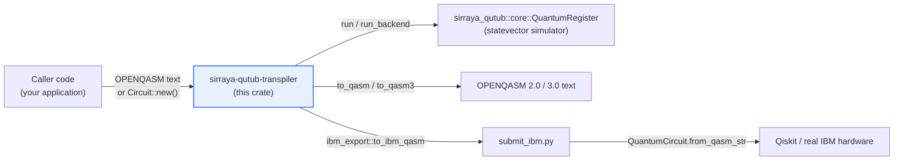

The transpiler never talks to real hardware directly except via the IBM QASM 2.0 export path — everything else either executes against the local simulator or emits text for some other system to consume.

---

## 1. What this crate is

`sirraya-qutub-transpiler` is a **QASM 2.0/3.0 importer and multi-backend native-gate compiler** for circuits that ultimately execute on `sirraya_qutub::core::QuantumRegister` — Sirraya Labs' statevector simulator.

You can provide **OPENQASM 2.0 or 3.0** text or construct a `Circuit` directly — `qasm::parse` recognizes both dialects' spellings of the same handful of constructs unconditionally (no version flag; see `qasm.rs`'s own module doc for the full spelling comparison). The transpiler then takes the circuit through a hardware-aware compilation pipeline:


### The compilation stages

| Stage                    | Responsibility                                                           |
| ------------------------ | ------------------------------------------------------------------------ |
| **Parse**                | Convert OPENQASM 2.0 or 3.0 into the transpiler IR                       |
| **Source optimization**  | Cancel, reorder, and simplify gates before hardware lowering             |
| **Routing**              | Insert `Swap` gates to satisfy physical connectivity                     |
| **Native decomposition** | Convert gates into a target-native gate vocabulary                       |
| **Backend lowering**     | Adapt circuits to specific backend families                              |
| **Native optimization**  | Fuse rotations, remove cancellations, and resynthesize single-qubit runs |
| **Fidelity estimation**  | Provide a fast, simulation-free sanity check                             |
| **Execution / emission** | Run against `sirraya_qutub` or emit QASM                                 |

> **Verification principle**
>
> Every non-trivial identity in every module is checked against the real simulator, not merely asserted algebraically.
>
> This is the crate's most important engineering convention.

---

## 2. Architecture at a glance

The crate deliberately separates **source-level semantics**, **hardware topology**, **native gate synthesis**, **backend-specific lowering**, and **execution**.

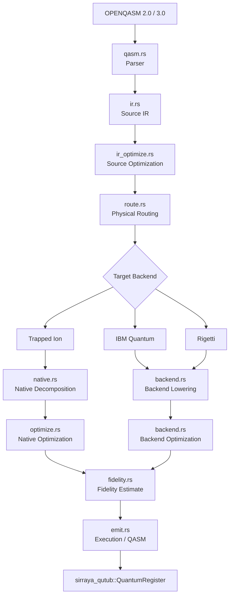

### Module map

| Module           | Role                                       |
| ---------------- | ------------------------------------------ |
| `ir.rs`          | Source-level circuit representation        |
| `qasm.rs`        | OPENQASM 2.0 and 3.0 importer               |
| `ir_optimize.rs` | Source-level optimization                  |
| `native.rs`      | Trapped-ion-style native decomposition     |
| `backend.rs`     | Backend-specific lowering and optimization (shared engine; see `backend/` below for the per-backend plugins) |
| `coupling.rs`    | Physical connectivity models               |
| `route.rs`       | Hardware-aware SWAP insertion              |
| `optimize.rs`    | Native-level peephole optimization         |
| `emit.rs`        | Execution and QASM emission                |
| `fidelity.rs`    | Fast fidelity budgeting                    |
| `diagram.rs`     | ASCII/SVG circuit diagram rendering, at any of the three IR levels (debug/inspection) |
| `pulse.rs`       | Pulse-level scheduling: lowers an already-lowered `BackendCircuit` into a hardware-channel `Schedule`, using a per-backend calibration table. Optional, downstream of everything above — nothing upstream needs to know it exists. |
| `waveform_sim.rs`| Numerically integrates a single pulse instruction against a two-level qubit model, to check a `pulse.rs` calibration table's `rot` entries actually achieve the rotation angle they claim. Sits below `pulse.rs`, same "optional, nothing upstream depends on it" relationship. |
| `ibm_export.rs`  | Real IBM-hardware-native export: expands a `BackendCircuit` lowered for `Backend::IbmQ` into IBM's actual physical basis gates (`rz`, `sx`, `x`, `cx`, `measure`) and emits OPENQASM 2.0 text a real Qiskit/IBM job-submission pipeline can consume (paired with `submit_ibm.py`, since there's no official Rust SDK for IBM Quantum Platform). Deliberately stays OPENQASM 2.0-only, since `submit_ibm.py`'s Qiskit loader (`QuantumCircuit.from_qasm_str`) only accepts 2.0. Distinct from `emit::to_qasm`/`emit::to_qasm3`, which round-trip only through this crate's own `qasm::parse`. |

`backend.rs` has its own companion directory, `backend/`, holding one file per backend implementation plus the trait each of them implements:

| File | Role |
| ---- | ---- |
| `backend/spec.rs` | The `BackendSpec` trait and the `Backend` handle type — the open extension point every backend plugs into. See §4's `backend.rs` section for the full design rationale. |
| `backend/trapped_ion.rs` | `BackendSpec` implementation for `Backend::TrappedIon` |
| `backend/ibmq.rs` | `BackendSpec` implementation for `Backend::IbmQ` |
| `backend/rigetti.rs` | `BackendSpec` implementation for `Backend::Rigetti` |

Nothing outside `backend/` needs to import from these directly — `backend.rs` re-exports `Backend`, `BackendSpec`, and `RotAxis` at its own top level (`crate::backend::{Backend, BackendSpec, RotAxis}`), which is in turn what `lib.rs` re-exports at the crate root. A new backend is a new file in this directory, not a change to `backend.rs`'s own logic.

---

## 3. The compilation pipeline

The pipeline is intentionally divided into distinct transformations rather than treating transpilation as a single optimization pass.

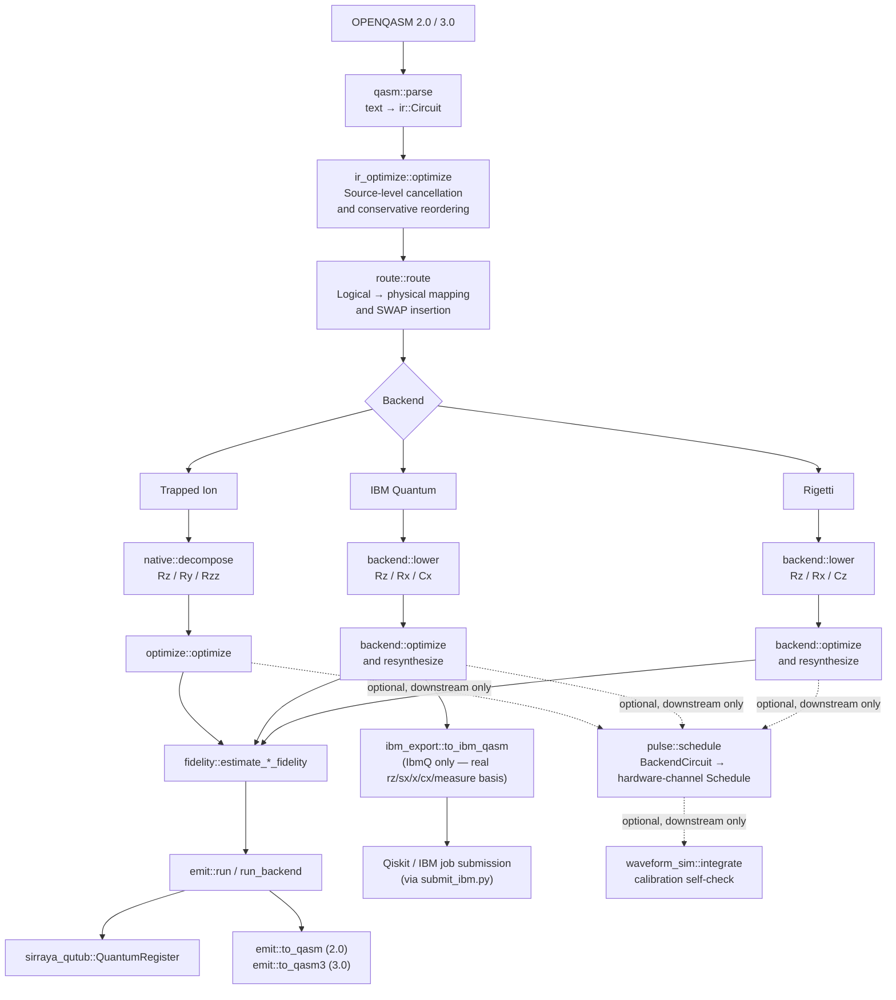

`pulse.rs`/`waveform_sim.rs`/`ibm_export.rs` are drawn with dashed/branch edges deliberately: nothing upstream of `backend::lower`'s output needs to change, or even know these exist, for a caller to opt into any of them.

`lib.rs`'s own documentation contains the same high-level architecture diagram and serves as the compact map of the crate.

---

# 4. Module-by-module

## `ir.rs` — Source gate set

`Gate` is deliberately rich. It mirrors the `QuantumRegister` operation surface rather than prematurely restricting circuits to a particular hardware vocabulary.

### Supported source operations

```text
H
X / Y / Z
S / Sdg
T / Tdg
Rx / Ry / Rz
Cx
Cz
Swap
Rxx / Ryy / Rzz
Cp
Measure
```

The narrowing to hardware-native gates does **not** happen here. That responsibility belongs to `native.rs` and `backend.rs`.

`Circuit` also carries `num_clbits`, mirroring `num_qubits`, because `Gate::Measure` needs a destination for its classical outcome.

### Circuit semantic model

A `Circuit` is exactly three things:

```text
Circuit
 |
 +-- num_qubits    (qubit count; also the valid range for every Gate qubit index)
 +-- num_clbits    (classical bit count; the valid range for Measure's clbit index)
 +-- gates: Vec<Gate>   (an ordered sequence — program order is operation order)
```

There is no separate "metadata" or "compilation information" field at this level. Anything a later pass needs beyond the gate sequence itself — a routing mapping, a backend tag, a pulse schedule — lives in that pass's own output type (`BackendCircuit`, `Schedule`, ...), not bolted onto `Circuit`. This is a deliberate choice: it keeps `Circuit` unambiguous about what it represents (a bare, ordered gate sequence, nothing else) rather than becoming a grab-bag that every downstream pass reads different fields out of.

### Gate representation

`Gate` is a single flat enum, not a trait-object hierarchy or a boxed dynamic-dispatch scheme. Every variant is one of exactly two shapes:

```text
Single-qubit   -- H, X, Y, Z, S, Sdg, T, Tdg, Rx, Ry, Rz, Measure
Two-qubit      -- Cx, Cz, Swap, Rxx, Ryy, Rzz, Cp
```

`Gate::qubits()` returns the qubit indices for either shape uniformly, which is what every pass that needs to reason generically about "which wires does this gate touch" (`ir_optimize.rs`'s disjointness check, `route.rs`'s remapping, `diagram.rs`'s column packing) calls instead of matching on every variant itself.

Extending the gate set means adding an enum variant, one `qubits()` arm, and one `decompose_gate` arm in `native.rs` — no unrelated infrastructure needs to change, which is the extensibility property this representation is chosen for.

### Gate parameter semantics

Every angle parameter (`Rx`/`Ry`/`Rz`/`Rxx`/`Ryy`/`Rzz`'s `theta`, `Cp`'s `lambda`) is:

* in **radians**
* **not normalized** — `native.rs`/`optimize.rs` wrap angles into `(-2π, 2π]` purely cosmetically during peephole cleanup, but the IR itself imposes no range restriction on a stored angle
* required to be **finite** — `Circuit::validate()` (below) rejects `NaN`/`±inf`, since both `native.rs`'s ZYZ synthesis and `optimize.rs`'s angle-merging would otherwise silently propagate a NaN through every later decision rather than erroring

Symbolic (non-numeric) parameters are **not supported** anywhere in this IR — every angle is a concrete `f64` at construction time. This is a real, current limitation rather than an oversight left undocumented: a future symbolic-parameter feature would need its own `Gate` variant shape (or a `Rz(usize, Parameter)`-style enum around the angle) and is out of scope for the current representation.

### Logical vs. physical qubits

`LogicalQubit`/`PhysicalQubit` (defined in `ir.rs`) give the two qubit "spaces" this compiler distinguishes real, distinct types:

```text
LogicalQubit(usize)   -- q0, q1, ... exactly as declared by the input program.
                         Identity never changes across compilation.

PhysicalQubit(usize)  -- a row in a CouplingMap: a hardware wire position.
                         Which logical qubit's state lives on a given
                         physical qubit changes as route::route inserts Swaps.
```

**Current scope of this distinction.** `Gate`/`Circuit`'s own qubit fields remain plain `usize`, not these newtypes — `Gate`/`Circuit` are reused as the same type both *before* routing (fields mean logical indices) and *after* it (`route::route`'s output, still a `Circuit`, means physical indices). Giving `Gate` a real type-level split (effectively `Gate<Q>`/`Circuit<Q>`) is a larger design change touching every module that builds or consumes a `Circuit`, and is tracked as separate follow-up work rather than folded in here.

**What's already fixed.** The riskiest spot for a logical/physical mix-up isn't `Gate` itself — it's `route.rs`'s own internal bookkeeping, where a `logical_to_physical`/`physical_to_logical` pair of `Vec<usize>` could be passed to each other's argument slot with no compiler error. Migrating that internal state to `LogicalQubit`/`PhysicalQubit` is real, scoped follow-up work (see `route.rs`'s section below for why it isn't done in the same change as the type definitions).

### Routing metadata ownership

`route.rs` is the sole owner of the logical↔physical mapping. It is constructed, mutated, and discarded entirely within `route::route`/`route::route_lookahead`'s own stack frames — no other module holds a reference to it, stores it, or mutates it. Once routing finishes, the mapping's information is fully consumed into the routed `Circuit`'s gate addressing; nothing downstream (`native.rs`, `backend.rs`, `emit.rs`) ever needs to ask "what is qubit N's current physical location," because by the time they see the circuit, every gate is already addressed in physical terms. There is exactly one authoritative owner for this piece of state, and it never outlives the function call that produced it.

### Measurement is intentionally special

`Gate::Measure` is the one variant that is not a unitary rewrite target.

It represents a **classical side effect**, so several parts of the compiler treat it specially rather than pretending it behaves like an ordinary quantum gate:

* `ir_optimize.rs`'s commuting pass never reorders a `Measure` relative to *anything*, even a qubit-disjoint gate — two `Measure`s writing different qubits into the same classical bit are only disjoint by qubit, not by the classical side effect that matters.
* `optimize.rs`'s peephole pass never merges or drops a `Measure` — it has no "angle" to cancel to zero and is a real effect the caller depends on.
* `native.rs`/`backend.rs` pass `Measure` through unchanged rather than decomposing it.
* `emit.rs` only executes it via the `_with_measurement` entry points, which use `QuantumRegister::measure_single_qubit`'s real Born-rule-sampled projective measurement (sample → collapse → renormalize) — the plain `run`/`apply_to` entry points reject a circuit containing `Measure`, since they have nowhere to put a classical outcome.
* Verification for `Measure` uses shot-based statistical comparison (`tests/measurement.rs`), not the fidelity-based comparison used for unitary gates, because measurement collapses the state — see §11.

### IR invariants

`Circuit::validate()` checks every invariant this crate currently relies on elsewhere by convention, in one place:

1. **Qubit references are valid** — every qubit index any gate touches is `< num_qubits`.
2. **Classical destinations are valid** — every `Measure`'s clbit index is `< num_clbits`.
3. **Two-qubit gates don't self-target** — a two-qubit gate's two qubit arguments must be distinct.
4. **Gate parameters are finite** — no angle is `NaN` or `±inf`.

**Gate arity is deliberately not a runtime check.** `Gate`'s own variant shapes (`Cx(usize, usize)` vs. `H(usize)`) already make a wrong-arity gate a compile error, not a validation failure — there is no way to construct an ill-formed `Gate` in the first place. This is itself a documented answer to "what invariants must hold": some are enforced by the type system, and only the invariants the type system *can't* express (index bounds, distinctness, finiteness) need a runtime check.

`qasm::parse` already range-checks qubit/clbit indices as it parses (see §`qasm.rs`), so `validate()`'s main value is for a `Circuit` built any other way — directly via `Circuit::new`/`push`, or by a future frontend — before it's handed to `route`/`native::decompose`/`backend::lower`, none of which re-check these invariants themselves today.

### Representation boundaries

| Representation      | Logical qubits | Physical mapping | Native gate set        | Backend-specific detail |
| -------------------- | :------------: | :---------------: | ----------------------- | :----------------------: |
| `ir::Circuit` (source)      | Yes | No  | No (rich source set)     | No  |
| `ir::Circuit` (post-`route`) | Yes (unchanged identity) | Yes (baked into gate addressing, mapping itself discarded) | No | No |
| `native::NativeCircuit`      | Yes | Yes | `{Rz, Ry, Rzz}` | No |
| `backend::BackendCircuit`    | Yes | Yes | Target-native (`{Rz,Rx,Cx}` / `{Rz,Rx,Cz}` / `{Rz,Ry,Rzz}`) | Yes (via `Backend` tag) |

The one asymmetry worth calling out: routing produces a *new* `ir::Circuit` (same type as its input), not a distinct "RoutedCircuit" type — see "Logical vs. physical qubits" above for why that's a real, scoped limitation rather than an oversight.

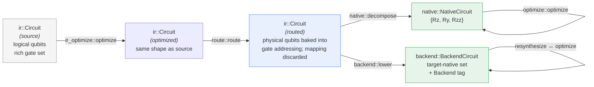

Note that both `A` and `B` and `C` are literally the same Rust type (`ir::Circuit`) — the diagram separates them by *meaning*, not by type, which is precisely the "current scope of this distinction" limitation called out above: the type system can't yet tell a caller which of the three they're holding.

### Ownership and mutation rules

Every pass in this crate follows the same convention: **take a shared reference, return an owned new value.**

```text
fn optimize(circuit: &Circuit) -> Circuit          // ir_optimize.rs
fn route(circuit: &Circuit, ...) -> Circuit        // route.rs
fn decompose(circuit: &Circuit) -> NativeCircuit   // native.rs
fn lower(circuit: &Circuit, ...) -> BackendCircuit // backend.rs
fn optimize(circuit: &NativeCircuit) -> NativeCircuit // optimize.rs
```

No pass mutates its input `Circuit`/`NativeCircuit`/`BackendCircuit` in place, and no pass retains a reference to its input past its own call. This means a caller can always compare a circuit before and after a pass (which is exactly what every fidelity-based test in this crate does — see §10), and a pipeline stage never needs to worry about a prior stage's structure being invalidated out from under it.

### Pass contracts

Every pass in this crate already documents its own input representation, precondition, and guarantee in its module doc comment — this section just names that existing convention explicitly rather than introducing a new one:

| Pass | Input representation | Guarantee on output |
| ---- | --------------------- | -------------------- |
| `ir_optimize::optimize` | `ir::Circuit` | Same acting circuit; only self-inverse cancellation and disjoint-qubit-safe commuting reorder applied |
| `route::route` / `route_lookahead` | `ir::Circuit` + `CouplingMap` | Every two-qubit gate lands on a `CouplingMap`-adjacent pair; identical action; identity mapping restored at the end |
| `native::decompose` | `ir::Circuit` | Output uses only `{Rz, Ry, Rzz, Measure}`; identical action (exact identities, checked in `tests/decompositions.rs`) |
| `backend::lower` | `ir::Circuit` + `Backend` | Output uses only that backend's native set; routes first if the backend has a `CouplingMap` |
| `optimize::optimize` (native) | `native::NativeCircuit` | Identical action; adjacent same-axis rotations fused, zero-angle gates dropped, `Measure` untouched |

A pass that can't offer this shape of guarantee (a fixed input representation, a stated output representation, and an explicit "what stays true" guarantee) doesn't belong in this pipeline without first working out what it can promise.

### Structural equality vs. semantic equivalence

The crate draws (in practice, if not previously in so many words) a firm line between two different notions of "the same circuit":

* **Structural equality** — `Gate: PartialEq`/`Circuit: PartialEq` (`Circuit` derives no `PartialEq` today, but `Gate`'s does) compares representation, field for field. Two circuits differing only in, say, gate order that happens to commute are *not* structurally equal even though they act identically.
* **Semantic equivalence** — "does this circuit act the same way." This crate never checks this algebraically; every non-trivial transformation is instead checked against `sirraya_qutub::core::QuantumRegister::fidelity` on a randomized initial state (§10), or, for `Measure`-containing circuits, via shot-based statistical comparison (§11) — never via `PartialEq`, since a `Circuit` before and after routing, decomposition, or optimization is essentially never structurally equal to its input.

Nothing in this crate currently computes a `Fidelity(A, B) ≈ 1`-style numeric similarity score for two IR-level circuits directly — the fidelity checks in the test suite compare *executed states*, not two `Circuit` values against each other. Distinguishing these three notions matters mainly so a future contributor doesn't reach for `PartialEq` where semantic equivalence (or a fidelity check) is what's actually needed.

### Debugging and inspection

Any of the three circuit levels — `ir::Circuit`, `native::NativeCircuit`, `backend::BackendCircuit` — can be rendered as a human-readable diagram via `diagram.rs`, either as ASCII text or a standalone SVG document. This is the crate's answer to "how do I inspect an IR during debugging": all three gate sets funnel into one shared intermediate diagram model (`Diagram`/`DiagramInstr`), so there's one column-packing algorithm and one pair of renderers regardless of which pipeline stage produced the circuit being inspected.

---

## `qasm.rs` — OPENQASM importer

The parser implements a deliberately constrained subset of **OPENQASM**, spanning both the 2.0 and 3.0 dialects.

There is no version flag and no separate entry point per dialect: `qasm::parse` recognizes both dialects' spellings of the same handful of constructs unconditionally, so a 2.0 program is parsed exactly the way it always was, and a 3.0 program's differently-spelled equivalents are additionally recognized alongside it.

| construct           | QASM 2.0                 | QASM 3.0                           |
| -------------------- | ------------------------- | ------------------------------------ |
| version header        | `OPENQASM 2.0;`            | `OPENQASM 3.0;` (or `3;`)             |
| include                | `include "qelib1.inc";`    | `include "stdgates.inc";`             |
| qubit register          | `qreg q[5];`                 | `qubit[5] q;` (or bare `qubit q;`)     |
| classical register       | `creg c[2];`                 | `bit[2] c;` (or bare `bit c;`)         |
| measure                 | `measure q[0] -> c[0];`     | `c[0] = measure q[0];`                |

The version header and the include statement were already skipped unconditionally (their contents were never inspected), so neither needed a code change. Gate-call syntax (`h q[0];`, `rz(0.5) q[1];`, ...) is identical between the two dialects and already worked either way. Only the register declarations and the measure statement actually differ in spelling, so those are the only two constructs with a second recognized spelling.

A source file can even freely mix both spellings — `parse` doesn't enforce internal consistency of dialect, only that each individual statement is one of the recognized forms.

It accepts:

* the dialect emitted by `sirraya_qutub::QuantumCircuit::to_qasm`
* the dialect emitted by `QuantumRegister::to_qasm`
* common `qelib1.inc`/`stdgates.inc` mnemonics used by tools such as Qiskit for the same gate set

It intentionally does **not** implement:

* gate definitions
* classical control
* arbitrary includes
* multiple qubit-register / classical-register declarations
* barriers

Anything outside the supported subset produces a **parse error identifying the offending line**, rather than being silently ignored.

This crate's own QASM *emitters* (`emit::to_qasm` for 2.0, `emit::to_qasm3` for 3.0; see §8) each commit to one dialect per function rather than mixing spellings — the parser's acceptance of either spelling is about being a liberal *importer* of QASM written or exported by other tools, not license for this crate's own writers to be inconsistent.

### Measurement safety

A statement such as:

```text
measure q[i] -> c[j];
```

or its 3.0 equivalent:

```text
c[j] = measure q[i];
```

is range-checked against the declared qubit-register and classical-register sizes at parse time.

This prevents invalid classical destinations from surviving into later compilation stages.

---

## `ir_optimize.rs` — Source-level optimization

The source optimizer operates before hardware-specific lowering.

It performs two primary transformations.

### Inverse and self-inverse cancellation

Examples include:

```text
H ; H
S ; Sdg
Cx(a,b) ; Cx(a,b)
```

as well as zero-angle and angle-negating rotation pairs.

### Conservative commuting reordering

The optimizer can slide gates past one another when their qubit sets are disjoint, allowing otherwise separated cancellable gates to become adjacent.

The key architectural constraint is deliberate:

> **Only universally valid disjoint-qubit commutation is used here.**

The optimizer does **not** encode hardware- or gate-specific identities such as:

```text
Rz commutes through a CNOT control wire
```

Those identities belong in the backend-specific optimization layer, where each rule can have its own derivation and verification.

### Measurement barrier

`Gate::Measure` is never treated as commutable.

This remains true even when the measured qubit is disjoint from another gate.

The reason is that measurement has a classical side effect. Two measurements can also write to the same classical bit, which cannot be represented purely by examining qubit overlap.

---

## `native.rs` — Trapped-ion native gate set

The native decomposition stage reduces the source gate set to:

```text
{ Rz, Ry, Rzz }
```

This corresponds to the gate vocabulary used by the `sirraya_qutub` Quantinuum Helios `HardwareCalibration` model.

### Exact identities

The decomposition includes exact identities such as:

#### ZYZ Euler decomposition

Arbitrary single-qubit unitaries are decomposed using a small local complex / 2×2 matrix implementation:

```text
C
Mat2
matmul
```

This algebra remains local to `native.rs` so the synthesizer does not depend on the simulator's internal complex-number representation.

#### CNOT

```text
Cx = H(target)
   · Cp(control, target, π)
   · H(target)
```

#### SWAP

```text
Swap = Cx(a,b)
     ; Cx(b,a)
     ; Cx(a,b)
```

#### RXX

```text
Rxx(θ) =
    (H ⊗ H)
    · Rzz(θ)
    · (H ⊗ H)
```

because:

```text
X = H · Z · H
```

#### RYY

```text
Ryy(θ) =
    (Rx(π/2) ⊗ Rx(π/2))
    · Rzz(θ)
    · (Rx(-π/2) ⊗ Rx(-π/2))
```

### Shared validated algebra

`C`, `Mat2`, and the matrix builders are `pub(crate)` rather than fully private.

This allows `backend.rs` to reuse the **same validated ZYZ implementation** for resynthesis rather than creating a second independently derived implementation.

> **Design principle:** one implementation of the algebra, one verification path, multiple consumers.

---

## `backend.rs` + `backend/` — Multi-backend lowering

`backend.rs` maps circuits onto the actual native gate vocabulary of supported backend families. It is deliberately split into two layers:

* **`backend.rs` itself** — the shared engine every backend runs through: the generic per-gate lowering loop, the `resynthesize`/`optimize` fixed-point pass, `BackendGate`/`BackendCircuit`, and a handful of gate-identity helpers (`push_ry`, `push_h`) that any backend built from `{Rz, one rotation axis, an Rzz-derived two-qubit gate}` can reuse.
* **`backend/` (`spec.rs`, `trapped_ion.rs`, `ibmq.rs`, `rigetti.rs`)** — the part that's actually different per backend, expressed as one `BackendSpec` trait implementation per file.

This split replaced an earlier version of this module where `Backend` was a closed three-variant enum and every piece of per-backend behavior — `lower`'s gate expansion, the two-qubit-gate identity, `resynthesize`'s axis shift, calibration, coupling map — was a `match backend { TrappedIon => .., IbmQ => .., Rigetti => .. }` repeated at each of those sites (plus two more outside `backend.rs` entirely, in `emit.rs` and `diagram.rs`). Adding a backend meant finding and correctly extending every one of those matches. The trait-based version below replaces "find every match" with "implement one trait, once."

### The `BackendSpec` trait

```text
trait BackendSpec {
    fn id(&self) -> &'static str;
    fn calibration(&self) -> PublishedCalibration;
    fn coupling_map(&self, num_qubits: usize) -> Option<CouplingMap>;
    fn rot_axis(&self) -> RotAxis;                                  // Ry or Rx
    fn push_two_qubit_zz(&self, bc, a, b, theta);                   // this backend's Rzz identity
    fn is_native_decompose_target(&self) -> bool { false }          // true only for TrappedIon
}
```

`Backend` is a small `Copy` handle wrapping `&'static dyn BackendSpec` — `Backend::TrappedIon`, `Backend::IbmQ`, and `Backend::Rigetti` are constants pointing at each backend's implementation. Everywhere that used to `match backend { .. }` now either calls a `Backend`/`BackendSpec` method directly, or — for the two truly binary physical choices this crate encodes, which axis a native rotation is about — matches on `RotAxis` (`Ry` or `Rx`) instead. `RotAxis` stays a closed two-variant enum on purpose: unlike `Backend`, it isn't meant to grow — see `backend/spec.rs`'s module doc for why a backend whose native single-qubit gate isn't expressible as one of these two doesn't fit this trait's shape at all.

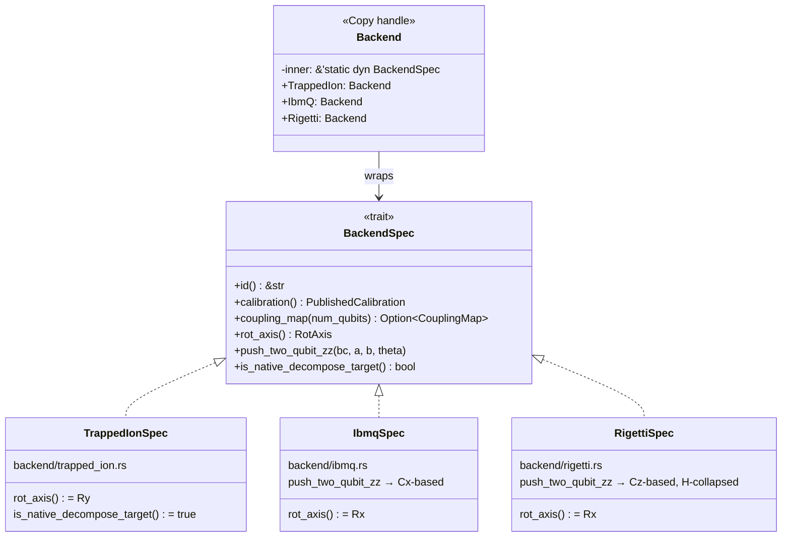

Adding a fourth backend that fits this trait's shape means adding one more `..Spec` box to the diagram above — nothing in `Backend`, `backend.rs`'s shared engine, `emit.rs`, or `diagram.rs` changes.

### Backend matrix

| Backend         | Native gate set   | Connectivity model | Routing      | Rotation axis |
| --------------- | ----------------- | ------------------ | ------------ | -------------- |
| **Trapped Ion** | `Rz`, `Ry`, `Rzz` | All-to-all         | Not required | `Ry` |
| **IBM Quantum** | `Rz`, `Rx`, `Cx`  | Heavy-hex          | Required     | `Rx` |
| **Rigetti**     | `Rz`, `Rx`, `Cz`  | Square grid        | Required     | `Rx` |

### Trapped Ion (`backend/trapped_ion.rs`)

The trapped-ion backend's native gate set already *is* `native::decompose`'s own canonical `{Rz, Ry, Rzz}` output, so its `push_two_qubit_zz` just pushes `Rzz` straight through, and it's the one backend that overrides `is_native_decompose_target` to `true` — telling `backend.rs`'s `lower` to skip the general re-expansion/resynthesize path entirely and just relabel `native::decompose`'s gates.

### IBM Quantum (`backend/ibmq.rs`)

IBM Quantum uses:

```text
{ Rz, Rx, Cx }
```

Its `rot_axis()` returns `Rx`, so `backend.rs`'s shared `push_ry` helper re-expresses every source `Ry` via the general identity:

```text
Ry(θ) = Rx(-π/2)
       · Rz(θ)
       · Rx(π/2)
```

and its `push_two_qubit_zz` builds:

```text
Rzz(a,b,θ) =
    Cx(a,b)
    · Rz(b,θ)
    · Cx(a,b)
```

### Rigetti (`backend/rigetti.rs`)

Rigetti uses:

```text
{ Rz, Rx, Cz }
```

Also an `Rx`-axis backend (so it reuses the exact same `push_ry` identity as `IbmQ`), but with no native `Cx`. Rather than naively substituting `Cx(a,b) == H(b).Cz(a,b).H(b)` into the `IbmQ` identity twice — which would cost four `H`'s — its `push_two_qubit_zz` uses:

```text
H · Rz(θ) · H = Rx(θ)
```

to collapse the middle of that expansion and build the shortened `H(b).Cz(a,b).Rx(b,θ).Cz(a,b).H(b)` form directly, at a cost of two `H`'s instead of four.

### Extending: adding a fourth backend

A new backend that fits the `{Rz, one rotation axis, Rzz-derived two-qubit gate}` shape is: one new file under `backend/` implementing `BackendSpec`, plus one new `Backend::` constant in `backend/spec.rs`. Nothing in `backend.rs`, `emit.rs`, or `diagram.rs` needs to change — see `backend/spec.rs`'s module doc for the full contract a new implementation must satisfy.

A backend that *doesn't* fit that shape — see "Why Pasqal (and photonic) are not implemented" below — needs more than a new `BackendSpec` impl, because the mismatch isn't in which axis or which two-qubit identity it uses, it's in whether `BackendGate` can represent its physics at all.

---

### Backend optimization

Two cleanup passes run to a fixed point.

#### `optimize`

A peephole optimizer that handles:

* adjacent same-axis rotation fusion
* `Rz` commutation through diagonal-compatible gates
* `Cz` / `Rzz` commutation
* `Cx` commutation through the **control** wire only
* same-pair `Cx` / `Cz` / `Rzz` cancellation and fusion

A critical correctness constraint is preserved:

> `Rz` may commute through the control wire of a `Cx`, but **not its target wire**.

The tests specifically pin this distinction down.

#### `resynthesize`

`resynthesize` goes further than local peephole optimization.

It collects the **entire matrix product** of a maximal single-qubit run and reconstructs it using the validated ZYZ decomposition.

This means a run containing six or more single-qubit gates can collapse to at most three gates, regardless of how the original sequence was formed.

The important distinction is that `optimize` correctly refuses to merge across certain real intervening `Rz` gates, while `resynthesize` can reason about the entire matrix product.

### Fixed-point strategy

`lower` repeatedly applies:

```text
resynthesize
→ optimize
→ resynthesize
→ ...
```

until the transformations reach a fixed point.

This matters because one optimization can expose another:

```text
optimization A
      ↓
reveals cancellation
      ↓
optimization B
      ↓
creates new resynthesis opportunity
```

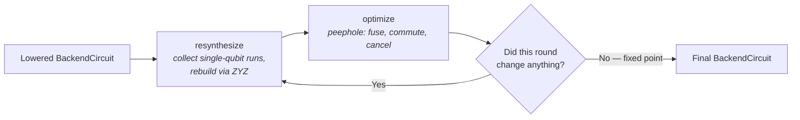

---

### Connectivity integration

`Backend::coupling_map` connects backend lowering to `coupling.rs` and `route.rs` — an inherent method on `Backend` that delegates to whichever `BackendSpec` implementation `Backend` is currently holding (see the trait section above).

| Backend     | Coupling map      |
| ----------- | ----------------- |
| Trapped Ion | `None`            |
| IBM Quantum | `heavy_hex_for`   |
| Rigetti     | `square_grid_for` |

Trapped-ion routing is unnecessary because the modeled shared motional mode provides direct pairwise reachability.

---

### Why Pasqal (and photonic) are not implemented

`Backend::Pasqal` is deliberately **not** represented as another fixed-connectivity digital backend, and there is no `Backend::Photonic` either — even though `Backend` is now an open trait rather than a closed enum (see above), meaning adding either one is no longer blocked by "finding every match site." The blocker was never that; it's that neither platform's physics fits what `BackendSpec` is actually a contract for.

**Neutral atoms (Pasqal).** Neutral-atom platforms require:

* atom placement
* blockade-radius reasoning
* movement / placement constraints
* hardware-aware routing fundamentally different from fixed two-qubit gate connectivity

`BackendSpec::coupling_map` returns a fixed `CouplingMap` because every backend implemented so far *has* a fixed topology; Pasqal's "connectivity" is a function of where the atoms currently are, which isn't a `BackendSpec` method at all, fixed or otherwise.

**Photonic.** Linear-optical qubits (dual-rail, or continuous-variable encodings) don't have a `Rot`/`Rzz`-shaped native gate set at all — their primitives are beamsplitters and phase shifters acting on modes, not qubit-indexed rotations, and for the common dual-rail/KLM-style encoding, two-qubit gates are probabilistic/measurement-induced rather than deterministic unitaries. `BackendSpec::rot_axis` and `push_two_qubit_zz` assume every implementor is doing the same kind of thing `TrappedIon`/`IbmQ`/`Rigetti` do — expressing a unitary in terms of a fixed two-qubit gate — which is precisely the assumption photonic breaks.

Modeling either as a `Rigetti`-like `BackendSpec` implementation would therefore create the appearance of support without actually representing the hardware model. A real implementation of either needs its own gate representation below `ir::Circuit` — likely a new `BackendGate`-shaped enum with its own execution/emit path, not an implementation of this trait — which is why this is tracked as separate follow-on work rather than "just write the `BackendSpec` impl."

> **The project deliberately prefers an honest missing backend over a misleading abstraction.**

---

# 5. `coupling.rs` — Physical qubit connectivity

`CouplingMap` describes which physical qubit pairs can directly participate in a native two-qubit operation. This is the piece of state that turns "some backend's native gate set" into "what a specific chip's wiring actually allows" — `native.rs`/`backend.rs` answer *which gates* a circuit may contain, `coupling.rs` answers *which pairs of qubits* a two-qubit gate may act on.

Every topology below is exposed the same way: a `CouplingMap` is just a graph, and every backend that needs one gets it from a `<topology>_for(n)` constructor that takes only the qubit count and returns a connected subgraph of exactly that size. Nothing downstream needs to know *which* topology it received — `route.rs` only ever calls the three graph-operation methods described at the end of this section.

## Topology models at a glance

Each topology is shown separately below, since cramming all three into one diagram made them hard to tell apart at a glance. Node **shape** and **color** track the connectivity role: circles for the topology-free linear case, hexagons/small ovals for heavy-hex's two-tier data/flag structure, and squares for the uniform square grid.

**`linear(n)`** — every qubit has at most two neighbors, one on each side:


**`heavy_hex_grid`** — one hexagonal cell: hexagon-shaped **data qubits** (degree ≤ 3 in the full lattice) alternate with oval **flag qubits** (degree 2) around each ring, rather than data qubits connecting directly to each other:

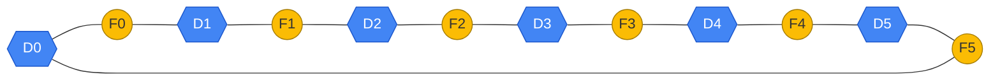

*One ring shown for clarity — the real lattice tiles many of these hexagons together, which is what pushes boundary data qubits from degree 2 (as drawn here) up to degree 3.*

**`square_grid`** — every interior qubit connects to its four neighbors (up/down/left/right); this 3×3 slice shows the pattern:

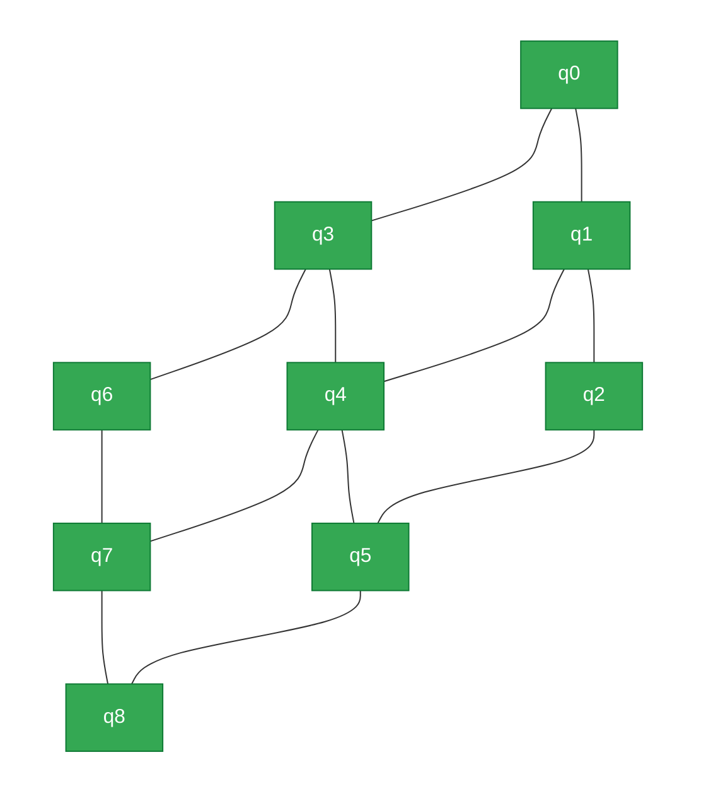

| Topology | Used by | Typical degree | Notes |
| --- | --- | --- | --- |
| `linear(n)` | Nothing (fallback only) | ≤ 2 | Kept as a topology-free stand-in for the 0- and 1-qubit edge cases |
| `heavy_hex_grid` | IBM Quantum | ≤ 3 (data), 2 (flag) | BFS prefix of the smallest grid containing ≥ n qubits |
| `square_grid` | Rigetti (Ankaa-class) | ≤ 4 | BFS prefix of the smallest rectangular grid containing ≥ n qubits |

## Supported topology models

### `linear(n)`

A simple chain where:

```text
q ↔ q + 1
```

are adjacent.

It is no longer used by any backend as its primary physical topology, but remains useful as a topology-free stand-in for the zero- and one-qubit cases.

---

### `heavy_hex_grid(rows, cols)`

IBM's superconducting processor family is modeled using a heavy-hex lattice.

The topology contains:

* degree-≤3 data qubits
* degree-2 flag qubits
* a hexagonal connectivity structure

`heavy_hex_for(n)`:

1. Finds the smallest heavy-hex grid containing at least `n` qubits.
2. Performs a BFS traversal.
3. Takes a prefix containing exactly `n` qubits.

Because a BFS prefix of a connected graph remains connected, this gives a connected physical topology without claiming to reproduce the exact numbering of a particular IBM chip.

> **Important:** this represents the **topology family**, not a specific processor's exact qubit numbering.

---

### `square_grid(rows, cols)`

Rigetti's current Ankaa-class processors are modeled as a rectangular square lattice.

The topology provides approximately:

```text
Interior → degree 4
Edges    → degree 3
Corners  → degree 2
```

This intentionally differs from the square-octagonal unit cell associated with earlier Aspen-generation devices.

`square_grid_for(n)` uses the same basic strategy as `heavy_hex_for(n)`:

1. Find the smallest grid containing at least `n` qubits.
2. Traverse using BFS.
3. Take the connected prefix of exactly `n` qubits.

---

### Graph operations

`CouplingMap` exposes:

```text
neighbors(q)
is_adjacent(a, b)
shortest_path(a, b)
```

`neighbors(q)` was added specifically so `route.rs` can reason about the graph structure and construct a spanning tree.

`is_adjacent` only answers a local yes/no question, while `shortest_path` is point-to-point. Neither is sufficient for general graph traversal.

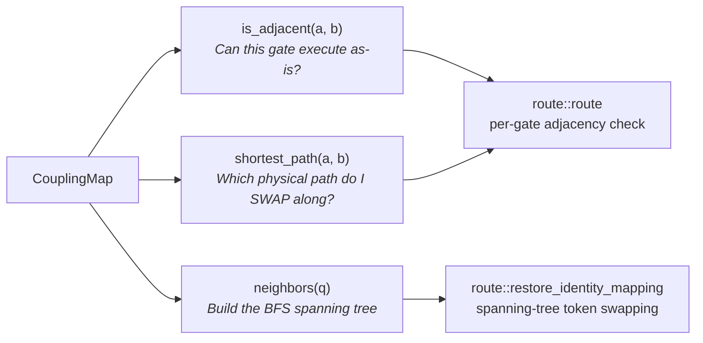

Each of `route.rs`'s two jobs — routing a gate that isn't yet adjacent, and restoring the identity mapping afterward — leans on a different subset of these three primitives, which is why `CouplingMap` exposes exactly these three and no general-purpose traversal API of its own.

---

# 6. `route.rs` — Hardware-aware SWAP insertion

Routing occurs **before** native decomposition.

This is important because routing operates on the source-level circuit and therefore preserves the logical structure of the original gate set for as long as possible.

The router:

1. Maintains a `logical → physical` mapping.
2. Re-addresses single-qubit gates according to the current mapping.
3. Detects non-adjacent two-qubit operations.
4. Inserts `Swap` gates along a shortest physical path.
5. Preserves the original argument order.

### Routing algorithm, per gate

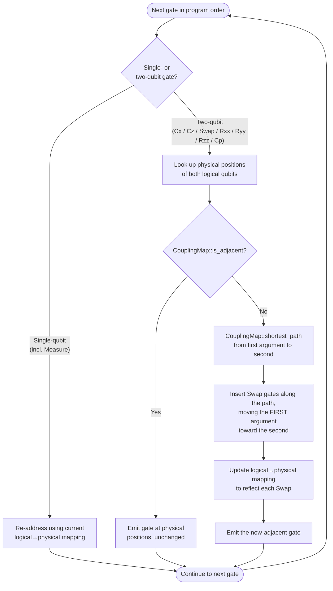

### Worked example: routing a non-adjacent `Cx`

Suppose `Cx(q0, q2)` needs to run on a linear-adjacency topology `q0 ↔ q1 ↔ q2`, where `q0` and `q2` are two hops apart:

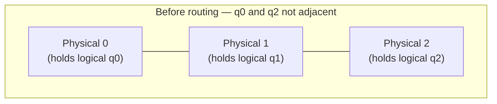

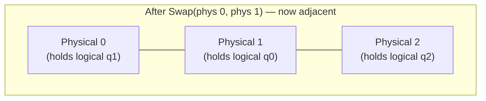

The router emits `Swap(phys0, phys1)` — moving logical `q0` (the **first** argument of `Cx(q0, q2)`) one hop closer — then emits `Cx` at physical positions `(1, 2)`, which are now adjacent. Logical `q1`, which never appears in this `Cx`, has been silently displaced to physical position `0` as a side effect; this is exactly why identity restoration (below) has to happen, not just "route the gates that need it."

### Why argument order matters

For:

```text
Cx(control, target)
```

the two arguments are asymmetric.

The router therefore always moves the **first argument** toward the second argument's physical location.

It does not arbitrarily choose which qubit to move.

This prevents routing from silently changing:

```text
Cx(control, target)
```

into:

```text
Cx(target, control)
```

which would be a semantic error rather than a routing optimization.

---

## Restoring logical identity

After routing, the physical mapping is restored to the identity mapping.

This is **not optional bookkeeping**.

A SWAP inserted for one interaction also displaces another logical qubit. That qubit might never have participated in a subsequent gate, but it still occupies a different physical position.

Without restoration, the final physical wire arrangement could silently differ from the logical circuit's expected output ordering.

The result could therefore have incorrect fidelity even if every individual gate transformation was correct.

---

## General-graph token swapping

The original restoration strategy used adjacent-index bubble sorting.

That implicitly assumed:

```text
0 ↔ 1 ↔ 2 ↔ 3 ↔ ...
```

which is valid for a linear topology but **not** for a heavy-hex graph.

The current implementation instead:

1. Builds a BFS spanning tree of the coupling graph.
2. Repeatedly selects a leaf.
3. If the leaf already contains its own logical token, retires it.
4. Otherwise, walks the required token toward its home position using tree-adjacent swaps.

This produces a connectivity-correct restoration pass on general graphs.

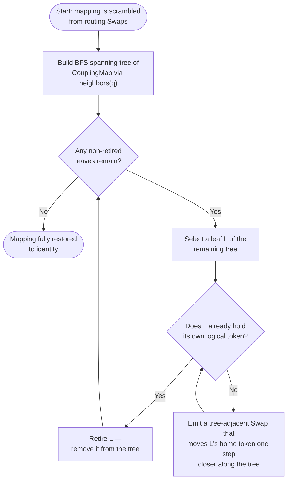

Each retired leaf shrinks the remaining tree by one node, so the process always terminates — but, as the correctness-vs-optimality note below states, it is not tuned to minimize the number of `Swap`s it emits along the way.

### Optimization boundary

This algorithm is intentionally **not SWAP-count optimal**.

Optimal token swapping on general graphs is NP-hard.

The module's current goal is:

> **Correct routing first; global SWAP minimization later.**

---

## Measurement routing

`Gate::Measure` is treated as single-qubit-shaped for routing.

It is remapped **at the point where it is encountered**, using the qubit's current physical location.

It does not wait until the final identity restoration pass.

## The full mapping lifecycle

Putting the pieces above together, a `logical → physical` mapping is born, mutated, and fully consumed within a single call to `route::route` — no other module ever sees it:

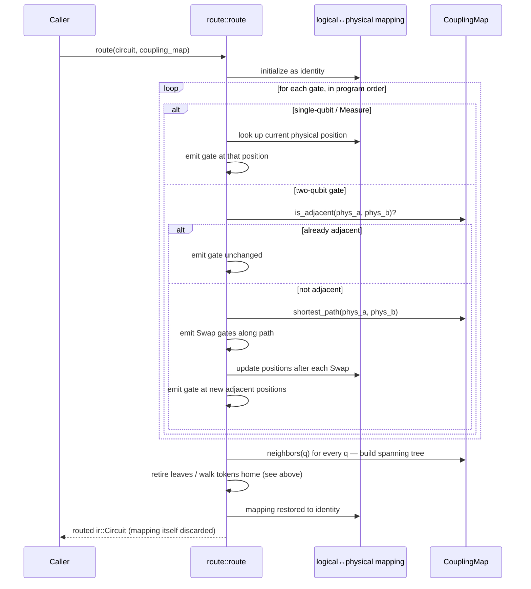

---

# 7. `optimize.rs` — Native-level peephole optimization

`optimize.rs` is the smaller sibling of the backend optimizer.

It operates on:

```text
NativeCircuit
```

with the native gate set:

```text
{ Rz, Ry, Rzz }
```

Two passes run to a fixed point.

### Rotation fusion

Adjacent same-axis operations on the same qubit or qubit pair are combined:

```text
Rz(a) ; Rz(b)
        ↓
Rz(a + b)
```

and similarly for `Ry` and `Rzz`.

### Zero-angle elimination

If the combined angle is exactly zero, the resulting gate is removed.

### Measurement safety

`Measure` is never a candidate for these transformations.

It is not a rotation, and more importantly it represents a real classical side effect that the caller depends upon.

---

# 8. `emit.rs` — Execution and QASM emission

`emit.rs` is the module that actually touches `sirraya_qutub`.

### Execution APIs

Native circuits:

```text
run
apply_to
```

Backend circuits:

```text
run_backend
apply_backend_to
```

These execute against a real `QuantumRegister`.

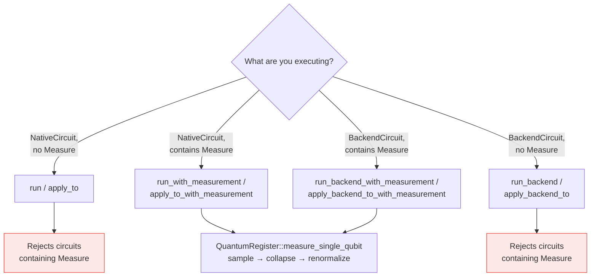

---

## Measurement-aware execution

The basic execution entry points reject `Measure` because they have nowhere to place a classical outcome.

For measurement circuits, use:

```text
run_with_measurement
apply_to_with_measurement
```

or their backend equivalents.

These execute measurement through:

```text
QuantumRegister::measure_single_qubit
```

The measurement path is a genuine Born-rule-sampled projective measurement:

1. Sample according to the state probabilities.
2. Collapse the state.
3. Renormalize the resulting state vector.

This is not a symbolic measurement approximation.

---

## QASM round-tripping

`to_qasm` emits a native circuit back into the `sirraya_qutub` OPENQASM **2.0** dialect; `to_qasm3` emits the identical gate order and mnemonics as OPENQASM **3.0** text instead (`qubit[n] q;`/`bit[n] c;` declarations, assignment-style `c[i] = measure q[j];`). Both round-trip back through `qasm::parse` to the same `Circuit` — they differ only in which of `parse`'s two recognized spellings they happen to emit (see §4's `qasm.rs` section for the full dialect comparison).

The emitted QASM includes a `creg`/`bit` register sized according to:

```text
num_clbits
```

rather than simply using:

```text
num_qubits
```

This distinction matters because a circuit's classical-bit count does not necessarily equal its qubit count.

Hardcoding the classical register to `num_qubits` would silently break round-tripping for such circuits.

`ibm_export::to_ibm_qasm` deliberately stays OPENQASM 2.0-only rather than growing its own 3.0 variant: it feeds `submit_ibm.py`, whose Qiskit loader (`QuantumCircuit.from_qasm_str`) only accepts 2.0.

---

# 9. `fidelity.rs` — Fast fidelity budgeting

`fidelity.rs` provides a **fast, gate-count-based fidelity estimate** based on an independent-depolarizing-event approximation.

It is intended as a sanity check:

```text
"Is this circuit likely worth running?"
```

It is **not** intended to replace:

* noisy simulation
* XEB
* hardware execution
* experimentally measured fidelity

The goal is to provide an inexpensive estimate before paying the computational cost of a full noisy simulation.

---

## Published calibration

`PublishedCalibration` originally independently re-derived the calibration formula and Quantinuum Helios parameters represented by:

```text
sirraya_qutub::xeb::HardwareCalibration
```

The implementation later confirmed that the two representations are field-for-field identical for the shared Quantinuum Helios entry.

The independent derivation was therefore removed.

`quantinuum_helios_2026()` now acts as a thin `From`-based wrapper around the real simulator type.

A test pins the two values together so they cannot silently diverge in the future.

---

## Other backend calibrations

The following models currently stand on their own:

```text
ibm_heron_r2()
rigetti_ankaa3()
google_willow_2024()
```

They do not have corresponding entries in `sirraya_qutub::xeb`.

Their documented sources and limitations therefore remain important when interpreting those figures.

In particular, the single-qubit figure for `rigetti_ankaa3` comes from the previous device generation and is explicitly identified as such. `google_willow_2024` specifically uses Willow's "Chip 1: Quantum Error Correction" (CZ-tuned) configuration numbers, since CZ is the two-qubit gate `backend::google::GoogleSpec` actually lowers to — not the alternate "Chip 2" iSWAP-tuned figures from the same spec sheet.

---

# 10. Testing philosophy

> ## Verification standard
>
> **Every gate identity, decomposition, and optimization pass is verified against the real `sirraya_qutub::core::QuantumRegister`.**
>
> Algebraic derivation is necessary, but it is not sufficient.

This pattern appears throughout:

```text
tests/decompositions.rs
ir_optimize.rs
route.rs
backend.rs
tests/measurement.rs
```

---

## 10.1 Quantum identity testing

For gate identities and unitary transformations, the recurring process is:

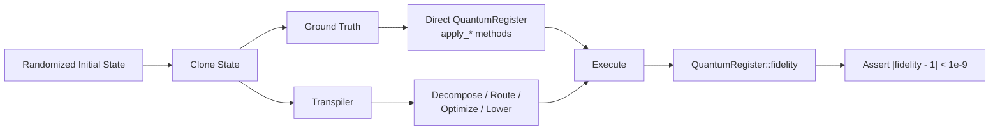

### Randomized state

The initial state is generated from a random product of single-qubit rotations.

This ensures:

* amplitudes are generally non-zero
* relative phases matter
* errors are not hidden by trivial basis states

### Ground truth

The reference implementation executes directly against a cloned `QuantumRegister` using its native `apply_*` operations.

### Transpiler path

Another clone passes through the actual transformation pipeline:

```text
decompose
→ route
→ optimize
→ lower
→ execute
```

depending on what is being tested.

### Fidelity

The two resulting states are compared using:

```text
QuantumRegister::fidelity
```

with:

```text
(fidelity - 1.0).abs() < 1e-9
```

as the correctness threshold.

This makes sign errors and incorrect phase conventions highly visible.

> A wrong algebraic sign should not survive as a subtle discrepancy. The two implementations should either agree to numerical precision or clearly disagree.

---

# 11. Measurement testing

Measurement cannot use the same fidelity methodology because measurement collapses the quantum state.

Instead, `tests/measurement.rs` uses statistical sampling.

The test:

1. Runs the measurement path for **4000 shots**.
2. Collects empirical outcome frequencies.
3. Computes the ideal Born-rule probability.
4. Compares the empirical and ideal distributions.
5. Allows a tolerance of **six standard errors**.

The ideal probability is obtained by running the same circuit with the `Measure` operations omitted and querying:

```text
get_measurement_probability
```

The tolerance is deliberately wide enough that normal sampling noise almost never causes a false failure, while still making genuine implementation bugs statistically detectable.

---

# 12. Adding a new gate identity

If a new decomposition or optimization identity is added anywhere in the crate, it should follow the same verification standard.

### Required

For unitary identities:

```text
fidelity-based verification
```

For measurement behavior:

```text
shot-based statistical verification
```

### Not sufficient

A test containing only:

```rust
assert_eq!(hand_computed_matrix, expected_matrix);
```

does not meet the crate's verification philosophy by itself.

The implementation should ultimately be validated against the real `QuantumRegister`.

---

# 13. Current implementation status

## Completed

| Area                    |  Status  | What is implemented                                                         |
| ----------------------- | :------: | --------------------------------------------------------------------------- |
| Measurement             | Complete | End-to-end parsing, IR, routing, lowering, execution, and statistical tests |
| Calibration consistency | Complete | Quantinuum Helios calibration is shared and test-pinned                     |
| IBM topology            | Complete | Real heavy-hex connectivity model                                           |
| Identity restoration    | Complete | General-graph token-swapping restoration                                    |
| Source optimization     | Complete | Conservative cancellation and disjoint-qubit commuting                      |
| Native optimization     | Complete | Rotation fusion and zero-angle elimination                                  |
| Backend optimization    | Complete | Peephole optimization + matrix resynthesis                                  |
| Fidelity estimation     | Complete | Fast gate-count-based budgeting                                             |

### P0.1 — Measurement

`Gate::Measure` is supported end-to-end through:

```text
qasm.rs
    ↓
ir.rs / native.rs
    ↓
route.rs
    ↓
backend.rs
    ↓
emit.rs
    ↓
tests/measurement.rs
```

This includes actual classical outcomes and shot-based verification.

### P0.2 — Calibration consistency

`fidelity::PublishedCalibration` and:

```text
sirraya_qutub::xeb::HardwareCalibration
```

were confirmed to be field-for-field identical for their shared Quantinuum Helios entry.

The independent re-derivation was replaced by a thin wrapper and a test preventing future drift.

### P1.1 — IBM heavy-hex topology

`IbmQ` now routes against:

```text
CouplingMap::heavy_hex_for
CouplingMap::heavy_hex_grid
```

instead of using a linear-chain stand-in.

### P1.2 — General identity restoration

`route.rs` now restores logical identity using connectivity-correct graph routing rather than adjacent-index bubble sorting.

This fixes a real correctness issue that appeared once IBM's heavy-hex topology was introduced.

---

# 14. Open work and known gaps

| Area                     |    Status    | Current limitation                                  |
| ------------------------ | :----------: | --------------------------------------------------- |
| Rigetti topology         |     Open     | Still uses a conservative linear coupling map       |
| Pasqal backend           |    Planned   | Requires atom placement and blockade-aware routing  |
| Photonic backend         |    Planned   | Needs its own gate representation; doesn't fit `BackendSpec`'s `Rot`/`Rzz` shape (see §4's `backend.rs` section) |
| SWAP minimization        |    Planned   | No global routing optimization yet                  |
| Source-level commutation |    Planned   | Only disjoint-qubit commutation currently supported |
| Optimal token swapping   | Not targeted | General problem is computationally difficult        |

---

## Rigetti topology

Rigetti is currently modeled with a conservative `linear` coupling map rather than its actual square-grid topology.

This is safe in the current implementation because a route that succeeds on a line also succeeds on the more permissive grid.

However, the transpiler is not yet taking advantage of Rigetti's real connectivity.

---

## Pasqal / neutral atoms, and photonic

`Backend::Pasqal` and `Backend::Photonic` both remain unimplemented.

This is intentional, and — since backend lowering (§4, `backend.rs`) moved from a closed enum to an open `BackendSpec` trait — no longer a matter of "haven't gotten to it yet" in the way it would have been under the old design. Either could be wired in as a new `Backend::` constant in an afternoon; the reason neither is isn't friction, it's that neither platform's physics is expressible through `BackendSpec` as written.

A proper neutral-atom backend requires reasoning about:

```text
atom placement
blockade radius
physical movement
interaction geometry
```

That is materially different from lowering a circuit onto a fixed two-qubit gate topology — `BackendSpec::coupling_map` returns one fixed `CouplingMap`, which has nothing to say about atoms whose reachability changes as they move.

A photonic backend fails even earlier: `BackendSpec::rot_axis`/`push_two_qubit_zz` assume the native gate set is `{Rz, one other rotation axis, an Rzz-derived two-qubit gate}` acting on qubit-indexed wires. Linear-optical qubits don't have that shape — the primitives are beamsplitters/phase shifters on modes, and two-qubit interaction is typically probabilistic rather than a fixed unitary — so there's no `rot_axis`/`push_two_qubit_zz` pair that would honestly describe it.

A digital-mode Rigetti-style stand-in for either was explicitly rejected because it would make the architecture appear to support a hardware family that has not actually been modeled or tested. A real implementation of either needs its own gate representation below `ir::Circuit`, not a `BackendSpec` impl — see §4's `backend.rs` section for the fuller version of this argument.

---

## SWAP-count minimization

`route.rs` currently prioritizes correctness over global routing efficiency.

It does not yet perform:

* reordering of independent gates
* lookahead
* future-interaction analysis
* global SWAP minimization

The current router therefore answers:

> **"Can this circuit be executed correctly on this topology?"**

before attempting to answer:

> **"What is the globally minimal SWAP schedule?"**

That distinction is deliberate.

---

## Source-level commutation

`ir_optimize.rs` currently uses only the universally safe rule:

```text
disjoint qubit sets commute
```

It does not yet implement gate-specific rules such as:

```text
Rz commutes through the control wire of Cx
```

Those rules already exist in the backend peephole optimizer where they can be individually derived and tested.

The source optimizer remains intentionally conservative until equivalent rules can be introduced with the same verification standard.

---

## Token-swapping optimality

The current `restore_identity_mapping` implementation is designed for **correctness**, not minimum SWAP count.

Optimal token swapping is NP-hard on general graphs.

Consequently, future contributors should not treat the current graph algorithm as a failed optimization attempt. It is intentionally a correctness-focused baseline.

---

# 15. Design principles

The architecture can be summarized by a few rules.

## 1. Preserve semantic richness early

The source IR should represent the circuit faithfully before hardware-specific constraints are introduced.


---

## 2. Route before native decomposition

Routing happens at the source level so the compiler can reason about logical operations before they are expanded into lower-level gates.

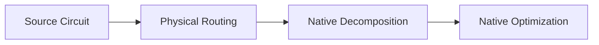

---

## 3. Reuse validated mathematics

The ZYZ matrix algebra lives in one place and is shared by multiple compilation paths.

```mermaid
flowchart TD
    A["native.rs"] --> B["Validated Mat2 / ZYZ Algebra"]
    B --> C["backend.rs"]
    B --> D["Resynthesis"]
```

This avoids maintaining multiple mathematically equivalent implementations.

---

## 4. Separate correctness from optimization

The project does not assume that the most optimized transformation is automatically the safest transformation.

```mermaid
flowchart TD
    A["Correctness"] --> B["Hardware Validity"]
    B --> C["Semantic Preservation"]
    C --> D["Optimization"]
```

This is particularly visible in routing, where the current implementation explicitly accepts non-optimal SWAP counts in exchange for a correctness-first algorithm.

---

## 5. Validate transformations against the simulator

The transpiler is not trusted merely because an identity looks correct on paper.

The actual implementation is checked against:

```text
sirraya_qutub::core::QuantumRegister
```

with numerical fidelity testing wherever possible.

---

# 16. Architecture summary

At a high level, the crate is a layered compiler:

```mermaid
flowchart TD
    SOURCE["Source Layer<br/><br/>OPENQASM 2.0 / 3.0<br/>Rich Quantum IR"]

    OPT["Optimization Layer<br/><br/>Cancellation<br/>Conservative Reordering"]

    ROUTING["Routing Layer<br/><br/>Logical → Physical Mapping<br/>SWAP Insertion"]

    BACKEND["Backend Layer<br/><br/>Trapped Ion<br/>IBM Quantum<br/>Rigetti"]

    NATIVE["Native Optimization Layer<br/><br/>Fusion<br/>Cancellation<br/>Resynthesis"]

    VERIFY["Verification Layer<br/><br/>Fidelity Tests<br/>Measurement Statistics"]

    EXEC["Execution Layer<br/><br/>sirraya_qutub::QuantumRegister<br/>or QASM Output"]

    SOURCE --> OPT
    OPT --> ROUTING
    ROUTING --> BACKEND
    BACKEND --> NATIVE
    NATIVE --> VERIFY
    VERIFY --> EXEC
```

The central architectural idea is:

> **Keep the circuit semantically rich for as long as possible, introduce hardware constraints deliberately, optimize only where the transformation is justified, and verify every non-trivial transformation against the actual simulator.**

---

# 17. See also

[`CONTRIBUTING.md`](CONTRIBUTING.md) contains:

* project setup
* test commands
* coding conventions
* contribution workflow
* pull-request checklist

This document is intentionally different:

> **`CONTRIBUTING.md` tells you how to work on the crate.**
> **This document explains what the crate is, how its architecture fits together, and why the implementation makes the choices it does.**