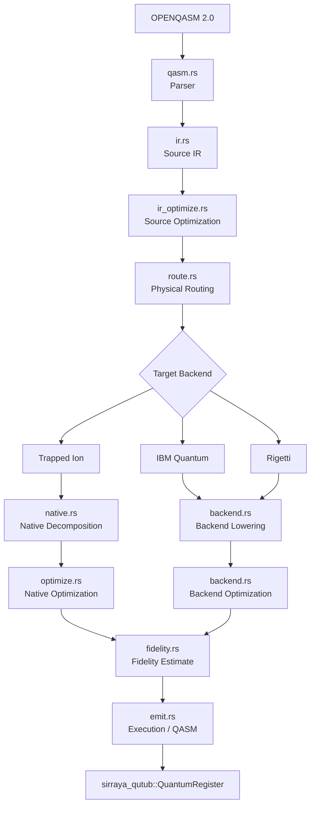
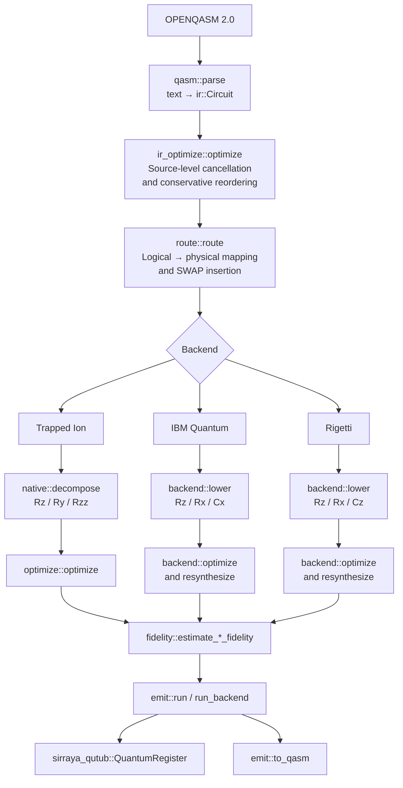
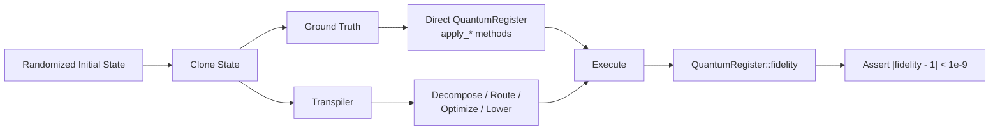
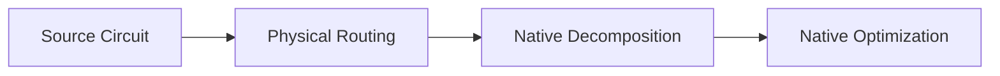
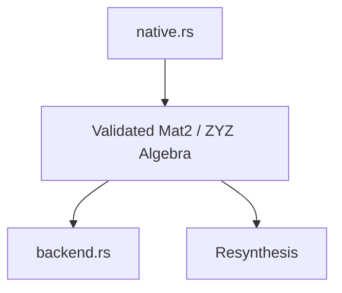
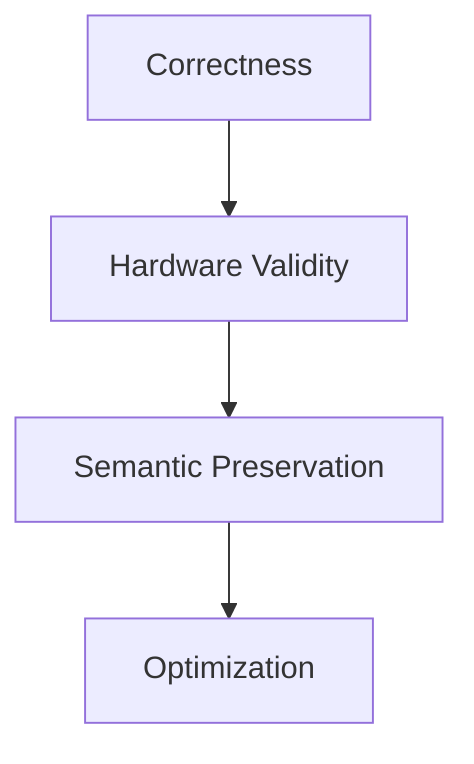
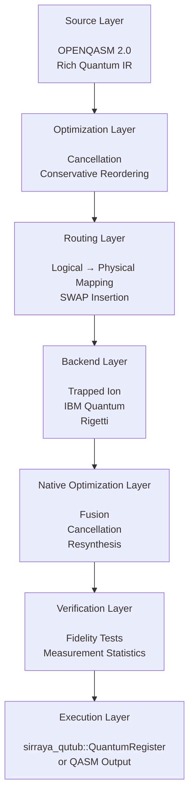

# Architecture — `sirraya-qutub-transpiler`

> **Deep-dive architecture reference** for the Sirraya QuTub transpiler: its intermediate representation, optimization pipeline, hardware-aware routing, backend lowering, execution model, and verification strategy.
>
> **Looking for setup, tests, or PR instructions?** See [`CONTRIBUTING.md`](CONTRIBUTING.md). This document explains **what the transpiler does, why it is built this way, and what remains open**.

---

## 1. What this crate is

`sirraya-qutub-transpiler` is a **QASM 2.0 importer and multi-backend native-gate compiler** for circuits that ultimately execute on `sirraya_qutub::core::QuantumRegister` — Sirraya Labs' statevector simulator.

You can provide **OPENQASM 2.0** text or construct a `Circuit` directly. The transpiler then takes the circuit through a hardware-aware compilation pipeline:


### The compilation stages

| Stage                    | Responsibility                                                           |
| ------------------------ | ------------------------------------------------------------------------ |
| **Parse**                | Convert OPENQASM 2.0 into the transpiler IR                              |
| **Source optimization**  | Cancel, reorder, and simplify gates before hardware lowering             |
| **Routing**              | Insert `Swap` gates to satisfy physical connectivity                     |
| **Native decomposition** | Convert gates into a target-native gate vocabulary                       |
| **Backend lowering**     | Adapt circuits to specific backend families                              |
| **Native optimization**  | Fuse rotations, remove cancellations, and resynthesize single-qubit runs |
| **Fidelity estimation**  | Provide a fast, simulation-free sanity check                             |
| **Execution / emission** | Run against `sirraya_qutub` or emit QASM                                 |

> **Verification principle**
>
> Every non-trivial identity in every module is checked against the real simulator, not merely asserted algebraically.
>
> This is the crate's most important engineering convention.

---

## 2. Architecture at a glance

The crate deliberately separates **source-level semantics**, **hardware topology**, **native gate synthesis**, **backend-specific lowering**, and **execution**.



### Module map

| Module           | Role                                       |
| ---------------- | ------------------------------------------ |
| `ir.rs`          | Source-level circuit representation        |
| `qasm.rs`        | OPENQASM 2.0 importer                      |
| `ir_optimize.rs` | Source-level optimization                  |
| `native.rs`      | Trapped-ion-style native decomposition     |
| `backend.rs`     | Backend-specific lowering and optimization |
| `coupling.rs`    | Physical connectivity models               |
| `route.rs`       | Hardware-aware SWAP insertion              |
| `optimize.rs`    | Native-level peephole optimization         |
| `emit.rs`        | Execution and QASM emission                |
| `fidelity.rs`    | Fast fidelity budgeting                    |

---

## 3. The compilation pipeline

The pipeline is intentionally divided into distinct transformations rather than treating transpilation as a single optimization pass.



`lib.rs`'s own documentation contains the same high-level architecture diagram and serves as the compact map of the crate.

---

# 4. Module-by-module

## `ir.rs` — Source gate set

`Gate` is deliberately rich. It mirrors the `QuantumRegister` operation surface rather than prematurely restricting circuits to a particular hardware vocabulary.

### Supported source operations

```text
H
X / Y / Z
S / Sdg
T / Tdg
Rx / Ry / Rz
Cx
Cz
Swap
Rxx / Ryy / Rzz
Cp
Measure
```

The narrowing to hardware-native gates does **not** happen here. That responsibility belongs to `native.rs` and `backend.rs`.

`Circuit` also carries `num_clbits`, mirroring `num_qubits`, because `Gate::Measure` needs a destination for its classical outcome.

### Measurement is intentionally special

`Gate::Measure` is the one variant that is not a unitary rewrite target.

It represents a **classical side effect**, so several parts of the compiler treat it specially rather than pretending it behaves like an ordinary quantum gate.

---

## `qasm.rs` — OPENQASM importer

The parser implements a deliberately constrained subset of **OPENQASM 2.0**.

It accepts:

* the dialect emitted by `sirraya_qutub::QuantumCircuit::to_qasm`
* the dialect emitted by `QuantumRegister::to_qasm`
* common `qelib1.inc` mnemonics used by tools such as Qiskit for the same gate set

It intentionally does **not** implement:

* gate definitions
* classical control
* arbitrary includes
* multiple `qreg` / `creg` declarations
* barriers

Anything outside the supported subset produces a **parse error identifying the offending line**, rather than being silently ignored.

### Measurement safety

A statement such as:

```text
measure q[i] -> c[j];
```

is range-checked against the declared `qreg` and `creg` sizes at parse time.

This prevents invalid classical destinations from surviving into later compilation stages.

---

## `ir_optimize.rs` — Source-level optimization

The source optimizer operates before hardware-specific lowering.

It performs two primary transformations.

### Inverse and self-inverse cancellation

Examples include:

```text
H ; H
S ; Sdg
Cx(a,b) ; Cx(a,b)
```

as well as zero-angle and angle-negating rotation pairs.

### Conservative commuting reordering

The optimizer can slide gates past one another when their qubit sets are disjoint, allowing otherwise separated cancellable gates to become adjacent.

The key architectural constraint is deliberate:

> **Only universally valid disjoint-qubit commutation is used here.**

The optimizer does **not** encode hardware- or gate-specific identities such as:

```text
Rz commutes through a CNOT control wire
```

Those identities belong in the backend-specific optimization layer, where each rule can have its own derivation and verification.

### Measurement barrier

`Gate::Measure` is never treated as commutable.

This remains true even when the measured qubit is disjoint from another gate.

The reason is that measurement has a classical side effect. Two measurements can also write to the same classical bit, which cannot be represented purely by examining qubit overlap.

---

## `native.rs` — Trapped-ion native gate set

The native decomposition stage reduces the source gate set to:

```text
{ Rz, Ry, Rzz }
```

This corresponds to the gate vocabulary used by the `sirraya_qutub` Quantinuum Helios `HardwareCalibration` model.

### Exact identities

The decomposition includes exact identities such as:

#### ZYZ Euler decomposition

Arbitrary single-qubit unitaries are decomposed using a small local complex / 2×2 matrix implementation:

```text
C
Mat2
matmul
```

This algebra remains local to `native.rs` so the synthesizer does not depend on the simulator's internal complex-number representation.

#### CNOT

```text
Cx = H(target)
   · Cp(control, target, π)
   · H(target)
```

#### SWAP

```text
Swap = Cx(a,b)
     ; Cx(b,a)
     ; Cx(a,b)
```

#### RXX

```text
Rxx(θ) =
    (H ⊗ H)
    · Rzz(θ)
    · (H ⊗ H)
```

because:

```text
X = H · Z · H
```

#### RYY

```text
Ryy(θ) =
    (Rx(π/2) ⊗ Rx(π/2))
    · Rzz(θ)
    · (Rx(-π/2) ⊗ Rx(-π/2))
```

### Shared validated algebra

`C`, `Mat2`, and the matrix builders are `pub(crate)` rather than fully private.

This allows `backend.rs` to reuse the **same validated ZYZ implementation** for resynthesis rather than creating a second independently derived implementation.

> **Design principle:** one implementation of the algebra, one verification path, multiple consumers.

---

## `backend.rs` — Multi-backend lowering

`backend.rs` maps circuits onto the actual native gate vocabulary of supported backend families.

### Backend matrix

| Backend         | Native gate set   | Connectivity model | Routing      |
| --------------- | ----------------- | ------------------ | ------------ |
| **Trapped Ion** | `Rz`, `Ry`, `Rzz` | All-to-all         | Not required |
| **IBM Quantum** | `Rz`, `Rx`, `Cx`  | Heavy-hex          | Required     |
| **Rigetti**     | `Rz`, `Rx`, `Cz`  | Square grid        | Required     |

### Trapped Ion

The trapped-ion backend delegates directly to:

```text
native::decompose
```

### IBM Quantum

IBM Quantum uses:

```text
{ Rz, Rx, Cx }
```

The backend relies on exact identities including:

```text
Ry(θ) = Rx(-π/2)
       · Rz(θ)
       · Rx(π/2)
```

and:

```text
Rzz(a,b,θ) =
    Cx(a,b)
    · Rz(b,θ)
    · Cx(a,b)
```

### Rigetti

Rigetti uses:

```text
{ Rz, Rx, Cz }
```

Rather than naively replacing a CNOT with a CZ expansion containing four Hadamards, the implementation uses:

```text
H · Rz(θ) · H = Rx(θ)
```

to collapse the middle of the expansion and reach a two-Hadamard representation.

---

### Backend optimization

Two cleanup passes run to a fixed point.

#### `optimize`

A peephole optimizer that handles:

* adjacent same-axis rotation fusion
* `Rz` commutation through diagonal-compatible gates
* `Cz` / `Rzz` commutation
* `Cx` commutation through the **control** wire only
* same-pair `Cx` / `Cz` / `Rzz` cancellation and fusion

A critical correctness constraint is preserved:

> `Rz` may commute through the control wire of a `Cx`, but **not its target wire**.

The tests specifically pin this distinction down.

#### `resynthesize`

`resynthesize` goes further than local peephole optimization.

It collects the **entire matrix product** of a maximal single-qubit run and reconstructs it using the validated ZYZ decomposition.

This means a run containing six or more single-qubit gates can collapse to at most three gates, regardless of how the original sequence was formed.

The important distinction is that `optimize` correctly refuses to merge across certain real intervening `Rz` gates, while `resynthesize` can reason about the entire matrix product.

### Fixed-point strategy

`lower` repeatedly applies:

```text
resynthesize
→ optimize
→ resynthesize
→ ...
```

until the transformations reach a fixed point.

This matters because one optimization can expose another:

```text
optimization A
      ↓
reveals cancellation
      ↓
optimization B
      ↓
creates new resynthesis opportunity
```

---

### Connectivity integration

`Backend::coupling_map` connects backend lowering to `coupling.rs` and `route.rs`.

| Backend     | Coupling map      |
| ----------- | ----------------- |
| Trapped Ion | `None`            |
| IBM Quantum | `heavy_hex_for`   |
| Rigetti     | `square_grid_for` |

Trapped-ion routing is unnecessary because the modeled shared motional mode provides direct pairwise reachability.

---

### Why Pasqal is not implemented

`Backend::Pasqal` is deliberately **not** represented as another fixed-connectivity digital backend.

Neutral-atom platforms require:

* atom placement
* blockade-radius reasoning
* movement / placement constraints
* hardware-aware routing fundamentally different from fixed two-qubit gate connectivity

Modeling Pasqal as a Rigetti-like backend would therefore create the appearance of support without actually representing the hardware model.

> **The project deliberately prefers an honest missing backend over a misleading abstraction.**

---

# 5. `coupling.rs` — Physical qubit connectivity

`CouplingMap` describes which physical qubit pairs can directly participate in a native two-qubit operation.

## Supported topology models

### `linear(n)`

A simple chain where:

```text
q ↔ q + 1
```

are adjacent.

It is no longer used by any backend as its primary physical topology, but remains useful as a topology-free stand-in for the zero- and one-qubit cases.

---

### `heavy_hex_grid(rows, cols)`

IBM's superconducting processor family is modeled using a heavy-hex lattice.

The topology contains:

* degree-≤3 data qubits
* degree-2 flag qubits
* a hexagonal connectivity structure

`heavy_hex_for(n)`:

1. Finds the smallest heavy-hex grid containing at least `n` qubits.
2. Performs a BFS traversal.
3. Takes a prefix containing exactly `n` qubits.

Because a BFS prefix of a connected graph remains connected, this gives a connected physical topology without claiming to reproduce the exact numbering of a particular IBM chip.

> **Important:** this represents the **topology family**, not a specific processor's exact qubit numbering.

---

### `square_grid(rows, cols)`

Rigetti's current Ankaa-class processors are modeled as a rectangular square lattice.

The topology provides approximately:

```text
Interior → degree 4
Edges    → degree 3
Corners  → degree 2
```

This intentionally differs from the square-octagonal unit cell associated with earlier Aspen-generation devices.

`square_grid_for(n)` uses the same basic strategy as `heavy_hex_for(n)`:

1. Find the smallest grid containing at least `n` qubits.
2. Traverse using BFS.
3. Take the connected prefix of exactly `n` qubits.

---

### Graph operations

`CouplingMap` exposes:

```text
neighbors(q)
is_adjacent(a, b)
shortest_path(a, b)
```

`neighbors(q)` was added specifically so `route.rs` can reason about the graph structure and construct a spanning tree.

`is_adjacent` only answers a local yes/no question, while `shortest_path` is point-to-point. Neither is sufficient for general graph traversal.

---

# 6. `route.rs` — Hardware-aware SWAP insertion

Routing occurs **before** native decomposition.

This is important because routing operates on the source-level circuit and therefore preserves the logical structure of the original gate set for as long as possible.

The router:

1. Maintains a `logical → physical` mapping.
2. Re-addresses single-qubit gates according to the current mapping.
3. Detects non-adjacent two-qubit operations.
4. Inserts `Swap` gates along a shortest physical path.
5. Preserves the original argument order.

### Why argument order matters

For:

```text
Cx(control, target)
```

the two arguments are asymmetric.

The router therefore always moves the **first argument** toward the second argument's physical location.

It does not arbitrarily choose which qubit to move.

This prevents routing from silently changing:

```text
Cx(control, target)
```

into:

```text
Cx(target, control)
```

which would be a semantic error rather than a routing optimization.

---

## Restoring logical identity

After routing, the physical mapping is restored to the identity mapping.

This is **not optional bookkeeping**.

A SWAP inserted for one interaction also displaces another logical qubit. That qubit might never have participated in a subsequent gate, but it still occupies a different physical position.

Without restoration, the final physical wire arrangement could silently differ from the logical circuit's expected output ordering.

The result could therefore have incorrect fidelity even if every individual gate transformation was correct.

---

## General-graph token swapping

The original restoration strategy used adjacent-index bubble sorting.

That implicitly assumed:

```text
0 ↔ 1 ↔ 2 ↔ 3 ↔ ...
```

which is valid for a linear topology but **not** for a heavy-hex graph.

The current implementation instead:

1. Builds a BFS spanning tree of the coupling graph.
2. Repeatedly selects a leaf.
3. If the leaf already contains its own logical token, retires it.
4. Otherwise, walks the required token toward its home position using tree-adjacent swaps.

This produces a connectivity-correct restoration pass on general graphs.

### Optimization boundary

This algorithm is intentionally **not SWAP-count optimal**.

Optimal token swapping on general graphs is NP-hard.

The module's current goal is:

> **Correct routing first; global SWAP minimization later.**

---

## Measurement routing

`Gate::Measure` is treated as single-qubit-shaped for routing.

It is remapped **at the point where it is encountered**, using the qubit's current physical location.

It does not wait until the final identity restoration pass.

---

# 7. `optimize.rs` — Native-level peephole optimization

`optimize.rs` is the smaller sibling of the backend optimizer.

It operates on:

```text
NativeCircuit
```

with the native gate set:

```text
{ Rz, Ry, Rzz }
```

Two passes run to a fixed point.

### Rotation fusion

Adjacent same-axis operations on the same qubit or qubit pair are combined:

```text
Rz(a) ; Rz(b)
        ↓
Rz(a + b)
```

and similarly for `Ry` and `Rzz`.

### Zero-angle elimination

If the combined angle is exactly zero, the resulting gate is removed.

### Measurement safety

`Measure` is never a candidate for these transformations.

It is not a rotation, and more importantly it represents a real classical side effect that the caller depends upon.

---

# 8. `emit.rs` — Execution and QASM emission

`emit.rs` is the module that actually touches `sirraya_qutub`.

### Execution APIs

Native circuits:

```text
run
apply_to
```

Backend circuits:

```text
run_backend
apply_backend_to
```

These execute against a real `QuantumRegister`.

---

## Measurement-aware execution

The basic execution entry points reject `Measure` because they have nowhere to place a classical outcome.

For measurement circuits, use:

```text
run_with_measurement
apply_to_with_measurement
```

or their backend equivalents.

These execute measurement through:

```text
QuantumRegister::measure_single_qubit
```

The measurement path is a genuine Born-rule-sampled projective measurement:

1. Sample according to the state probabilities.
2. Collapse the state.
3. Renormalize the resulting state vector.

This is not a symbolic measurement approximation.

---

## QASM round-tripping

`to_qasm` emits a native circuit back into the `sirraya_qutub` QASM dialect.

The emitted QASM includes a `creg` sized according to:

```text
num_clbits
```

rather than simply using:

```text
num_qubits
```

This distinction matters because a circuit's classical-bit count does not necessarily equal its qubit count.

Hardcoding `creg` to `num_qubits` would silently break round-tripping for such circuits.

---

# 9. `fidelity.rs` — Fast fidelity budgeting

`fidelity.rs` provides a **fast, gate-count-based fidelity estimate** based on an independent-depolarizing-event approximation.

It is intended as a sanity check:

```text
"Is this circuit likely worth running?"
```

It is **not** intended to replace:

* noisy simulation
* XEB
* hardware execution
* experimentally measured fidelity

The goal is to provide an inexpensive estimate before paying the computational cost of a full noisy simulation.

---

## Published calibration

`PublishedCalibration` originally independently re-derived the calibration formula and Quantinuum Helios parameters represented by:

```text
sirraya_qutub::xeb::HardwareCalibration
```

The implementation later confirmed that the two representations are field-for-field identical for the shared Quantinuum Helios entry.

The independent derivation was therefore removed.

`quantinuum_helios_2026()` now acts as a thin `From`-based wrapper around the real simulator type.

A test pins the two values together so they cannot silently diverge in the future.

---

## Other backend calibrations

The following models currently stand on their own:

```text
ibm_heron_r2()
rigetti_ankaa3()
```

They do not have corresponding entries in `sirraya_qutub::xeb`.

Their documented sources and limitations therefore remain important when interpreting those figures.

In particular, the single-qubit figure for `rigetti_ankaa3` comes from the previous device generation and is explicitly identified as such.

---

# 10. Testing philosophy

> ## Verification standard
>
> **Every gate identity, decomposition, and optimization pass is verified against the real `sirraya_qutub::core::QuantumRegister`.**
>
> Algebraic derivation is necessary, but it is not sufficient.

This pattern appears throughout:

```text
tests/decompositions.rs
ir_optimize.rs
route.rs
backend.rs
tests/measurement.rs
```

---

## 10.1 Quantum identity testing

For gate identities and unitary transformations, the recurring process is:



### Randomized state

The initial state is generated from a random product of single-qubit rotations.

This ensures:

* amplitudes are generally non-zero
* relative phases matter
* errors are not hidden by trivial basis states

### Ground truth

The reference implementation executes directly against a cloned `QuantumRegister` using its native `apply_*` operations.

### Transpiler path

Another clone passes through the actual transformation pipeline:

```text
decompose
→ route
→ optimize
→ lower
→ execute
```

depending on what is being tested.

### Fidelity

The two resulting states are compared using:

```text
QuantumRegister::fidelity
```

with:

```text
(fidelity - 1.0).abs() < 1e-9
```

as the correctness threshold.

This makes sign errors and incorrect phase conventions highly visible.

> A wrong algebraic sign should not survive as a subtle discrepancy. The two implementations should either agree to numerical precision or clearly disagree.

---

# 11. Measurement testing

Measurement cannot use the same fidelity methodology because measurement collapses the quantum state.

Instead, `tests/measurement.rs` uses statistical sampling.

The test:

1. Runs the measurement path for **4000 shots**.
2. Collects empirical outcome frequencies.
3. Computes the ideal Born-rule probability.
4. Compares the empirical and ideal distributions.
5. Allows a tolerance of **six standard errors**.

The ideal probability is obtained by running the same circuit with the `Measure` operations omitted and querying:

```text
get_measurement_probability
```

The tolerance is deliberately wide enough that normal sampling noise almost never causes a false failure, while still making genuine implementation bugs statistically detectable.

---

# 12. Adding a new gate identity

If a new decomposition or optimization identity is added anywhere in the crate, it should follow the same verification standard.

### Required

For unitary identities:

```text
fidelity-based verification
```

For measurement behavior:

```text
shot-based statistical verification
```

### Not sufficient

A test containing only:

```rust
assert_eq!(hand_computed_matrix, expected_matrix);
```

does not meet the crate's verification philosophy by itself.

The implementation should ultimately be validated against the real `QuantumRegister`.

---

# 13. Current implementation status

## Completed

| Area                    |  Status  | What is implemented                                                         |
| ----------------------- | :------: | --------------------------------------------------------------------------- |
| Measurement             | Complete | End-to-end parsing, IR, routing, lowering, execution, and statistical tests |
| Calibration consistency | Complete | Quantinuum Helios calibration is shared and test-pinned                     |
| IBM topology            | Complete | Real heavy-hex connectivity model                                           |
| Identity restoration    | Complete | General-graph token-swapping restoration                                    |
| Source optimization     | Complete | Conservative cancellation and disjoint-qubit commuting                      |
| Native optimization     | Complete | Rotation fusion and zero-angle elimination                                  |
| Backend optimization    | Complete | Peephole optimization + matrix resynthesis                                  |
| Fidelity estimation     | Complete | Fast gate-count-based budgeting                                             |

### P0.1 — Measurement

`Gate::Measure` is supported end-to-end through:

```text
qasm.rs
    ↓
ir.rs / native.rs
    ↓
route.rs
    ↓
backend.rs
    ↓
emit.rs
    ↓
tests/measurement.rs
```

This includes actual classical outcomes and shot-based verification.

### P0.2 — Calibration consistency

`fidelity::PublishedCalibration` and:

```text
sirraya_qutub::xeb::HardwareCalibration
```

were confirmed to be field-for-field identical for their shared Quantinuum Helios entry.

The independent re-derivation was replaced by a thin wrapper and a test preventing future drift.

### P1.1 — IBM heavy-hex topology

`IbmQ` now routes against:

```text
CouplingMap::heavy_hex_for
CouplingMap::heavy_hex_grid
```

instead of using a linear-chain stand-in.

### P1.2 — General identity restoration

`route.rs` now restores logical identity using connectivity-correct graph routing rather than adjacent-index bubble sorting.

This fixes a real correctness issue that appeared once IBM's heavy-hex topology was introduced.

---

# 14. Open work and known gaps

| Area                     |    Status    | Current limitation                                  |
| ------------------------ | :----------: | --------------------------------------------------- |
| Rigetti topology         |     Open     | Still uses a conservative linear coupling map       |
| Pasqal backend           |    Planned   | Requires atom placement and blockade-aware routing  |
| SWAP minimization        |    Planned   | No global routing optimization yet                  |
| Source-level commutation |    Planned   | Only disjoint-qubit commutation currently supported |
| Optimal token swapping   | Not targeted | General problem is computationally difficult        |

---

## Rigetti topology

Rigetti is currently modeled with a conservative `linear` coupling map rather than its actual square-grid topology.

This is safe in the current implementation because a route that succeeds on a line also succeeds on the more permissive grid.

However, the transpiler is not yet taking advantage of Rigetti's real connectivity.

---

## Pasqal / neutral atoms

`Backend::Pasqal` remains unimplemented.

This is intentional.

A proper neutral-atom backend requires reasoning about:

```text
atom placement
blockade radius
physical movement
interaction geometry
```

That is materially different from lowering a circuit onto a fixed two-qubit gate topology.

A digital-mode Rigetti-style stand-in was explicitly rejected because it would make the architecture appear to support a hardware family that has not actually been modeled or tested.

---

## SWAP-count minimization

`route.rs` currently prioritizes correctness over global routing efficiency.

It does not yet perform:

* reordering of independent gates
* lookahead
* future-interaction analysis
* global SWAP minimization

The current router therefore answers:

> **"Can this circuit be executed correctly on this topology?"**

before attempting to answer:

> **"What is the globally minimal SWAP schedule?"**

That distinction is deliberate.

---

## Source-level commutation

`ir_optimize.rs` currently uses only the universally safe rule:

```text
disjoint qubit sets commute
```

It does not yet implement gate-specific rules such as:

```text
Rz commutes through the control wire of Cx
```

Those rules already exist in the backend peephole optimizer where they can be individually derived and tested.

The source optimizer remains intentionally conservative until equivalent rules can be introduced with the same verification standard.

---

## Token-swapping optimality

The current `restore_identity_mapping` implementation is designed for **correctness**, not minimum SWAP count.

Optimal token swapping is NP-hard on general graphs.

Consequently, future contributors should not treat the current graph algorithm as a failed optimization attempt. It is intentionally a correctness-focused baseline.

---

# 15. Design principles

The architecture can be summarized by a few rules.

## 1. Preserve semantic richness early

The source IR should represent the circuit faithfully before hardware-specific constraints are introduced.


---

## 2. Route before native decomposition

Routing happens at the source level so the compiler can reason about logical operations before they are expanded into lower-level gates.



---

## 3. Reuse validated mathematics

The ZYZ matrix algebra lives in one place and is shared by multiple compilation paths.



This avoids maintaining multiple mathematically equivalent implementations.

---

## 4. Separate correctness from optimization

The project does not assume that the most optimized transformation is automatically the safest transformation.



This is particularly visible in routing, where the current implementation explicitly accepts non-optimal SWAP counts in exchange for a correctness-first algorithm.

---

## 5. Validate transformations against the simulator

The transpiler is not trusted merely because an identity looks correct on paper.

The actual implementation is checked against:

```text
sirraya_qutub::core::QuantumRegister
```

with numerical fidelity testing wherever possible.

---

# 16. Architecture summary

At a high level, the crate is a layered compiler:



The central architectural idea is:

> **Keep the circuit semantically rich for as long as possible, introduce hardware constraints deliberately, optimize only where the transformation is justified, and verify every non-trivial transformation against the actual simulator.**

---

# 17. See also

[`CONTRIBUTING.md`](CONTRIBUTING.md) contains:

* project setup
* test commands
* coding conventions
* contribution workflow
* pull-request checklist

This document is intentionally different:

> **`CONTRIBUTING.md` tells you how to work on the crate.**
> **This document explains what the crate is, how its architecture fits together, and why the implementation makes the choices it does.**
