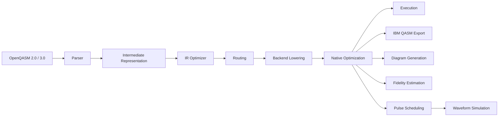
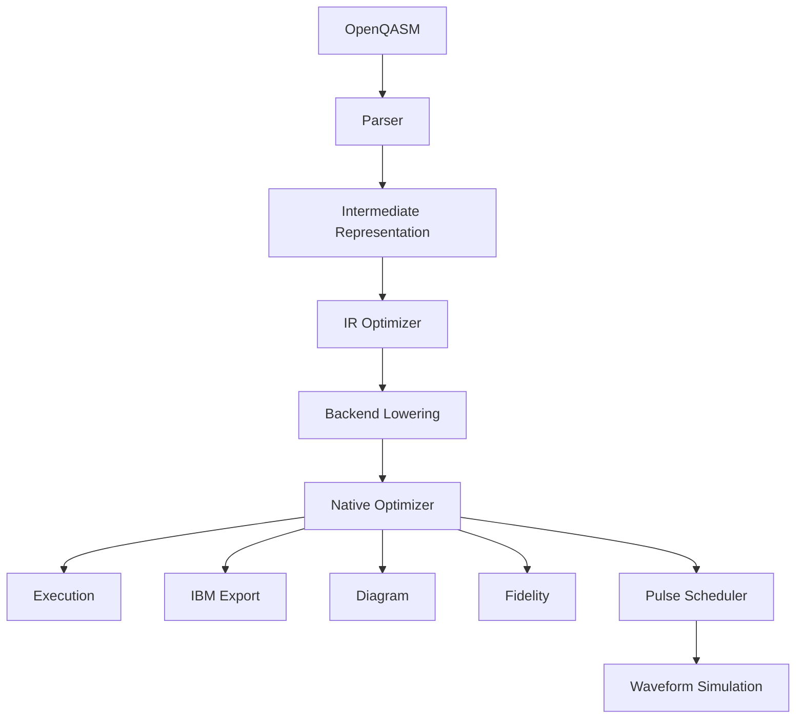

# sirraya-qutub-transpiler

[](https://crates.io/crates/sirraya-qutub-transpiler)
[](https://docs.rs/sirraya-qutub-transpiler)
[](#license)
[](https://www.rust-lang.org)

A modern **OpenQASM compiler and transpiler** for the **Sirraya QuTub** ecosystem.

Write quantum circuits using familiar, hardware-independent gates and compile them into optimized native instructions for different quantum hardware architectures—all from a single Rust API.

---

## Why this project exists

One of the biggest challenges in quantum software engineering is the growing diversity of quantum hardware.

Different vendors expose different:

- native gate sets
- qubit connectivity
- calibration characteristics
- execution models

A circuit written for one device often cannot execute directly on another.

`sirraya-qutub-transpiler` bridges that gap.

Instead of writing circuits specifically for trapped-ion, superconducting, or future hardware, developers write circuits once using a common representation. The transpiler performs parsing, optimization, routing, native-gate decomposition, fidelity estimation, visualization, and hardware export, allowing the same logical circuit to target multiple physical architectures.

The project is designed with three goals:

- **Correctness** through mathematically verified decompositions.
- **Extensibility** through an open backend architecture.
- **Transparency** by keeping every compilation stage inspectable.

Rather than acting as a black box, every stage of the compilation pipeline can be visualized, tested, exported, or inspected independently.

---

## What is Sirraya QuTub?

Sirraya QuTub is an open-source quantum computing ecosystem written in Rust.

The ecosystem is composed of multiple libraries, each responsible for a different layer of the quantum software stack.

```text
Algorithms
      │
      ▼
OpenQASM
      │
      ▼
sirraya-qutub-transpiler
      │
      ▼
Native Circuits
      │
      ▼
QuantumRegister
      │
      ▼
Simulation / Hardware
```

This crate occupies the compiler layer.

It transforms high-level quantum circuits into representations suitable for execution, simulation, visualization, fidelity estimation, or export to external quantum platforms.

---

# Features

✔ OpenQASM 2.0 and 3.0 parser

✔ Source-level circuit optimization

✔ Hardware-aware routing

✔ Native gate decomposition

✔ Multi-backend compilation

✔ IBM Quantum OpenQASM export

✔ Circuit fidelity estimation

✔ Pulse scheduling

✔ Waveform validation

✔ ASCII & SVG circuit diagrams

✔ Extensible backend architecture

✔ Pure Rust implementation

---

# Compiler Pipeline

The transpiler follows a layered compiler architecture.



Each stage performs one well-defined responsibility.

Unlike monolithic transpilers, every intermediate representation remains accessible to applications, making debugging and experimentation significantly easier.

---

# Core Concepts

## Intermediate Representation (IR)

The parser converts OpenQASM into a hardware-independent intermediate representation.

The IR intentionally contains only logical quantum operations.

At this stage the compiler has **no knowledge** of:

- IBM hardware
- Rigetti hardware
- trapped-ion hardware
- routing
- calibration
- pulse schedules

This separation keeps parsing independent from hardware compilation.

---

## Source-Level Optimization

Once parsed, the circuit undergoes source-level optimization.

Typical transformations include:

- adjacent gate cancellation
- commutation-based reordering
- redundant rotation elimination
- identity removal

These optimizations reduce circuit complexity before any hardware-specific transformations begin.

---

## Routing

Not every quantum processor allows arbitrary two-qubit interactions.

For example, IBM Quantum processors expose a heavy-hex connectivity graph, meaning many qubits cannot directly interact.

When necessary, the routing stage inserts SWAP operations and rewrites the circuit so every two-qubit operation respects the hardware connectivity graph.

Backends with all-to-all connectivity, such as trapped-ion systems, bypass this stage entirely.

---

## Backend Lowering

Logical quantum gates rarely correspond directly to physical hardware operations.

For example:

```
CX
```

may become

```
Rz
Rx
Cx
```

on one backend,

while another backend may implement it using

```
Ry
Rzz
```

instead.

Backend lowering performs these mathematically equivalent transformations while preserving circuit semantics.

---

## Native Optimization

After lowering, additional optimizations become possible because the compiler now knows the backend's native instruction set.

Examples include:

- rotation merging
- redundant native gate cancellation
- backend-specific peephole optimization
- exact gate resynthesis

This produces a smaller and more efficient native circuit.

---

## Fidelity Estimation

Executing quantum circuits on real hardware is affected by noise.

Using published calibration data, the transpiler can estimate the expected fidelity of a compiled circuit before execution.

This enables rapid comparison between optimization strategies without requiring immediate access to physical hardware.

---

## Pulse Scheduling

Circuit compilation stops at logical instructions.

Pulse scheduling takes one step further.

Instead of describing *what* operation should be performed, it generates schedules describing *how* hardware control channels should drive those operations.

This stage is optional and completely independent from the compiler itself.

---

## Waveform Simulation

Waveform simulation operates below pulse scheduling.

Rather than executing complete circuits, it numerically integrates individual pulse waveforms against a two-level qubit model.

This allows pulse calibrations to be validated independently from the rest of the compilation pipeline.

---

# Supported Backends

The crate currently provides three backend implementations.

| Backend | Native Gate Set | Connectivity |
|----------|-----------------|--------------|
| `Backend::TrappedIon` | `{Rz, Ry, Rzz}` | All-to-all |
| `Backend::IbmQ` | `{Rz, Rx, Cx}` | Heavy Hex |
| `Backend::Rigetti` | `{Rz, Rx, Cz}` | Square Grid |

The backend architecture is intentionally open, allowing additional hardware targets to be introduced without modifying existing compiler logic.

---

# Architecture Overview



---

# Installation

Add the crate to your project.

```toml
[dependencies]
sirraya-qutub-transpiler = "0.1"
```

The transpiler depends on the `sirraya-qutub` crate published on crates.io.

No additional repositories are required.

---

# Quick Start

The following example parses an OpenQASM program, optimizes it, compiles it into native operations, and estimates its expected fidelity.

```rust
use sirraya_qutub_transpiler::{
    qasm,
    optimize_ir,
    decompose,
    optimize,
    estimate_circuit_fidelity,
    PublishedCalibration,
};

let source = r#"
OPENQASM 2.0;
include "qelib1.inc";

qreg q[2];
creg c[2];

h q[0];
cx q[0], q[1];

measure q[0] -> c[0];
measure q[1] -> c[1];
"#;

let circuit = qasm::parse(source)?;
let circuit = optimize_ir(&circuit);

let native = decompose(&circuit);
let native = optimize(&native);

let calibration = PublishedCalibration::quantinuum_helios_2026();

let fidelity =
    estimate_circuit_fidelity(&native, &calibration);

println!("{:.2}%", fidelity * 100.0);
```

The same logical circuit can also be lowered to a specific hardware backend.

```rust
use sirraya_qutub_transpiler::{
    Backend,
    lower,
    qasm,
    optimize_ir,
    to_ibm_qasm,
};

let circuit = qasm::parse(source)?;
let circuit = optimize_ir(&circuit);

let backend = lower(&circuit, Backend::IbmQ);

let qasm =
    to_ibm_qasm(&backend, "bell_state")?;

std::fs::write("bell.qasm", qasm)?;
```

The exported file is compatible with IBM Quantum's native OpenQASM workflow and can be submitted directly using the provided helper script or integrated into a Qiskit workflow.

---

# What the Compiler Does

At a high level, every compilation follows the same sequence.

```
OpenQASM

↓

Parser

↓

IR Optimization

↓

Routing

↓

Backend Lowering

↓

Native Optimization

↓

Execution / Export / Visualization
```

Each stage has a single responsibility, making the compiler easier to understand, extend, test, and validate.

---

---

# Architecture

The transpiler follows a traditional compiler pipeline, where every stage has a single responsibility.

```text
              OpenQASM 2.0 / 3.0
                      │
                      ▼
              Parse → Circuit IR
                      │
                      ▼
            IR Optimization Passes
                      │
                      ▼
             Backend Lowering
          (routing + decomposition)
                      │
        ┌─────────────┴──────────────┐
        ▼                            ▼
 BackendCircuit              NativeCircuit
        │                            │
        ├──────────────┬─────────────┤
        ▼              ▼             ▼
   Diagram        Fidelity      Execution
        │
        ▼
 IBM QASM Export
        │
        ▼
 IBM Quantum / Qiskit
```

Every stage is intentionally separated.

The parser never knows about hardware.

The optimizer never knows about routing.

The router never knows about pulse scheduling.

The pulse scheduler never knows about QASM parsing.

This separation keeps each component independently testable while making the entire pipeline significantly easier to extend.

---

# Pipeline

## 1. Parsing

The compiler begins by parsing OpenQASM source.

Both OpenQASM 2.0 and OpenQASM 3.0 are supported through the same parser.

```rust
let circuit = qasm::parse(source)?;
```

The output is a hardware-independent intermediate representation.

---

## 2. IR Optimization

Before targeting any hardware, simple algebraic optimizations are performed.

Examples include

- gate cancellation

```
X X → I
```

- inverse elimination

```
S S† → I
```

- commuting independent operations

- removing redundant identities

These optimizations reduce circuit depth before hardware-specific transformations begin.

---

## 3. Backend Lowering

Different quantum hardware exposes different native gate sets.

Algorithms usually describe circuits using abstract gates like

```
H
CX
T
RX
RY
RZ
```

Real devices cannot execute many of these directly.

The lowering stage rewrites every operation into the native instruction set of the selected backend.

Currently supported:

| Backend | Native Gates |
|-----------|-----------------------------|
| Trapped Ion | Rz, Ry, Rzz |
| IBM Quantum | Rz, Rx, CX |
| Rigetti | Rz, Rx, CZ |

Routing is automatically applied when the hardware does not provide all-to-all connectivity.

---

## 4. Native Optimization

Once lowering is complete, another optimization pass performs backend-specific cleanup.

Examples include

- removing redundant rotations

- combining consecutive rotations

- simplifying gate identities

- reducing overall gate count

Because these optimizations operate on native gates, they often remove operations introduced during decomposition.

---

## 5. Fidelity Estimation

The crate includes a lightweight fidelity estimator.

Rather than simulating noisy quantum evolution, it estimates execution fidelity using published calibration data.

```rust
let calibration =
    PublishedCalibration::quantinuum_helios_2026();

let fidelity =
    estimate_circuit_fidelity(&native, &calibration);
```

This provides a fast sanity check before executing on real hardware.

---

## 6. Execution

Lowered circuits can be executed directly on the Sirraya QuTub simulator.

```rust
run_backend(...)
```

Measurement operations are fully supported.

---

## 7. Visualization

Every stage of compilation can be visualized.

```text
q0 ──H────■────M
          │
q1 ───────X────M
```

ASCII diagrams are useful during debugging.

SVG rendering is also supported for documentation and publications.

---

## 8. IBM Export

IBM hardware accepts a very specific native instruction set.

The transpiler exports circuits directly into IBM-compatible OpenQASM.

Supported basis gates include

```
rz
sx
x
cx
measure
```

This output can be executed directly using Qiskit Runtime without another transpilation step.

---

# Supported Hardware

The architecture currently includes three production backends.

## Trapped Ion

Native gates

```
Rz
Ry
Rzz
```

Characteristics

- all-to-all connectivity
- no routing required
- ideal for exact native decompositions

---

## IBM Quantum

Native gates

```
Rz
Rx
CX
```

Characteristics

- heavy-hex connectivity
- automatic routing
- IBM-compatible OpenQASM export

---

## Rigetti

Native gates

```
Rz
Rx
CZ
```

Characteristics

- square-grid connectivity
- automatic routing
- CZ-native decomposition

---

# Extensible Backend Architecture

Earlier versions of the transpiler stored backend behavior inside large `match` statements.

Every new backend required modifications across multiple files.

The current architecture replaces this with an open `BackendSpec` abstraction.

Each backend implements its own specification independently.

This means adding another backend no longer requires modifying existing backend implementations.

Instead, a new backend supplies

- calibration
- coupling map
- native rotation axis
- two-qubit lowering rules
- decomposition strategy

and registers itself with the compiler.

This significantly reduces maintenance cost while keeping backend-specific logic isolated.

---

# Examples

The repository includes complete working examples.

```bash
cargo run --example bell_state_end_to_end
```

Examples demonstrate

- OpenQASM parsing
- optimization
- lowering
- IBM export
- execution
- fidelity estimation

---

# Testing Philosophy

Correctness is verified against the real `sirraya-qutub` execution engine.

Tests cover

- parser correctness
- optimizer correctness
- routing
- decomposition identities
- backend lowering
- IBM export
- diagram generation
- pulse scheduling
- waveform simulation

Rather than simply asserting mathematical identities, decompositions are validated through actual execution against the simulator.

This ensures compiler transformations preserve circuit semantics.

---

# Roadmap

Current development focuses on

- additional OpenQASM 3 language features
- improved routing algorithms
- hardware-aware optimization
- richer calibration models
- expanded pulse scheduling
- additional backend implementations
- benchmarking infrastructure
- educational examples and tutorials

Longer term goals include supporting more quantum hardware families while maintaining a clean separation between compiler infrastructure and hardware-specific implementations.

---

# Contributing

Contributions are welcome from both Rust developers and quantum computing enthusiasts.

Ways to contribute include

- implementing optimization passes
- improving routing algorithms
- adding backend support
- writing documentation
- improving examples
- fixing bugs
- expanding test coverage

If you're new to the project, look for issues labeled **good first issue**.

Please read **CONTRIBUTING.md** before submitting a pull request.

---

# Community

We're building Sirraya QuTub as an open-source quantum computing ecosystem.

Whether your interests are

- compiler engineering
- quantum algorithms
- quantum hardware
- Rust
- formal verification
- performance engineering
- education

there are opportunities to contribute.

Contributors are recognized in the project, and outstanding contributions may be featured in the project's Hall of Fame.

---

# Documentation

| Resource | Description |
|-----------|-------------|
| `ARCHITECTURE.md` | Complete compiler architecture and design rationale |
| `CONTRIBUTING.md` | Development workflow and contribution guide |
| docs.rs | API documentation |
| crates.io | Published crate |

---

# License

Licensed under either

- MIT License
- Apache License 2.0

at your option.

See `LICENSE-MIT` and `LICENSE-APACHE` for details.

---

## Acknowledgements

This project is part of the **Sirraya QuTub** ecosystem, an open-source initiative focused on advancing accessible quantum computing infrastructure in Rust.

If this project helps your research, education, or development work, consider giving the repository a ⭐ and joining the community.