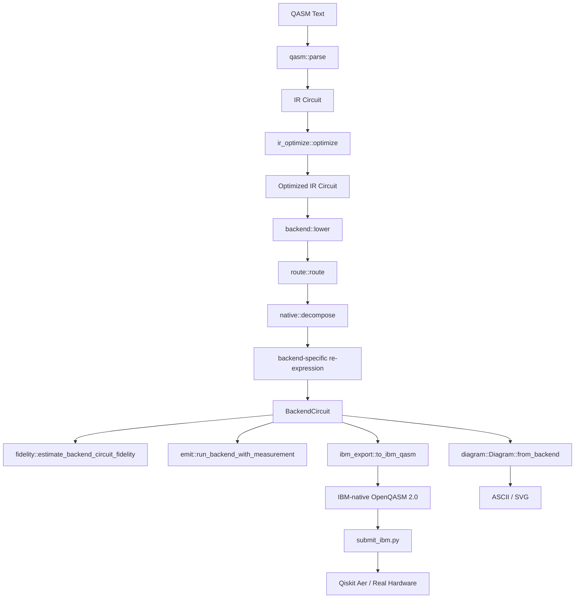
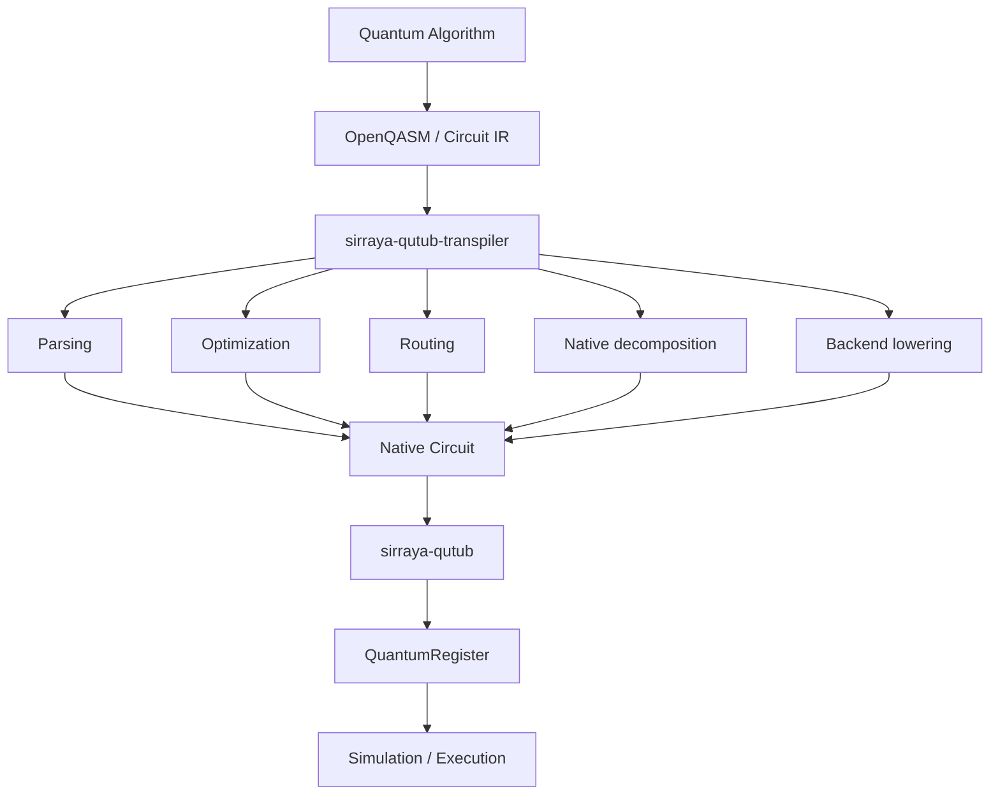
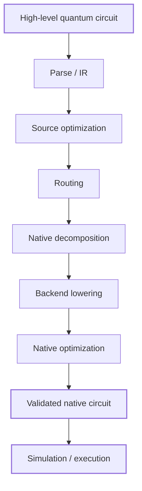

# `sirraya-qutub-transpiler`

[](https://crates.io/crates/sirraya-qutub-transpiler)
[](https://docs.rs/sirraya-qutub-transpiler)
[](LICENSE)
[](https://www.rust-lang.org)

A QASM 2.0 importer and multi-backend native-gate compiler for quantum circuits destined to run on the Sirraya QuTub ecosystem. This crate decouples circuit *description* from the specific gate set a given execution target actually supports — enabling circuits written in convenient gates (`H`, `CX`, `T`, `RXX`, measurement, ...) to be compiled down to the native operations of a trapped-ion simulator, or routed and lowered to real superconducting hardware, including IBM Quantum devices.

---

## What it does

The transpiler provides a complete pipeline from a high-level circuit description through to execution:

- **Parse** OpenQASM 2.0 source into an intermediate representation
- **Optimize** at the source level (gate cancellation and commutation-based reordering)
- **Lower** to a target backend's native gate set — trapped-ion, or a routed superconducting target (IBM- or Rigetti-style)
- **Route** two-qubit gates against a backend's physical qubit connectivity, where the backend doesn't offer all-to-all coupling
- **Optimize** again at the native/backend level (peephole cleanup specific to the lowered gate set)
- **Estimate** fidelity against a hardware calibration, or **execute** directly against `QuantumRegister`
- **Export** to real IBM Quantum OpenQASM (basis gates `rz`, `sx`, `x`, `cx`, `measure`) for submission to actual hardware or Qiskit
- **Visualize** any stage of the pipeline as an ASCII or SVG circuit diagram

The crate depends on [`sirraya-qutub`](https://crates.io/crates/sirraya-qutub) directly from crates.io, with no prerequisite changes to that repository.

---

# Why this crate exists

Quantum algorithms are usually described using a convenient, hardware-independent gate vocabulary.

Hardware and calibrated simulators are not.

A circuit may naturally contain:

```text
H
CX
T
Rx
Ry
Rz
Rxx
Ryy
Rzz
SWAP
Controlled-phase
```

while the execution layer may expose only a smaller calibrated native set.

The transpiler provides the boundary between those two worlds.


This separation is intentional.

The [`sirraya-qutub`](https://crates.io/crates/sirraya-qutub) simulator is responsible for quantum-state simulation and calibrated execution behavior.

This crate is responsible for **transforming and validating circuits before execution**.

---

# Architecture



### 1. QASM Parser (`qasm.rs`)

A deliberately narrow OpenQASM 2.0 subset parser covering the dialect `sirraya-qutub` itself writes (`h q[0];`, `rzz(1.2) q[0], q[2];`, `measure q[0] -> c[0];`), plus the standard `qelib1.inc` mnemonics other tools (Qiskit, etc.) commonly use for the same gate set. No gate definitions, no classical control, no includes/registers beyond a single `qreg`/`creg` pair. Any unsupported construct is a parse error naming the offending line — never a silent skip.

### 2. Source-Level Optimization (`ir_optimize.rs`)

Cancels adjacent inverse pairs and commutes gates past disjoint or compatible neighbors to expose non-adjacent cancellations, before any backend-specific decomposition happens. `Gate::Measure` is never reordered relative to any other gate, including another `Measure` writing the same classical bit.

### 3. Backend Lowering (`backend/`)

Three execution targets, selected via `Backend`:

| Backend | Native gate set | Two-qubit topology |
|---|---|---|
| `Backend::TrappedIon` | `{Rz, Ry, Rzz}` | All-to-all (no routing needed) |
| `Backend::IbmQ` | `{Rz, Rx, Cx}` | Heavy-hex lattice (matches IBM's published Eagle/Heron-family topology) |
| `Backend::Rigetti` | `{Rz, Rx, Cz}` | Square grid (matches Rigetti's Ankaa-class topology) |

`Backend` is an open extension point, not a closed enum: it's a handle onto a `BackendSpec` trait implementation (`backend/spec.rs`), and each backend implements that trait in its own file — `backend/trapped_ion.rs`, `backend/ibmq.rs`, `backend/rigetti.rs`. `backend.rs` itself holds the shared engine every backend runs through: the generic per-gate lowering loop, the `resynthesize`/`optimize` fixed-point pass, and `BackendGate`/`BackendCircuit`. Adding a new backend means implementing `BackendSpec` in a new file under `backend/` and registering one `Backend::` constant — no existing match statement needs to change (see `backend/spec.rs`'s module doc for exactly what a new backend needs to supply, and its scope limits).

`TrappedIon`'s `BackendSpec` implementation delegates directly to the `{Rz, Ry, Rzz}` decomposition in `native.rs` (its native gate set already *is* that canonical form). `IbmQ` and `Rigetti` reuse the same canonical form and then re-express it in terms of their own native two-qubit gate — `Rzz(a,b,θ) == Cx(a,b).Rz(b,θ).Cx(a,b)` for IBM's `Cx`, and a shortened `H.Cz.Rx.Cz.H` form for Rigetti's `Cz` that avoids paying for redundant `H` conjugations. A `resynthesize`/`optimize` fixed-point loop then collapses the resulting single-qubit rotation runs.

Every two-qubit gate a circuit contains that isn't already the backend's native one is more expensive than that backend's own gate — for example, a source-level `Cx` lowers to **two** native `Cx`s on `IbmQ` (via the `Rzz`-based identity above), not one, since the pipeline always canonicalizes through `Rzz` first rather than special-casing `Cx` as already-native.

### 4. Routing (`coupling.rs`, `route.rs`)

For backends without all-to-all connectivity, `route::route` (and a lookahead variant, `route::route_lookahead`) inserts `SWAP`s so every two-qubit gate lands on physically adjacent qubits, restoring each qubit to its original wire by the end of the circuit. `CouplingMap` generates the real topology family for each backend: a heavy-hex lattice for `IbmQ`, a square grid for `Rigetti`.

### 5. Native/Backend-Level Optimization (`optimize.rs`, `backend.rs::optimize`/`resynthesize`)

A peephole pass that merges adjacent same-axis rotations and same-pair two-qubit gates, cancels adjacent inverse pairs (`Cx.Cx`, `Cz.Cz`), and floats commuting single-qubit rotations across diagonal two-qubit gates to expose further cancellations — run to a fixed point together with `resynthesize`, which algebraically collapses a whole run of single-qubit gates (not just literally-adjacent pairs) into at most three gates. `Measure` is never dropped, merged, or reordered past anything.

### 6. Fidelity Estimation (`fidelity.rs`)

A self-contained, gate-count-based fidelity estimate: each native gate's error is treated as an independent depolarizing event, and per-gate survival probabilities are multiplied across the circuit — `O(gates)` rather than the `O(2^n)` cost of an actual noisy simulation. Calibration data is available for Quantinuum Helios (trapped-ion; delegates to `sirraya_qutub::xeb::HardwareCalibration` so the two crates' numbers cannot silently drift apart), IBM Heron r2, and Rigetti Ankaa-3, each with its cited source. `estimate_circuit_fidelity` covers a `NativeCircuit`; `estimate_backend_circuit_fidelity` covers a lowered `BackendCircuit` against that backend's own published numbers.

### 7. Execution (`emit.rs`)

Interfaces directly with `sirraya_qutub::core::QuantumRegister` — the one module in the crate that touches the dependency. `run`/`run_backend` execute a unitary-only circuit; `run_with_measurement`/`run_backend_with_measurement` additionally return the classical outcomes written by every `Measure`, sampled via `QuantumRegister::measure_single_qubit`'s real Born-rule projective measurement.

### 8. IBM Hardware Export (`ibm_export.rs`)

Bridges an `IbmQ`-lowered `BackendCircuit` to the exact basis gates IBM hardware pulses: `Rz` (a free, zero-duration virtual-Z frame change) and `Sx` (a single fixed π/2 pulse about X), with `X` used directly where the model's continuous `Rot` lands exactly on π. `to_ibm_qasm` emits OpenQASM 2.0 using IBM's own gate names (`rz`, `sx`, `x`, `cx`, `measure`), suitable for direct submission to Qiskit or the IBM Quantum Platform job API — as opposed to `emit::to_qasm`, which round-trips only through this crate's own parser.

### 9. Diagrams (`diagram.rs`)

`Diagram::from_circuit` / `from_native` / `from_backend` build a renderable model from any of the three circuit levels; `to_ascii` and `to_svg` render it. Useful for inspecting a circuit before and after routing/lowering without leaving Rust.

---

# Quick start

A complete example can be built from three stages:

### Basic Pipeline (trapped-ion target)

```rust
use sirraya_qutub_transpiler::{qasm, optimize_ir, decompose, optimize, estimate_circuit_fidelity, PublishedCalibration};

let qasm_src = r#"
    OPENQASM 2.0;
    include "qelib1.inc";
    qreg q[2];
    creg c[2];
    h q[0];
    cx q[0], q[1];
    measure q[0] -> c[0];
    measure q[1] -> c[1];
"#;

let circuit = qasm::parse(qasm_src)?;
let circuit = optimize_ir(&circuit);

let native = decompose(&circuit);
let native = optimize(&native);

let cal = PublishedCalibration::quantinuum_helios_2026();
let fidelity = estimate_circuit_fidelity(&native, &cal);
println!("Estimated fidelity: {:.2}%", fidelity * 100.0);
```

### Lowering to Real IBM Hardware and Exporting QASM

```rust
use sirraya_qutub_transpiler::{qasm, optimize_ir, lower, to_ibm_qasm, Backend};

let circuit = qasm::parse(qasm_src)?;
let circuit = optimize_ir(&circuit);

let backend_circuit = lower(&circuit, Backend::IbmQ); // routes + lowers to {Rz, Rx, Cx}
let ibm_qasm = to_ibm_qasm(&backend_circuit, "bell_state")?; // real basis: rz, sx, x, cx, measure

std::fs::write("bell.qasm", ibm_qasm)?;
```

`bell.qasm` is then ready for `submit_ibm.py` (below) or for direct use with Qiskit.

### Running the Full Example

```bash
cargo run --example bell_state_end_to_end
```

Parses a Bell-state QASM source, runs it through the real pipeline (`parse` → `optimize_ir` → `lower(IbmQ)` → `to_ibm_qasm`), writes `bell.qasm`, and produces a local-simulator shot histogram (`bell_reference_counts.json`) to compare against a real hardware run.

---

## Submitting to Real IBM Hardware (`submit_ibm.py`)

There is no official Rust SDK for IBM Quantum Platform / Qiskit Runtime, so QASM exported by `to_ibm_qasm` is handed off to a small Python bridge script.

**Local sanity check (no IBM account needed):**

```bash
pip install qiskit qiskit-aer --break-system-packages
python3 submit_ibm.py --qasm bell.qasm --shots 4096 --compare bell_reference_counts.json
```

This confirms the exported QASM is well-formed and loadable by Qiskit, and reports the total variation distance against the Rust simulator's own reference distribution — both are noiseless, so this distance should be small.

**Real hardware:**

```bash
pip install qiskit-ibm-runtime --break-system-packages
export IBM_QUANTUM_TOKEN=...      # from your IBM Quantum account settings
export IBM_QUANTUM_INSTANCE=...   # CRN of your instance/plan

python3 submit_ibm.py --qasm bell.qasm --shots 4096 --real \
    --backend <a real backend name from your account> \
    --compare bell_reference_counts.json
```

The circuit is submitted with `optimization_level=0`: routing and native-gate lowering already happened on the Rust side (`backend::lower` + `ibm_export`), so no further Qiskit transpilation is applied — the reported total variation distance reflects this crate's output running against real hardware, not Qiskit's own transpiler.

### Known simplification

`backend::lower` currently routes `IbmQ` circuits against the generic heavy-hex topology generator in `coupling.rs`, not a specific device's *actual* coupling map or basis gate pulled live from the IBM Quantum API (some IBM processors use `ECR` rather than `CX` as their native two-qubit gate). For small circuits this is unlikely to matter — routing either succeeds trivially or fails loudly — but pulling live device metadata is the natural next step before scaling this past small demonstration circuits.

---

# Performance and fidelity model

The transpiler can estimate the effect of accumulated gate errors on larger circuits.

The following example uses the documented calibration parameters:

```text
Single-qubit error:  5 × 10⁻⁵
Two-qubit error:     1.05 × 10⁻³
```

For a GHZ preparation workload, the estimated behavior scales approximately as follows:

Native decomposition costs below are for the trapped-ion `{Rz, Ry, Rzz}` target (`native.rs`). Lowering the same source gate to `IbmQ`/`Rigetti` (`backend.rs`) re-expresses this canonical form in terms of that backend's own native two-qubit gate, at the costs noted.

### Single-Qubit Gates
| Gate | Native decomposition (ZYZ) |
|---|---|
| H | Rz · Ry |
| X, Y, Z, S, Sdg, T, Tdg | Rz · Ry · Rz (as needed; some collapse to a single term) |
| Rx(θ) | Rz(π/2) · Ry(θ) · Rz(−π/2) |
| Ry(θ) | Native |
| Rz(θ) | Native |

### Two-Qubit Gates
| Gate | Native decomposition | Native two-qubit gates on IbmQ | Native two-qubit gates on Rigetti |
|---|---|---|---|
| Cx | H · Rzz · H | 2 × Cx | 2 × Cz |
| Cz | Rz · Rz · Rzz | 2 × Cx | 2 × Cz |
| Swap | 3 × Cx-equivalent | 6 × Cx | 6 × Cz |
| Rxx(θ) | H⊗H · Rzz · H⊗H | 2 × Cx | 2 × Cz |
| Ryy(θ) | Rx⊗Rx · Rzz · Rx⊗Rx | 2 × Cx | 2 × Cz |
| Rzz(θ) | Native | 2 × Cx | 2 × Cz |
| Cp(θ) | Rz · Rz · Rzz | 2 × Cx | 2 × Cz |

Every two-qubit source gate costs exactly 2 native two-qubit gates once lowered to `IbmQ`/`Rigetti`, because the pipeline always canonicalizes through a single `Rzz`, and `Rzz(a,b,θ) == Cx(a,b).Rz(b,θ).Cx(a,b)` (or its Rigetti `Cz` equivalent) costs 2. This is a known, deliberate trade-off of the current design — see `backend.rs`'s module documentation — rather than a per-gate optimum; a source circuit built entirely from native `Cx`/`Cz` for its target backend would, in principle, need only 1 native two-qubit gate per source gate, which this pipeline does not yet special-case.

### Measurement

`Gate::Measure(qubit, clbit)` is passed through every stage unchanged — never decomposed, merged, cancelled, or reordered relative to any other gate — and is executed as a real Born-rule-sampled projective measurement via `QuantumRegister::measure_single_qubit`.

---

# Design principles

Every decomposition identity is validated against `sirraya_qutub::core::QuantumRegister` directly — the test suite builds circuits, applies gates both directly and through the decomposed/lowered/optimized pipeline, and compares state fidelity or exact matrix equality (up to global phase). This covers the ZYZ synthesizer's branch-ambiguous angle extraction, every backend's routing and lowering path, the peephole optimizer's commuting-gate cases, and the IBM export module's `Rot → Rz/Sx` identity (independently derived and checked numerically across a spread of angles before being pinned down as a regression test).

```bash
cargo test                                 # full suite: parser, optimizer, routing, lowering, export
cargo test -- --nocapture                  # show detailed output
cargo run --example bell_state_end_to_end  # end-to-end demo, real pipeline to IBM QASM
```

All tests run against the real `sirraya-qutub` crate pulled from crates.io — not a mock or local copy — before each release.

---

# Documentation

| Resource                                                         | Purpose                                                          |
| ---------------------------------------------------------------- | ---------------------------------------------------------------- |
| [`ARCHITECTURE.md`](ARCHITECTURE.md)                             | Compiler architecture, mathematical identities, design decisions |
| [`CONTRIBUTING.md`](CONTRIBUTING.md)                             | Development workflow and contribution guidelines                 |
| [`docs.rs`](https://docs.rs/sirraya-qutub-transpiler)            | Rust API documentation                                           |
| [`crates.io`](https://crates.io/crates/sirraya-qutub-transpiler) | Published package and release information                        |

---

# Ecosystem

Contributions are welcome. Please ensure:



This separation allows the compiler layer to evolve independently from the underlying quantum simulation and execution engine.

---

# License

Licensed under:

* [MIT License](LICENSE-MIT)

---

## Sirraya QuTub Transpiler

A compiler boundary between **how a quantum circuit is described** and **how its target execution system can actually run it**.



**Sirraya Labs** — [amir@sirraya.org](mailto:amir@sirraya.org)
