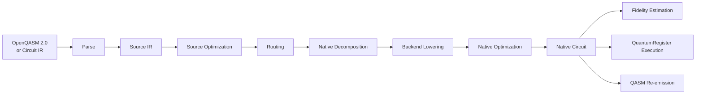
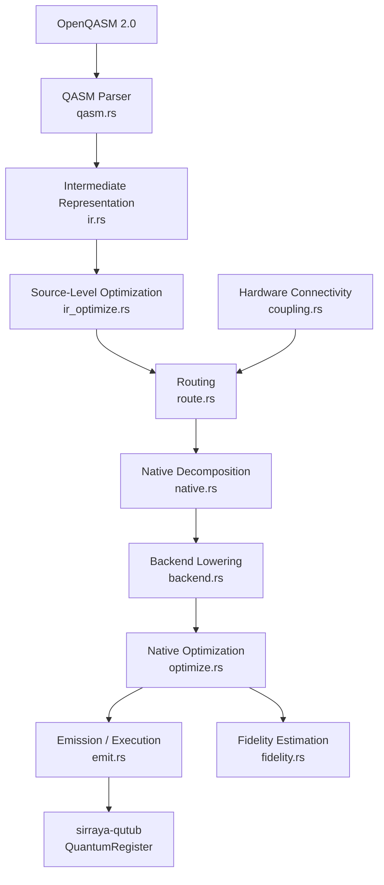
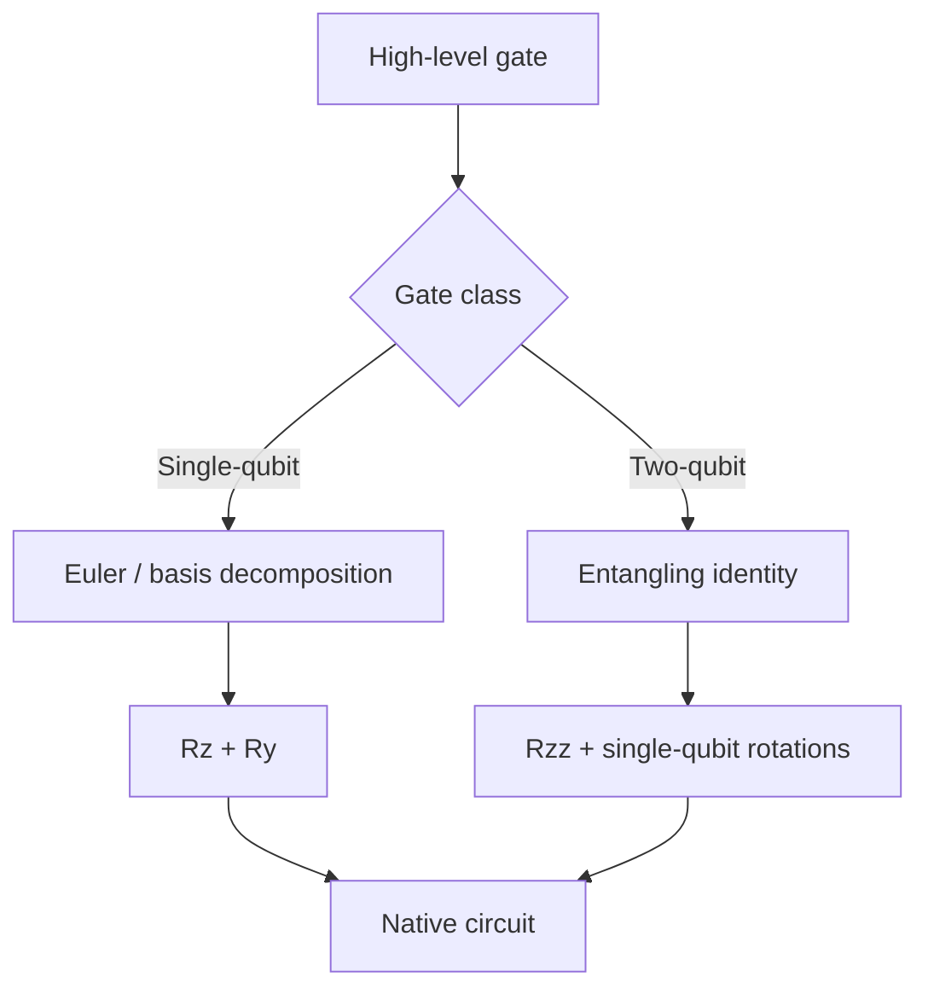
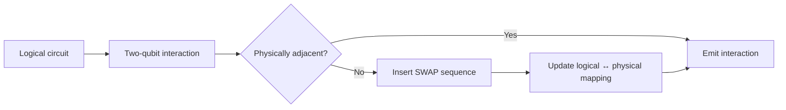
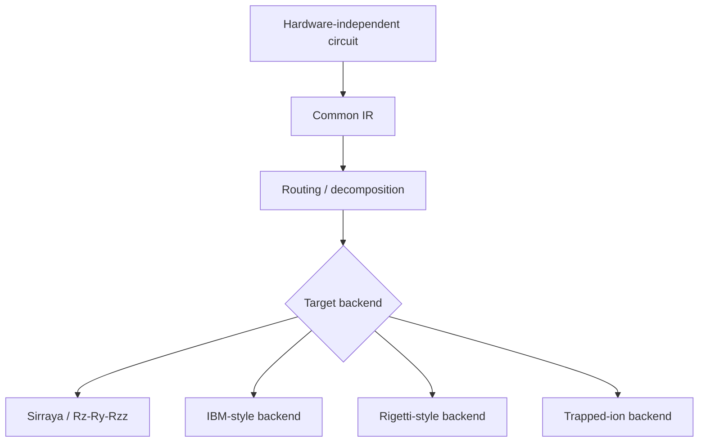
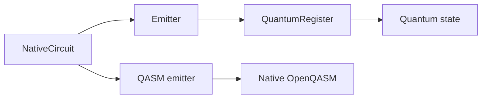
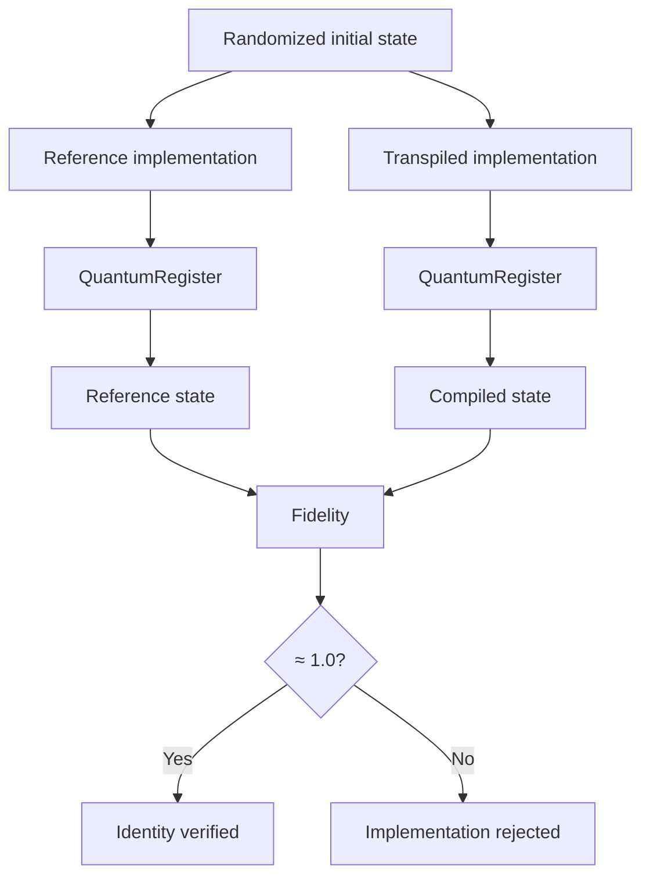
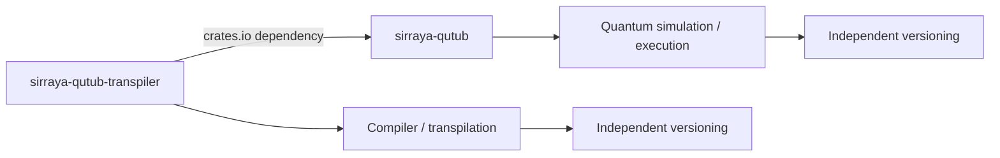
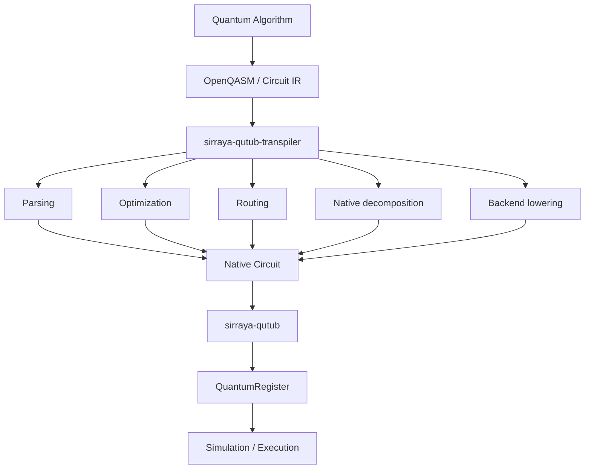
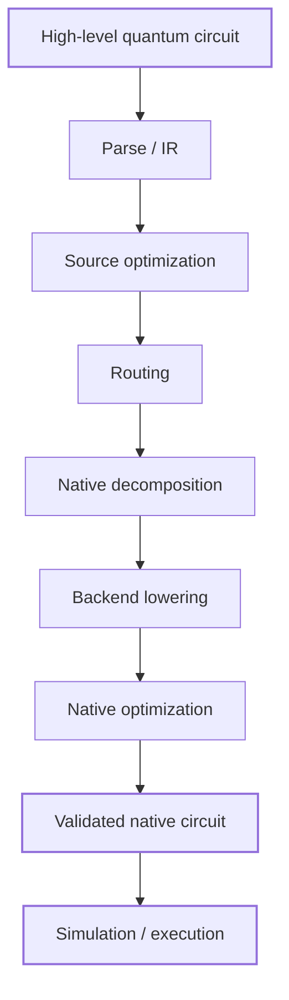

# `sirraya-qutub-transpiler`

[](https://crates.io/crates/sirraya-qutub-transpiler)
[](https://docs.rs/sirraya-qutub-transpiler)
[](LICENSE)
[](https://www.rust-lang.org)

**A native-gate quantum circuit compiler and OpenQASM 2.0 transpiler for the Sirraya QuTub ecosystem.**

`sirraya-qutub-transpiler` converts hardware-independent quantum circuits into validated, optimized native circuits suitable for execution through [`sirraya-qutub`](https://crates.io/crates/sirraya-qutub).

The crate separates **circuit description** from **hardware execution semantics**: circuits can be expressed using familiar gates such as `H`, `CX`, `T`, `RXX`, and `SWAP`, then transformed through a compiler pipeline into the native operations supported by the target execution model.

The result is a small, explicit compiler stack designed around three principles:

> **Correctness first. Explicit transformations. Hardware-aware execution.**

---

## What it does

At a high level, the transpiler takes a circuit through the following stages:



Depending on the workflow, the resulting native circuit can then be:

* Executed on a `QuantumRegister`
* Evaluated using the transpiler's fidelity model
* Emitted back into QASM
* Inspected as an intermediate/native circuit
* Used as a target for further backend-specific optimization

---

# Why this crate exists

Quantum algorithms are usually described using a convenient, hardware-independent gate vocabulary.

Hardware and calibrated simulators are not.

A circuit may naturally contain:

```text
H
CX
T
Rx
Ry
Rz
Rxx
Ryy
Rzz
SWAP
Controlled-phase
```

while the execution layer may expose only a smaller calibrated native set.

The transpiler provides the boundary between those two worlds.


This separation is intentional.

The [`sirraya-qutub`](https://crates.io/crates/sirraya-qutub) simulator is responsible for quantum-state simulation and calibrated execution behavior.

This crate is responsible for **transforming and validating circuits before execution**.

---

# Architecture

The transpiler is organized as a sequence of explicit compiler stages.



## Compiler stages

| Stage                | Module           | Purpose                                                            |
| -------------------- | ---------------- | ------------------------------------------------------------------ |
| Parsing              | `qasm.rs`        | Converts supported OpenQASM 2.0 into the internal representation   |
| IR                   | `ir.rs`          | Represents source-level quantum circuits and gates                 |
| Source optimization  | `ir_optimize.rs` | Performs conservative source-level cancellation and reordering     |
| Connectivity         | `coupling.rs`    | Represents physical qubit connectivity                             |
| Routing              | `route.rs`       | Inserts SWAP operations and maintains logical-to-physical mappings |
| Native decomposition | `native.rs`      | Converts gates into the native `{Rz, Ry, Rzz}` basis               |
| Backend lowering     | `backend.rs`     | Applies backend-specific gate-set transformations                  |
| Native optimization  | `optimize.rs`    | Performs native-level peephole optimization                        |
| Emission             | `emit.rs`        | Executes native circuits and re-emits them as QASM                 |
| Fidelity             | `fidelity.rs`    | Estimates circuit fidelity using the configured error model        |

The complete design rationale, mathematical identities, and implementation constraints are documented in [`ARCHITECTURE.md`](ARCHITECTURE.md).

---

# Core capabilities

## OpenQASM 2.0 import

The parser implements a deliberately constrained OpenQASM 2.0 dialect.

It supports the circuit forms used by the Sirraya QuTub ecosystem, including constructs such as:

```qasm
OPENQASM 2.0;
include "qelib1.inc";

qreg q[2];
creg c[2];

h q[0];
cx q[0], q[1];

measure q -> c;
```

The parser is intentionally strict.

Unsupported constructs are rejected with a parse error rather than silently ignored.

This is particularly important for compiler infrastructure: silently dropping an unsupported instruction can produce a syntactically valid but semantically incorrect circuit.

---

# Native gate representation

The core native decomposition basis is:

```text
{ Rz, Ry, Rzz }
```

Single-qubit gates are synthesized through exact rotation identities, including ZYZ-style Euler decomposition.

Two-qubit operations are reduced through exact constructions based on `Rzz` and basis changes.

Conceptually:



The native basis is chosen to match the operations for which the downstream execution model provides calibrated fidelity information.

---

# Gate decomposition

## Single-qubit gates

| Gate    | Native representation        |
| ------- | ---------------------------- |
| `H`     | `Rz(π) · Ry(π/2)`            |
| `X`     | `Ry(π) · Rz(-π)`             |
| `Y`     | `Ry(π)`                      |
| `Z`     | `Rz(π)`                      |
| `S`     | `Rz(π/2)`                    |
| `T`     | `Rz(π/4)`                    |
| `Rx(θ)` | `Rz(π/2) · Ry(θ) · Rz(-π/2)` |
| `Ry(θ)` | Native                       |
| `Rz(θ)` | Native                       |

## Two-qubit gates

| Gate     | Native construction                                    |
| -------- | ------------------------------------------------------ |
| `CX`     | Exact decomposition using single-qubit gates and `Rzz` |
| `CZ`     | Exact decomposition using single-qubit gates and `Rzz` |
| `SWAP`   | Three entangling operations plus basis changes         |
| `RXX(θ)` | Basis change around `Rzz(θ)`                           |
| `RYY(θ)` | Basis change around `Rzz(θ)`                           |
| `RZZ(θ)` | Native                                                 |
| `Cp(θ)`  | Exact construction using single-qubit gates and `Rzz`  |

The exact identities and implementation conventions are documented in [`ARCHITECTURE.md`](ARCHITECTURE.md).

---

# Optimization

After decomposition, the transpiler performs native-level peephole optimization.

The current optimization strategy focuses on transformations whose correctness can be established locally, including:

* Adjacent same-axis rotation merging
* Cancellation of approximately zero rotations
* Native-level simplification

For example:

```text
Rz(a) · Rz(b)
```

can be combined into:

```text
Rz(a + b)
```

and rotations whose resulting angle is numerically zero can be removed.

The optimizer is intentionally conservative.

Correctness takes priority over aggressive circuit reduction.

---

# Hardware-aware routing

Quantum hardware is not fully connected.

Two logical qubits may need to be moved through a physical coupling graph before an entangling operation can be executed.

The routing stage therefore separates:

```text
Logical qubits
```

from:

```text
Physical qubits
```

and maintains the mapping between them.



The coupling-map abstraction currently supports hardware connectivity models such as linear and heavy-hex-style topologies.

Routing is primarily a **correctness transformation** at present rather than a globally optimal SWAP minimizer.

---

# Backend model

The transpiler is designed to keep backend-specific concerns separate from the source-level circuit representation.

Conceptually:



This allows the same circuit representation and compiler infrastructure to be reused while backend-specific native gate constraints remain isolated.

---

# Fidelity estimation

The crate includes a self-contained circuit-level fidelity estimator.

For a gate acting on a Hilbert space of dimension `d`, the underlying depolarizing-error conversion follows:

```text
p = (1 - F) d / (d - 1)
```

where:

* `F` is the reported gate fidelity
* `d` is the relevant Hilbert-space dimension
* `p` is the corresponding error probability

The estimator uses the published calibration values documented for the target execution model.

This implementation is deliberately kept inside the transpiler rather than relying on internal representation details of `sirraya-qutub`.

That separation provides:

* Independent validation
* Explicit assumptions
* Stable package boundaries
* Easier testing
* Reduced coupling to simulator internals

See [`src/fidelity.rs`](src/fidelity.rs) for the implementation and reasoning.

> Fidelity estimation is a model-based estimate, not a substitute for experimentally measured device performance.

---

# Execution

Once a circuit has been lowered into the native representation, the `emit` layer can execute it through:

```text
sirraya_qutub::core::QuantumRegister
```

The execution boundary is intentionally explicit:



This allows the same compiled circuit to be used for both simulation and serialization.

---

# Installation

Add the crate to your project:

```toml
[dependencies]
sirraya-qutub-transpiler = "0.1.0"
```

The transpiler depends on [`sirraya-qutub`](https://crates.io/crates/sirraya-qutub) through its normal crates.io dependency.

No local checkout or workspace modification of `sirraya-qutub` is required.

---

# Quick start

A complete example can be built from three stages:


Example:

```rust
use sirraya_qutub_transpiler::{
    fidelity::estimate_circuit_fidelity,
    gate_decomposition::decompose_circuit,
    QasmParser,
    Transpiler,
};

fn main() -> Result<(), Box<dyn std::error::Error>> {
    let qasm = r#"
        OPENQASM 2.0;
        include "qelib1.inc";

        qreg q[2];
        creg c[2];

        h q[0];
        cx q[0], q[1];
        measure q -> c;
    "#;

    // Parse OpenQASM 2.0 into the compiler IR.
    let circuit = QasmParser::parse(qasm)?;

    // Lower into the native gate basis.
    let decomposed = decompose_circuit(&circuit);

    // Apply native-level optimization.
    let optimized = Transpiler::optimize(&decomposed);

    // Estimate circuit fidelity.
    let fidelity = estimate_circuit_fidelity(&optimized);

    println!("Estimated fidelity: {:.2}%", fidelity * 100.0);

    Ok(())
}
```

---

# Examples

The repository includes executable examples for exploring the compiler.

## Full pipeline

Run:

```bash
cargo run --example full_pipeline
```

This demonstrates the complete transformation from input circuit through compilation and execution.

## Gate decomposition reference

Run:

```bash
cargo run --example gate_cheatsheet
```

This provides a practical reference for the supported gate transformations.

---

# Testing and correctness

Quantum compiler transformations must be validated semantically, not merely syntactically.

A transformation may:

* Compile successfully
* Produce valid native gates
* Pass superficial structural checks

and still implement the wrong unitary.

For this reason, decomposition identities are tested against the actual `QuantumRegister` implementation.



The test methodology is:

1. Generate a randomized initial quantum state.
2. Apply the reference gate directly using `QuantumRegister`.
3. Apply the transpiler-generated decomposition to an identical state.
4. Compare the resulting states using `QuantumRegister::fidelity`.
5. Require the fidelity to be within the project's numerical tolerance.

For unitary transformations, the expected condition is:

```rust
(fidelity - 1.0).abs() < 1e-9
```

This catches errors such as:

* Incorrect signs
* Incorrect rotation angles
* Control/target reversal
* Phase errors
* Qubit-ordering errors
* Incorrect decomposition identities
* Optimization passes that alter semantics

Measurement is tested separately using shot-based statistical verification because state fidelity is not appropriate after measurement collapse.

---

# Running the test suite

Run all tests:

```bash
cargo test
```

Show detailed test output:

```bash
cargo test -- --nocapture
```

Run the end-to-end pipeline:

```bash
cargo run --example full_pipeline
```

Run formatting checks:

```bash
cargo fmt --check
```

Run Clippy:

```bash
cargo clippy --all-targets -- -D warnings
```

The release process validates the transpiler against the actual `sirraya-qutub` crate pulled from crates.io rather than a mocked simulator implementation.

---

# Performance and fidelity model

The transpiler can estimate the effect of accumulated gate errors on larger circuits.

The following example uses the documented calibration parameters:

```text
Single-qubit error:  5 × 10⁻⁵
Two-qubit error:     1.05 × 10⁻³
```

For a GHZ preparation workload, the estimated behavior scales approximately as follows:

| Qubits | Two-qubit operations | Estimated fidelity |
| -----: | -------------------: | -----------------: |
|      2 |                    1 |             99.85% |
|      4 |                    3 |             99.58% |
|      8 |                    7 |             99.05% |
|     16 |                   15 |             97.98% |
|     32 |                   31 |             95.88% |
|     64 |                   63 |             91.81% |
|     98 |                   97 |             87.68% |

The 98-qubit case corresponds to the stated full-width qubit count of Quantinuum Helios and represents a deliberately demanding scenario: a GHZ preparation requires `n - 1` sequential two-qubit entangling operations.

These values are **model-based estimates**, not experimental benchmark results.

---

# Repository relationship

`sirraya-qutub-transpiler` is intentionally maintained as a separate Rust package from `sirraya-qutub`.



This separation provides:

* Independent release cycles
* A clear dependency boundary
* Reduced coupling between compiler and simulator internals
* Easier downstream integration
* Independent evolution of compiler and execution layers

The transpiler therefore does not need to be part of the `sirraya-qutub` workspace.

---

# Design principles

The project is built around a few deliberate principles.

## 1. Correctness before optimization

An incorrect circuit that uses fewer gates is still incorrect.

Optimization is therefore subordinate to semantic preservation.

## 2. Explicit transformations

Compiler stages should have clear responsibilities.

A contributor should be able to identify where parsing, routing, decomposition, optimization, and backend lowering occur.

## 3. Exact identities where possible

If a gate can be represented exactly in the target basis, the transpiler should prefer the exact construction rather than an approximation.

## 4. Hardware awareness without hardware lock-in

The compiler needs to understand connectivity and native gates while keeping the circuit representation independent of any single hardware target.

## 5. Simulator-backed verification

Mathematical reasoning is necessary, but implementation correctness is ultimately validated against the actual quantum simulation layer.

## 6. Independent package boundaries

The compiler and simulator should remain independently testable, versionable, and releasable.

---

# Project structure

A simplified repository view:

```text
sirraya-qutub-transpiler/
├── src/
│   ├── backend.rs
│   ├── coupling.rs
│   ├── emit.rs
│   ├── fidelity.rs
│   ├── ir.rs
│   ├── ir_optimize.rs
│   ├── native.rs
│   ├── optimize.rs
│   ├── qasm.rs
│   └── route.rs
│
├── tests/
│   ├── decompositions.rs
│   └── measurement.rs
│
├── examples/
│   ├── full_pipeline.rs
│   └── gate_cheatsheet.rs
│
├── ARCHITECTURE.md
├── CONTRIBUTING.md
├── LICENSE-MIT
├── LICENSE-APACHE
└── Cargo.toml
```

For a detailed explanation of the internal compiler design, see [`ARCHITECTURE.md`](ARCHITECTURE.md).

For contribution guidelines, see [`CONTRIBUTING.md`](CONTRIBUTING.md).

---

# Contributing

Contributions are welcome.

Before submitting a change, please ensure:

* `cargo test` passes
* `cargo fmt --check` passes
* `cargo clippy --all-targets -- -D warnings` passes
* New mathematical transformations have semantic tests
* New functionality is documented
* Significant additions include examples where appropriate
* Breaking changes are clearly documented

For substantial compiler changes, especially those involving:

* Gate identities
* Routing
* Coupling maps
* Backend lowering
* Optimization
* IR changes

please open an issue or discussion before implementation.

See [`CONTRIBUTING.md`](CONTRIBUTING.md) for the complete contribution workflow.

---

# Documentation

| Resource                                                         | Purpose                                                          |
| ---------------------------------------------------------------- | ---------------------------------------------------------------- |
| [`ARCHITECTURE.md`](ARCHITECTURE.md)                             | Compiler architecture, mathematical identities, design decisions |
| [`CONTRIBUTING.md`](CONTRIBUTING.md)                             | Development workflow and contribution guidelines                 |
| [`docs.rs`](https://docs.rs/sirraya-qutub-transpiler)            | Rust API documentation                                           |
| [`crates.io`](https://crates.io/crates/sirraya-qutub-transpiler) | Published package and release information                        |

---

# Ecosystem

The transpiler is part of the broader Sirraya QuTub software stack:



This separation allows the compiler layer to evolve independently from the underlying quantum simulation and execution engine.

---

# License

Licensed under:

* [MIT License](LICENSE-MIT)

---

# Authors

**Sirraya Labs**

[amir@sirraya.org](mailto:amir@sirraya.org)

---

## Sirraya QuTub Transpiler

A compiler boundary between **how a quantum circuit is described** and **how its target execution system can actually run it**.



The objective is straightforward:

> **Transform quantum circuits without losing their meaning.**
