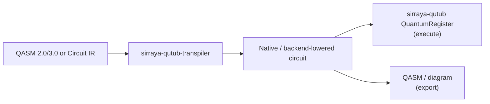
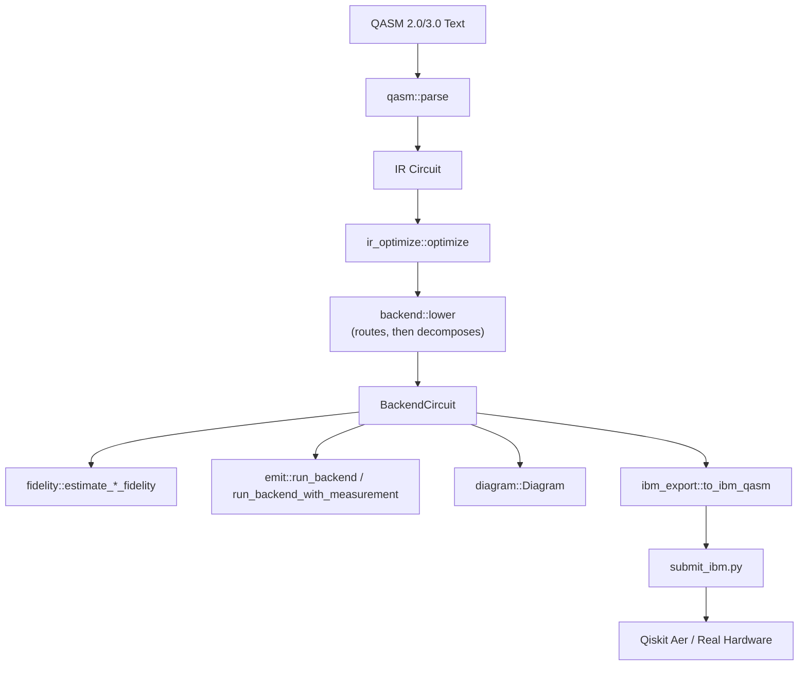

# `sirraya-qutub-transpiler`

[](https://crates.io/crates/sirraya-qutub-transpiler)
[](https://docs.rs/sirraya-qutub-transpiler)
[](#license)
[](https://www.rust-lang.org)

A **QASM 2.0/3.0 importer** and **multi-backend native-gate compiler** for quantum circuits destined to run on the Sirraya QuTub ecosystem. Write circuits in convenient, hardware-independent gates (`H`, `CX`, `T`, `RXX`, measurement, ...); this crate compiles them down to a trapped-ion simulator's native operations, or routes and lowers them to real superconducting hardware, including IBM Quantum devices.



**New here?** This page gets you running in a few minutes. For the full pipeline breakdown, module-by-module design rationale, and the mathematics behind each decomposition, see **[`ARCHITECTURE.md`](ARCHITECTURE.md)**. To contribute, see **[`CONTRIBUTING.md`](CONTRIBUTING.md)**.

---

## Install

```toml
[dependencies]
sirraya-qutub-transpiler = "0.1"
```

This crate depends on [`sirraya-qutub`](https://crates.io/crates/sirraya-qutub) directly from crates.io — no prerequisite changes to that repository.

---

## Quick start

```rust
use sirraya_qutub_transpiler::{qasm, optimize_ir, decompose, optimize, estimate_circuit_fidelity, PublishedCalibration};

// Either OPENQASM 2.0 or 3.0 source works here — qasm::parse accepts
// both dialects, no version flag needed.
let qasm_src = r#"
    OPENQASM 2.0;
    include "qelib1.inc";
    qreg q[2];
    creg c[2];
    h q[0];
    cx q[0], q[1];
    measure q[0] -> c[0];
    measure q[1] -> c[1];
"#;

let circuit = qasm::parse(qasm_src)?;
let circuit = optimize_ir(&circuit);

let native = decompose(&circuit);
let native = optimize(&native);

let cal = PublishedCalibration::quantinuum_helios_2026();
let fidelity = estimate_circuit_fidelity(&native, &cal);
println!("Estimated fidelity: {:.2}%", fidelity * 100.0);
```

Lowering to real IBM hardware and exporting QASM for submission:

```rust
use sirraya_qutub_transpiler::{qasm, optimize_ir, lower, to_ibm_qasm, Backend};

let circuit = qasm::parse(qasm_src)?;
let circuit = optimize_ir(&circuit);

let backend_circuit = lower(&circuit, Backend::IbmQ); // routes + lowers to {Rz, Rx, Cx}
let ibm_qasm = to_ibm_qasm(&backend_circuit, "bell_state")?; // real basis: rz, sx, x, cx, measure

std::fs::write("bell.qasm", ibm_qasm)?;
```

`bell.qasm` is then ready for [`submit_ibm.py`](#submitting-to-real-ibm-hardware) or for direct use with Qiskit.

Or run the full end-to-end demo:

```bash
cargo run --example bell_state_end_to_end
```

Parses a Bell-state QASM source, runs it through the real pipeline (`parse` → `optimize_ir` → `lower(IbmQ)` → `to_ibm_qasm`), writes `bell.qasm`, and produces a local-simulator shot histogram (`bell_reference_counts.json`) to compare against a real hardware run.

---

## What it does

- **Parse** OpenQASM 2.0 *or* 3.0 source into an intermediate representation (`qasm::parse` — no version flag; see [`ARCHITECTURE.md`](ARCHITECTURE.md#qasmrs--openqasm-importer) for the exact dialect spellings accepted)
- **Optimize** at the source level — gate cancellation and commutation-based reordering
- **Route** two-qubit gates against a backend's physical qubit connectivity, where the backend doesn't offer all-to-all coupling
- **Lower** to a target backend's native gate set — trapped-ion, or a routed superconducting target (IBM- or Rigetti-style)
- **Optimize** again at the native/backend level — peephole cleanup specific to the lowered gate set
- **Estimate** fidelity against a published hardware calibration, or **execute** directly against `QuantumRegister`
- **Export** back to QASM — `emit::to_qasm`/`to_qasm3` for either dialect (round-trips through this crate's own parser), or `ibm_export::to_ibm_qasm` for real IBM-hardware-native OpenQASM 2.0 (basis gates `rz`, `sx`, `x`, `cx`, `measure`) suitable for direct submission to Qiskit or the IBM Quantum Platform
- **Visualize** any stage of the pipeline as an ASCII or SVG circuit diagram

Three backends ship today, each an implementation of an open `BackendSpec` trait (adding a new one doesn't require touching existing code — see [`ARCHITECTURE.md`](ARCHITECTURE.md#backendrs--backend--multi-backend-lowering)):

| Backend | Native gate set | Two-qubit topology |
|---|---|---|
| `Backend::TrappedIon` | `{Rz, Ry, Rzz}` | All-to-all (no routing needed) |
| `Backend::IbmQ` | `{Rz, Rx, Cx}` | Heavy-hex lattice (IBM's published Eagle/Heron-family topology) |
| `Backend::Rigetti` | `{Rz, Rx, Cz}` | Square grid (Rigetti's Ankaa-class topology) |

---

## Architecture at a glance



This is deliberately the *short* version. The full pipeline (including the trapped-ion-only `native::decompose` path, native-level optimization/resynthesis, and the pulse/waveform-simulation stages downstream of everything else) — plus the rationale behind each design decision — lives in **[`ARCHITECTURE.md`](ARCHITECTURE.md)**.

Every non-trivial gate identity and decomposition in this crate is validated against `sirraya_qutub::core::QuantumRegister` directly, not just asserted algebraically — see [`ARCHITECTURE.md`'s testing philosophy](ARCHITECTURE.md#10-testing-philosophy) for how.

---

## Submitting to real IBM hardware

There is no official Rust SDK for IBM Quantum Platform / Qiskit Runtime, so QASM exported by `to_ibm_qasm` is handed off to a small Python bridge script, `submit_ibm.py`.

**Local sanity check (no IBM account needed):**

```bash
pip install qiskit qiskit-aer --break-system-packages
python3 submit_ibm.py --qasm bell.qasm --shots 4096 --compare bell_reference_counts.json
```

This confirms the exported QASM is well-formed and loadable by Qiskit, and reports the total variation distance against the Rust simulator's own reference distribution — both are noiseless, so this distance should be small.

**Real hardware:**

```bash
pip install qiskit-ibm-runtime --break-system-packages
export IBM_QUANTUM_TOKEN=...      # from your IBM Quantum account settings
export IBM_QUANTUM_INSTANCE=...   # CRN of your instance/plan

python3 submit_ibm.py --qasm bell.qasm --shots 4096 --real \
    --backend <a real backend name from your account> \
    --compare bell_reference_counts.json
```

The circuit is submitted with `optimization_level=0`: routing and native-gate lowering already happened on the Rust side (`backend::lower` + `ibm_export`), so no further Qiskit transpilation is applied — the reported total variation distance reflects this crate's output running against real hardware, not Qiskit's own transpiler.

> **Known simplification:** `backend::lower` currently routes `IbmQ` circuits against the generic heavy-hex topology generator in `coupling.rs`, not a specific device's *actual* coupling map or basis gate pulled live from the IBM Quantum API. For small circuits this is unlikely to matter. See [`ARCHITECTURE.md`](ARCHITECTURE.md#14-open-work-and-known-gaps) for this and other known gaps.

---

## Testing

```bash
cargo test                                 # full suite: parser, optimizer, routing, lowering, export
cargo test -- --nocapture                  # show detailed output
cargo run --example bell_state_end_to_end  # end-to-end demo, real pipeline to IBM QASM
```

All tests run against the real `sirraya-qutub` crate pulled from crates.io — not a mock or local copy — before each release. See [`CONTRIBUTING.md`](CONTRIBUTING.md) for the full development workflow, coding conventions, and pull-request checklist.

---

## Documentation

| Resource                                                         | Purpose                                                          |
| ------------------------------------------------------------------ | -------------------------------------------------------------------|
| [`ARCHITECTURE.md`](ARCHITECTURE.md)                             | Compiler architecture, mathematical identities, design decisions |
| [`CONTRIBUTING.md`](CONTRIBUTING.md)                             | Development workflow and contribution guidelines                 |
| [`docs.rs`](https://docs.rs/sirraya-qutub-transpiler)            | Rust API documentation                                           |
| [`crates.io`](https://crates.io/crates/sirraya-qutub-transpiler) | Published package and release information                        |

---

## License

Dual-licensed, at your option, under either:

* [MIT License](LICENSE-MIT)
* [Apache License, Version 2.0](LICENSE-APACHE)

---

**Sirraya Labs** — [amir@sirraya.org](mailto:amir@sirraya.org)