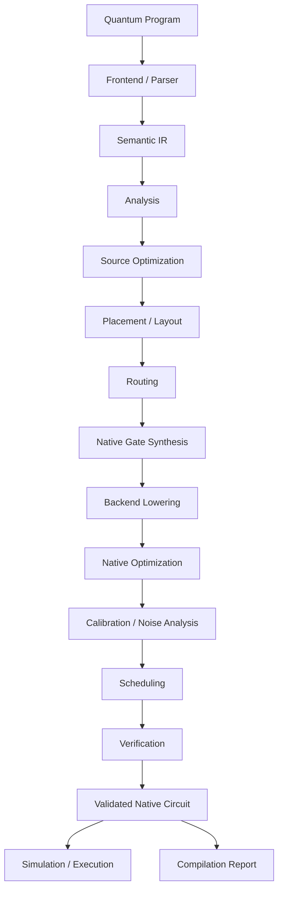
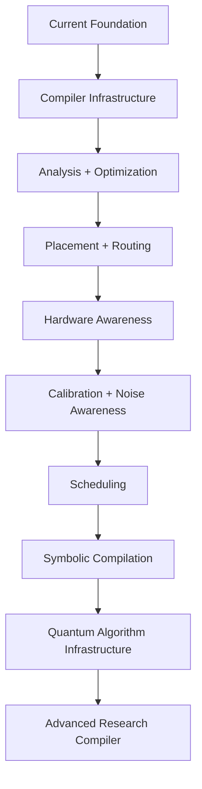

# Sirraya QuTub Transpiler — Architecture

> **A hardware-aware quantum compiler boundary between circuit semantics and executable reality.**

Sirraya QuTub Transpiler is an open-source quantum compilation system developed by **Sirraya Labs**.

Its purpose is to transform quantum programs from a high-level representation into circuits that are valid, optimized, hardware-aware, and independently verifiable for a target execution environment.

The project is intentionally designed as a compiler rather than a collection of gate-conversion utilities. Its architecture separates **quantum program semantics**, **compiler transformations**, **physical constraints**, **backend capabilities**, **calibration information**, and **verification** so that each layer can evolve independently.

The long-term objective is to provide a rigorous foundation for quantum compilation research and practical execution while remaining understandable, testable, and extensible for an open-source community.

---

## Table of Contents

* [1. Architecture at a Glance](#1-architecture-at-a-glance)
* [2. Why a Quantum Compiler Needs Multiple Layers](#2-why-a-quantum-compiler-needs-multiple-layers)
* [3. Design Goals](#3-design-goals)
* [4. Architectural Principles](#4-architectural-principles)
* [5. Compilation Pipeline](#5-compilation-pipeline)
* [6. Frontend and Parsing](#6-frontend-and-parsing)
* [7. Intermediate Representation](#7-intermediate-representation)
* [8. Compiler Analyses](#8-compiler-analyses)
* [9. Compiler Passes](#9-compiler-passes)
* [10. Source-Level Optimization](#10-source-level-optimization)
* [11. Gate Synthesis and Native Decomposition](#11-gate-synthesis-and-native-decomposition)
* [12. Placement and Layout](#12-placement-and-layout)
* [13. Routing](#13-routing)
* [14. Backend Architecture](#14-backend-architecture)
* [15. Hardware and Calibration Model](#15-hardware-and-calibration-model)
* [16. Cost Models](#16-cost-models)
* [17. Noise- and Fidelity-Aware Compilation](#17-noise--and-fidelity-aware-compilation)
* [18. Native-Level Optimization](#18-native-level-optimization)
* [19. Scheduling](#19-scheduling)
* [20. Parameterized and Symbolic Circuits](#20-parameterized-and-symbolic-circuits)
* [21. Pauli Algebra and Hamiltonian Infrastructure](#21-pauli-algebra-and-hamiltonian-infrastructure)
* [22. Verification and Correctness](#22-verification-and-correctness)
* [23. Measurement Verification](#23-measurement-verification)
* [24. Diagnostics and Compilation Reports](#24-diagnostics-and-compilation-reports)
* [25. Reproducibility](#25-reproducibility)
* [26. Performance Engineering](#26-performance-engineering)
* [27. Error Handling](#27-error-handling)
* [28. Extending QuTub](#28-extending-qutub)
* [29. Adding a New Gate](#29-adding-a-new-gate)
* [30. Adding a New Optimization Pass](#30-adding-a-new-optimization-pass)
* [31. Adding a New Backend](#31-adding-a-new-backend)
* [32. Testing Strategy](#32-testing-strategy)
* [33. Benchmarking](#33-benchmarking)
* [34. Architecture Decision Records](#34-architecture-decision-records)
* [35. Repository Organization](#35-repository-organization)
* [36. Current Architecture vs. Target Architecture](#36-current-architecture-vs-target-architecture)
* [37. Long-Term Direction](#37-long-term-direction)
* [38. Contributing to the Architecture](#38-contributing-to-the-architecture)
* [39. Guiding Principle](#39-guiding-principle)

---

# 1. Architecture at a Glance

The simplest description of QuTub is:

```text
High-level quantum program
            |
            v
      Frontend / Parser
            |
            v
     Semantic Compiler IR
            |
            v
          Analysis
            |
            v
   Source-level Optimization
            |
            v
      Logical Placement
            |
            v
          Routing
            |
            v
   Native Gate Synthesis
            |
            v
      Backend Lowering
            |
            v
    Native-level Optimization
            |
            v
 Calibration / Noise Analysis
            |
            v
        Scheduling
            |
            v
        Verification
            |
            v
    Validated Native Circuit
            |
            +------------------+
            |                  |
            v                  v
       Compilation         Execution /
          Report            Simulation
```

The key architectural boundary is:

> **The logical circuit describes what should happen. The target backend describes what can happen. The compiler connects the two.**

---

# 2. Why a Quantum Compiler Needs Multiple Layers

A quantum circuit can be mathematically correct and still be a poor circuit to execute.

For example, two logically equivalent circuits may differ significantly in:

* native gate count,
* two-qubit gate count,
* circuit depth,
* physical connectivity requirements,
* SWAP overhead,
* execution duration,
* calibration quality,
* expected error,
* and scheduling constraints.

A compiler therefore has to solve several distinct problems.

### Semantic problem

What operation does the circuit represent?

### Mathematical problem

Can the circuit be transformed into an equivalent but simpler form?

### Architectural problem

Which physical qubits should represent the logical qubits?

### Routing problem

How can required interactions be made physically executable?

### Synthesis problem

How can abstract gates be expressed using the target's native operations?

### Hardware problem

Which physical operations are currently reliable and available?

### Timing problem

When can each operation actually execute?

### Verification problem

How do we know that the compiler preserved the intended computation?

QuTub treats these as related but separable concerns.

---

# 3. Design Goals

QuTub is designed around the following goals.

## 3.1 Correctness

Compiler transformations must preserve circuit semantics within explicitly defined numerical or statistical tolerances.

Correctness takes precedence over optimization.

---

## 3.2 Extensibility

New:

* gates,
* optimization passes,
* routing algorithms,
* synthesis strategies,
* hardware models,
* backends,
* cost functions,
* verification methods,

should be addable without redesigning unrelated parts of the compiler.

---

## 3.3 Hardware awareness

The architecture must be capable of representing physical constraints rather than assuming an ideal all-to-all-connected quantum computer.

---

## 3.4 Explicitness

Important assumptions should be represented explicitly in types, configuration, diagnostics, and documentation.

The compiler should not silently:

* discard unsupported operations,
* change measurement semantics,
* introduce approximation,
* assume connectivity,
* or substitute a backend.

---

## 3.5 Reproducibility

Compilation results should be reproducible whenever deterministic algorithms are selected.

Randomized algorithms should support explicit seeds.

---

## 3.6 Verifiability

Important compiler transformations should have a corresponding correctness strategy.

---

## 3.7 Research friendliness

The architecture should support experimental compiler algorithms without forcing experimental behavior into the stable compilation path.

---

## 3.8 Long-term maintainability

The project is intended to be developed over many years by contributors who may not have participated in its earliest implementation.

Architecture must therefore communicate intent, not merely implementation.

---

# 4. Architectural Principles

## 4.1 Separate semantics from implementation

The IR should represent what a circuit means without prematurely encoding how one particular backend executes it.

---

## 4.2 Separate logical and physical qubits

A logical qubit represents the program's identity.

A physical qubit represents a location on a target system.

These concepts must not be conflated.

```text
Logical q0
    |
    | placement
    v
Physical Q7
```

A later routing decision may change the mapping without changing the logical program.

---

## 4.3 Prefer exact transformations

When an exact identity exists, it should generally be preferred over approximation.

Approximate synthesis is valid when explicitly requested or selected by a compilation policy and must expose its error tolerance.

---

## 4.4 Optimize according to explicit objectives

There is no universal definition of the "best" quantum circuit.

Depending on the target, users may care about:

* gate count,
* two-qubit gate count,
* depth,
* latency,
* expected fidelity,
* estimated error,
* SWAP count,
* or a weighted combination.

These objectives belong in explicit cost models.

---

## 4.5 Verification is part of compilation

Verification should not be an afterthought.

The compiler should make it possible to validate transformations systematically.

---

## 4.6 Diagnostics are part of the interface

A mature compiler should eventually be able to explain:

> Why was this gate introduced?

> Why was this route selected?

> Why was this decomposition chosen?

> Which optimization pass changed the circuit?

Explainability is particularly important when optimization becomes multi-objective.

---

# 5. Compilation Pipeline

The target compilation architecture is:



The exact set and order of passes may evolve.

The architecture should therefore support configurable pass pipelines rather than requiring one immutable sequence.

---

# 6. Frontend and Parsing

The frontend translates an external quantum program representation into QuTub's internal representation.

The current project includes an OpenQASM 2.0 parser.

The frontend is responsible for:

* lexical and syntactic validation,
* gate recognition,
* register handling,
* qubit references,
* measurement representation,
* parameter parsing,
* useful source-location diagnostics.

Unsupported constructs should produce explicit errors.

They should never be silently ignored.

---

## 6.1 Frontend independence

The compiler core should not depend on one source language.

Future frontends may include:

* OpenQASM,
* programmatic Rust APIs,
* circuit interchange formats,
* higher-level quantum representations,
* research-specific input formats.

All should converge into the compiler's semantic representation.

```text
OpenQASM ───────┐
                |
Rust API ───────┼──> Compiler IR
                |
Other frontend ┘
```

---

# 7. Intermediate Representation

The IR is the central contract between compiler stages.

A useful IR must represent:

* quantum operations,
* logical qubits,
* classical bits,
* measurements,
* resets,
* parameters,
* operation ordering,
* metadata,
* source locations,
* and eventually regions or basic blocks where needed.

The IR should be expressive enough to represent the program without requiring backend-specific decisions.

---

## 7.1 Logical operations

Examples include:

```text
H(q0)
X(q1)
Rx(q2, θ)
CX(q0, q1)
Rzz(q1, q2, φ)
Measure(q0)
Reset(q1)
```

---

## 7.2 Native operations

After target lowering, the representation may contain operations such as:

```text
Rz
Ry
Rzz
```

or another backend-defined native gate set.

The compiler should preserve enough metadata to determine where each operation came from.

---

## 7.3 Parameter representation

Long-term support should distinguish:

```text
Concrete:
    Rz(1.570796)

Symbolic:
    Rz(theta)

Expression:
    Rz(theta + phi)
```

This is important for parameterized circuits and variational algorithms.

---

# 8. Compiler Analyses

Analyses compute information that passes can consume without modifying the circuit.

Important analyses include:

### Dependency analysis

Determines which operations depend on previous operations.

### Depth analysis

Computes logical and physical circuit depth.

### Critical-path analysis

Identifies operations that constrain execution time.

### Resource analysis

Counts:

* logical qubits,
* physical qubits,
* gates,
* one-qubit gates,
* two-qubit gates,
* measurements,
* resets,
* depth.

### Interaction graph

Represents relationships between logical qubits.

```text
Vertex = logical qubit
Edge   = interaction
```

### Commutation analysis

Determines whether operations can be reordered while preserving semantics.

---

# 9. Compiler Passes

QuTub should evolve toward a pass-oriented architecture.

Conceptually:

```text
Pass Manager
    |
    +-- Analysis Passes
    |
    +-- Transformation Passes
    |
    +-- Placement Passes
    |
    +-- Routing Passes
    |
    +-- Synthesis Passes
    |
    +-- Scheduling Passes
    |
    +-- Verification Passes
    |
    +-- Reporting Passes
```

Each transformation pass should document:

* inputs,
* outputs,
* assumptions,
* invariants,
* analyses required,
* analyses invalidated,
* configuration,
* expected complexity,
* verification strategy.

---

## 9.1 Pass composition

Passes should be composable.

For example:

```text
Parse
  ↓
Canonicalize
  ↓
Optimize
  ↓
Analyze
  ↓
Place
  ↓
Route
  ↓
Decompose
  ↓
Optimize
  ↓
Schedule
  ↓
Verify
```

A future backend or optimization profile should be able to select a different sequence without modifying individual passes.

---

# 10. Source-Level Optimization

Source-level optimization operates on semantic gates before hardware constraints dominate the representation.

Examples include:

```text
H H       → I
X X       → I
Z Z       → I
Rz(a)Rz(b) → Rz(a+b)
```

Other future transformations may include:

* gate cancellation,
* rotation merging,
* commutation,
* block simplification,
* Clifford identities,
* Pauli simplification,
* redundant operation removal.

---

## 10.1 Why optimize before routing?

Routing can introduce additional operations.

Therefore it is useful to simplify the logical circuit before introducing physical constraints.

However, optimization should also happen after routing and decomposition because those stages can expose new opportunities.

This naturally produces:

```text
Source Optimization
        ↓
Routing
        ↓
Synthesis
        ↓
Native Optimization
```

rather than one optimization pass.

---

# 11. Gate Synthesis and Native Decomposition

The compiler must eventually translate abstract operations into operations supported by the target.

For a target supporting:

```text
{Rz, Ry, Rzz}
```

a higher-level operation may be represented using those primitives.

Examples include:

```text
H
X
Rx
CX
CZ
SWAP
Rxx
Ryy
```

The exact decomposition belongs to the synthesis layer rather than being hard-coded into unrelated compiler components.

---

## 11.1 Synthesis properties

Every synthesis rule should specify:

* source operation,
* native target set,
* exact or approximate status,
* mathematical identity,
* parameter conditions,
* expected native cost,
* verification method.

---

## 11.2 Technology-specific synthesis

Different technologies expose different native operations.

Therefore:

```text
Logical Gate
      |
      v
Synthesis Strategy
      |
      +----> Backend A
      |
      +----> Backend B
      |
      +----> Backend C
```

The compiler should not assume that one decomposition is universally optimal.

---

# 12. Placement and Layout

Placement maps logical qubits to physical qubits.


Placement can consider:

* connectivity,
* interaction frequency,
* expected routing overhead,
* physical gate fidelity,
* physical qubit availability,
* execution duration.

---

## 12.1 Interaction graph

For a circuit containing:

```text
CX(q0,q1)
CX(q1,q2)
CX(q0,q2)
```

the interaction graph contains:

```text
q0 ─── q1
 \     /
   q2
```

This graph can be compared with the target hardware topology to find useful initial placements.

---

# 13. Routing

Routing transforms logical interactions into physically executable interactions.

For example, if:

```text
Logical:
q0 ─── q2
```

but the hardware only supports:

```text
Q0 ─── Q1 ─── Q2
```

the compiler must move logical state or otherwise transform the circuit so that the interaction becomes executable.

SWAP insertion is one mechanism.

---

## 13.1 Routing strategies

The architecture should permit multiple strategies, including:

* shortest-path routing,
* A* search,
* lookahead routing,
* SABRE-style approaches,
* noise-aware routing,
* fidelity-aware routing,
* research algorithms.

No single routing algorithm should be treated as universally optimal.

---

## 13.2 Routing cost

A routing algorithm may optimize:

```text
SWAP count
+
depth
+
two-qubit error
+
duration
+
critical-path impact
```

The selected objective should be explicit.

---

# 14. Backend Architecture

A backend describes what a target can execute.

A backend may define:

* physical qubit count,
* native gate set,
* connectivity,
* gate durations,
* gate fidelities,
* measurement properties,
* reset behavior,
* calibration information,
* scheduling constraints,
* target-specific lowering rules.

The compiler core should interact with these capabilities through stable abstractions.

---

## 14.1 Backend independence

The architecture should permit:

```text
                 Compiler Core
                /      |      \
               /       |       \
          Backend A Backend B Backend C
```

A backend should not require rewriting the compiler's semantic layers.

---

# 15. Hardware and Calibration Model

A target hardware model should eventually represent physical characteristics.

## Qubit properties

Potential properties include:

* T1,
* T2,
* frequency,
* readout error,
* availability,
* calibration status.

## Gate properties

Potential properties include:

* native operation,
* fidelity,
* error rate,
* duration,
* calibration timestamp,
* physical qubit pair.

## Connectivity

The backend should represent which interactions are supported.

---

## 15.1 Calibration snapshots

Calibration information should be versioned and associated with compilation.

A compilation artifact should ideally be traceable to:

```text
Compiler version
Backend version
Calibration snapshot
Compilation profile
Source hash
Configuration
Random seed
```

This is essential for reproducibility.

---

# 16. Cost Models

A compiler needs a formal answer to:

> What does "better" mean?

A simple cost model might be:

```text
C =
    wg × gate_count
  + wd × depth
  + ws × swap_count
  + we × estimated_error
  + wt × duration
```

where each weight represents the importance of an objective.

The actual implementation may use more sophisticated models.

The key architectural principle is that cost should be **explicit and replaceable**.

---

## 16.1 Possible optimization profiles

QuTub may eventually expose profiles such as:

```text
GateCount
Depth
Fidelity
Latency
Balanced
Research
Debug
```

Each profile can select different:

* passes,
* routing algorithms,
* synthesis strategies,
* cost functions,
* verification levels.

---

# 17. Noise- and Fidelity-Aware Compilation

A circuit with fewer gates is not necessarily a better circuit.

For example:

```text
Circuit A
7 gates
2 high-error two-qubit operations

Circuit B
9 gates
1 high-error two-qubit operation
```

A gate-count optimizer may prefer A.

A fidelity-aware optimizer may prefer B.

QuTub's architecture should allow the objective to be selected according to the target and user requirements.

---

## 17.1 Error budget

A future compilation report may expose:

```text
Estimated Error Budget

Single-qubit operations      14%
Two-qubit operations         68%
Readout                       18%
```

This should be clearly labeled as an estimate.

The compiler must distinguish:

* measured hardware values,
* calibration-derived values,
* theoretical models,
* assumptions,
* approximations.

---

# 18. Native-Level Optimization

Optimization should happen again after synthesis.

This is important because decomposition may create new patterns.

For example:

```text
Logical circuit
      ↓
Native decomposition
      ↓
Rz(a)
Rz(b)
      ↓
Rz(a+b)
```

Native-level optimization may include:

* adjacent rotation merging,
* cancellation,
* commutation,
* redundant operation elimination,
* backend-specific identities,
* duration-aware transformations.

---

# 19. Scheduling

Scheduling assigns execution times to operations.

Potential scheduling strategies include:

* ASAP,
* ALAP,
* critical-path scheduling,
* duration-aware scheduling,
* resource-constrained scheduling,
* hardware-aware scheduling.

Scheduling must respect:

* dependencies,
* qubit availability,
* gate durations,
* hardware constraints,
* measurement/reset behavior,
* timing restrictions.

---

## 19.1 Why scheduling belongs after compilation

The final operation set and physical qubit assignment affect execution timing.

Therefore scheduling generally becomes more meaningful after:

```text
Routing
+
Synthesis
+
Backend lowering
```

although earlier scheduling analyses may still be useful.

---

# 20. Parameterized and Symbolic Circuits

Quantum algorithms frequently use parameterized circuits.

Examples include:

```text
Rx(theta)
Rz(phi)
Rzz(theta + phi)
```

The compiler should eventually represent symbolic expressions without requiring them to be evaluated immediately.

This enables:

* variational algorithms,
* parameter sweeps,
* symbolic simplification,
* parameter-aware optimization,
* reusable compiled templates.

---

## 20.1 Symbolic simplification

For example:

```text
Rz(theta)
Rz(phi)
```

can become:

```text
Rz(theta + phi)
```

without knowing the numerical values of either parameter.

---

# 21. Pauli Algebra and Hamiltonian Infrastructure

A long-term compiler can benefit from representations of Pauli operators:

```text
I
X
Y
Z
```

and Pauli strings such as:

```text
X0 Z1 Y3
```

This creates infrastructure for:

* Clifford transformations,
* Pauli rotations,
* Hamiltonians,
* VQE,
* QAOA,
* measurement grouping,
* symbolic operator manipulation.

---

## 21.1 Hamiltonian representation

A Hamiltonian can be represented conceptually as:

```text
H = Σ ci Pi
```

where `Pi` is a Pauli string.

For example:

```text
H =
    0.5 Z0
  + 0.7 Z1
  - 0.2 X0 X1
```

A future Hamiltonian layer may support:

* addition,
* subtraction,
* scalar multiplication,
* Pauli multiplication,
* coefficient merging,
* simplification,
* grouping.

---

## 21.2 Hamiltonian evolution

A synthesis layer may eventually support:

```text
exp(-iHt)
```

using methods such as:

* Pauli evolution,
* Trotterization,
* Suzuki formulas,
* commuting-group evolution,
* approximate synthesis.

Approximation must always expose its tolerance.

---

# 22. Verification and Correctness

Correctness is one of the defining engineering properties of QuTub.

The compiler should verify transformations at the strongest practical level.

---

## 22.1 Exact equivalence

For sufficiently small circuits, compare exact or numerically evaluated representations where practical.

---

## 22.2 Randomized state verification

A general strategy is:

```text
1. Generate a randomized initial state.
2. Execute the reference circuit.
3. Execute the transformed circuit.
4. Compare the resulting states.
```

For operations where fidelity is an appropriate metric:

```text
abs(fidelity - 1.0) < tolerance
```

should be used with a documented tolerance.

---

## 22.3 Property-based testing

Property-based testing can generate families of circuits and verify invariants automatically.

Potential properties include:

```text
U × U† = I
```

or:

```text
compile(compile(C)) ≈ compile(C)
```

where such an invariant is valid for the particular compilation stage.

---

## 22.4 Differential testing

Where appropriate, QuTub can compare against independent implementations.

This is particularly useful for:

* gate identities,
* parser behavior,
* measurement,
* synthesis,
* numerical algorithms.

---

# 23. Measurement Verification

Measurement requires different verification techniques because measurement changes the state and produces statistical outcomes.

Useful approaches include:

* repeated-shot testing,
* distribution comparison,
* statistical hypothesis tests,
* confidence intervals,
* controlled random seeds where appropriate.

A measurement transformation should be evaluated statistically rather than forced into a unitary equivalence framework.

---

# 24. Diagnostics and Compilation Reports

A mature compiler should make compilation observable.

A compilation report may contain:

```text
Sirraya QuTub Compilation Report

Input
    Logical qubits:          32
    Operations:             412
    Logical depth:           87

Placement
    Physical qubits:         32
    Mapping:                 complete

Routing
    SWAPs inserted:           19
    Physical depth:          121

Synthesis
    Native 1Q operations:    614
    Native 2Q operations:    108

Optimization
    Operations removed:       73
    Rotations merged:         41

Target
    Backend:                 <target>
    Calibration:             <snapshot>

Execution estimate
    Duration:                <estimate>
    Fidelity:                <estimate>

Verification
    Equivalence:             PASS
```

The exact report format may evolve.

---

## 24.1 Explainable compilation

A future compiler should be able to answer questions such as:

```text
Why was this SWAP inserted?

Why was this physical qubit selected?

Why was this synthesis rule selected?

Which optimization removed this operation?

What caused circuit depth to increase?

Which physical interactions dominate estimated error?
```

Explainability should become increasingly important as compiler decisions become more complex.

---

# 25. Reproducibility

A compilation result should ideally be reproducible from:

```text
Source program
+
Compiler version
+
Backend
+
Calibration snapshot
+
Compilation profile
+
Configuration
+
Random seed
```

This is particularly important for:

* research,
* benchmarking,
* debugging,
* regression testing,
* scientific publication.

---

# 26. Performance Engineering

Quantum compilation can become computationally expensive.

Potential bottlenecks include:

* IR allocation,
* graph construction,
* dependency analysis,
* routing search,
* symbolic manipulation,
* synthesis,
* verification,
* memory usage.

Performance improvements should be driven by profiling.

Correctness should not be sacrificed for premature optimization.

---

# 27. Error Handling

Errors should be explicit and typed where appropriate.

Possible error categories include:

```text
UnsupportedGate
InvalidCircuit
InvalidQubit
InvalidMapping
RoutingError
SynthesisError
BackendError
CalibrationError
VerificationError
NumericalError
ConfigurationError
```

The compiler should fail loudly rather than produce a plausible but incorrect circuit.

Unsupported operations must not be silently skipped.

---

# 28. Extending QuTub

A contribution should ideally have a clear architectural home.

Before implementing a new capability, determine whether it belongs to:

```text
Frontend
IR
Analysis
Optimization
Placement
Routing
Synthesis
Backend
Calibration
Scheduling
Verification
Reporting
```

If a feature does not fit cleanly into one of these boundaries, that may indicate that the architecture itself needs discussion.

---

# 29. Adding a New Gate

A new gate should generally require:

```text
1. Define its semantic representation.
2. Define validation rules.
3. Define parser support if applicable.
4. Define decomposition or native support.
5. Document mathematical identities.
6. Add direct tests.
7. Add randomized equivalence tests where appropriate.
8. Add regression cases.
9. Update examples/documentation.
10. Benchmark if the gate materially affects compilation cost.
```

A gate should not be considered complete merely because it can be parsed.

---

# 30. Adding a New Optimization Pass

A new optimization should document:

```text
Purpose
Preconditions
Transformation
Semantic guarantee
Affected IR
Required analyses
Invalidated analyses
Complexity
Numerical considerations
Verification strategy
Benchmark results
```

For example:

```text
Pass:
    RotationMerge

Input:
    Rz(a), Rz(b)

Output:
    Rz(a+b)

Requirement:
    Same logical qubit

Guarantee:
    Exact up to numerical representation
```

---

# 31. Adding a New Backend

A backend should describe at minimum:

```text
Native gates
Physical qubits
Connectivity
Gate durations
Gate fidelity/error information
Measurement behavior
Reset behavior
Calibration representation
Scheduling constraints
```

A new backend should include:

* backend tests,
* example circuits,
* verification tests,
* documentation,
* benchmarks where practical.

Backend-specific assumptions should remain localized to the backend abstraction.

---

# 32. Testing Strategy

Testing should occur at multiple levels.

## Unit tests

Validate individual functions and data structures.

## Identity tests

Validate mathematical transformations.

## Integration tests

Validate complete compiler stages.

## End-to-end tests

Validate:

```text
Input
→ Parse
→ Compile
→ Execute / Simulate
→ Verify
```

## Property-based tests

Generate broad circuit families.

## Regression tests

Every important bug should become a permanent test.

---

## 32.1 Reference simulation

Where appropriate, the real `sirraya-qutub` simulator should be used as the semantic reference rather than relying only on mocked behavior.

This is particularly important for decomposition correctness.

---

# 33. Benchmarking

Benchmarking should measure more than compilation time.

Relevant metrics include:

```text
Compilation time
Gate count
1Q gate count
2Q gate count
Depth
SWAP count
Estimated duration
Estimated fidelity
Estimated error
Memory consumption
Verification cost
```

Benchmarks should include diverse workloads:

* small circuits,
* wide circuits,
* deep circuits,
* routing-heavy circuits,
* parameterized circuits,
* algorithmic circuits,
* noise-sensitive circuits.

An optimization should be evaluated against a clearly stated objective.

---

# 34. Architecture Decision Records

Major architectural decisions should be recorded in ADRs.

Suggested structure:

```text
docs/
  adr/
    0001-ir-design.md
    0002-pass-manager.md
    0003-routing-interface.md
    0004-hardware-model.md
    0005-fidelity-model.md
```

Each ADR should contain:

```text
Context
Problem
Decision
Alternatives
Rationale
Consequences
Status
```

ADRs preserve architectural history and prevent future contributors from having to reconstruct decisions from source code and git history.

---

# 35. Repository Organization

As the project grows, a structure along these lines may be appropriate:

```text
sirraya-qutub-transpiler/
│
├── src/
│   ├── ir/
│   ├── frontend/
│   ├── analysis/
│   ├── passes/
│   ├── optimize/
│   ├── placement/
│   ├── routing/
│   ├── synthesis/
│   ├── backend/
│   ├── calibration/
│   ├── scheduling/
│   ├── verification/
│   ├── diagnostics/
│   └── reporting/
│
├── tests/
│   ├── parser/
│   ├── identities/
│   ├── optimization/
│   ├── routing/
│   ├── synthesis/
│   ├── backend/
│   ├── verification/
│   └── integration/
│
├── examples/
│
├── benchmarks/
│
├── docs/
│   ├── adr/
│   ├── design/
│   └── research/
│
├── ARCHITECTURE.md
├── CONTRIBUTING.md
├── CODE_OF_CONDUCT.md
└── README.md
```

This is a target organizational model rather than a requirement that the current repository immediately adopt every directory.

---

# 36. Current Architecture vs. Target Architecture

QuTub is an evolving open-source project.

It is important to distinguish between **implemented capabilities** and **architectural direction**.

## Current foundation

The project currently provides the foundations for:

* OpenQASM 2.0 parsing,
* circuit IR,
* native decomposition,
* source-level optimization,
* routing and coupling maps,
* backend lowering,
* native optimization,
* fidelity estimation,
* QASM emission,
* execution through `sirraya-qutub`,
* and direct simulator-based verification.

## Target architecture

The long-term architecture described in this document includes additional capabilities such as:

* a richer compiler IR,
* modular pass management,
* reusable analysis infrastructure,
* advanced placement,
* multiple routing strategies,
* hardware-aware cost models,
* calibration-aware compilation,
* noise-aware optimization,
* scheduling,
* symbolic compilation,
* Pauli and Hamiltonian infrastructure,
* richer verification,
* explainable compilation,
* and broader backend support.

These are architectural directions and should not be interpreted as claims that every capability is already implemented.

The repository, release notes, examples, and API documentation should remain the authoritative sources for current feature availability.

---

# 37. Long-Term Direction

The long-term evolution of QuTub can be understood as a progression:



The stages are not rigid release commitments.

They represent architectural maturity.

---

## 37.1 Stage 1 — Compiler infrastructure

Strengthen:

* IR,
* pass manager,
* analyses,
* diagnostics,
* testing,
* documentation.

---

## 37.2 Stage 2 — Advanced optimization

Develop:

* commutation,
* identity registries,
* Clifford optimization,
* symbolic simplification,
* multi-objective cost models.

---

## 37.3 Stage 3 — Physical compilation

Develop:

* placement,
* topology abstractions,
* routing strategies,
* hardware models,
* backend-specific synthesis.

---

## 37.4 Stage 4 — Hardware-aware compilation

Develop:

* calibration snapshots,
* gate durations,
* physical fidelity,
* error models,
* noise-aware routing,
* error budgets.

---

## 37.5 Stage 5 — Scheduling

Develop:

* timing-aware compilation,
* critical-path optimization,
* resource-aware scheduling,
* backend timing constraints.

---

## 37.6 Stage 6 — Symbolic and algorithmic infrastructure

Develop:

* symbolic parameters,
* Pauli algebra,
* Hamiltonians,
* Hamiltonian evolution,
* measurement grouping.

---

## 37.7 Stage 7 — Research platform

Explore:

* new synthesis algorithms,
* new routing algorithms,
* approximate compilation,
* calibration-adaptive compilation,
* advanced verification,
* multi-objective optimization,
* automated compiler search,
* hardware-specific research.

---

# 38. Contributing to the Architecture

QuTub is an open-source project.

Architecture is therefore a shared engineering artifact rather than something owned exclusively by the original authors.

Contributors are encouraged to propose improvements when they can demonstrate:

* a real problem,
* a clear architectural boundary,
* a measurable benefit,
* a correctness strategy,
* and a maintainable implementation.

For substantial changes, open a discussion or issue before beginning implementation.

This is particularly important for changes involving:

* IR design,
* backend interfaces,
* routing,
* synthesis,
* optimization semantics,
* calibration,
* scheduling,
* public APIs.

Small fixes and clearly scoped improvements generally do not require prior design discussion.

---

## 38.1 What makes a strong architectural contribution?

A strong contribution does more than add code.

It explains:

```text
Problem
    ↓
Constraints
    ↓
Design
    ↓
Alternatives
    ↓
Trade-offs
    ↓
Implementation
    ↓
Verification
    ↓
Benchmark
```

This makes the contribution useful to future engineers even after the original author is no longer maintaining it.

---

## 38.2 Research contributions

Research-oriented work is welcome.

A research contribution should ideally provide:

* a clear description of the algorithm,
* references where appropriate,
* assumptions,
* experimental methodology,
* reproducible configuration,
* benchmark circuits,
* results,
* limitations.

Research code may remain experimental until sufficient validation exists.

---

# 39. Guiding Principle

The central principle of QuTub can be expressed simply:

> **A quantum circuit is not finished when it is mathematically valid. It is finished when it has been transformed into a circuit that the target execution system can execute efficiently, reliably, and verifiably.**

That requires the compiler to understand several things at once:

```text
                Quantum Semantics
                       |
                       v
                  Mathematics
                       |
                       v
                 Compiler IR
                       |
                       v
                   Analysis
                       |
                       v
                  Optimization
                       |
                       v
                Physical Topology
                       |
                       v
                    Routing
                       |
                       v
                Native Synthesis
                       |
                       v
                 Hardware Model
                       |
                       v
              Calibration + Noise
                       |
                       v
                   Scheduling
                       |
                       v
                  Verification
                       |
                       v
              Executable Circuit
```

The long-term vision is therefore not simply:

```text
QASM → gates
```

It is:

```text
Quantum Program
      ↓
Semantic Understanding
      ↓
Compiler Analysis
      ↓
Mathematical Optimization
      ↓
Physical Mapping
      ↓
Hardware-Aware Routing
      ↓
Technology-Aware Synthesis
      ↓
Calibration-Aware Optimization
      ↓
Execution Scheduling
      ↓
Independent Verification
      ↓
Validated Execution Artifact
```

Sirraya QuTub Transpiler is intended to grow into a **general, hardware-aware, verification-oriented quantum compilation framework** while remaining open to multiple quantum technologies, compiler strategies, research directions, and contributors.

The architecture should evolve.

The principles should remain clear.

And every significant transformation should be explainable, testable, and grounded in the semantics of the quantum computation it transforms.

# Glossary and Key Terms

This glossary defines the terminology used throughout the Sirraya QuTub Transpiler architecture, roadmap, source code, documentation, issues, and contribution discussions.

The purpose of this section is to establish a **shared technical vocabulary**. Terms used in this project should retain the meanings defined here unless a document explicitly states otherwise.

---

## A

### Abstract Gate

A gate expressed at the circuit-description level rather than directly in the native instruction set of a target backend.

Examples include:

```text
H
X
CX
SWAP
RXX
RYY
```

Abstract gates are convenient for circuit authors but may require decomposition before execution on a specific target.

---

### Backend

A target-specific compilation layer responsible for translating an intermediate or native circuit into the gate set, connectivity model, and execution conventions of a particular quantum platform.

A backend may define:

* Native gates
* Gate decomposition rules
* Qubit topology
* Coupling constraints
* Parameter conventions
* Measurement semantics
* Execution interfaces
* Hardware-specific optimization opportunities

Conceptually:

```text
IR / Routed Circuit
        ↓
     Backend
        ↓
Target-specific circuit
```

---

### Backend Lowering

The process of transforming a circuit into the operations and conventions supported by a specific backend.

Backend lowering is distinct from generic gate decomposition because a backend may have capabilities, restrictions, or native operations that are not universal across targets.

---

## C

### Circuit

An ordered collection of quantum operations acting on a defined set of qubits.

In QuTub Transpiler, a circuit progresses through multiple representations during compilation rather than remaining in a single form from parsing to execution.

---

### Circuit IR

See **Intermediate Representation (IR)**.

---

### Compilation

The complete transformation process from a high-level circuit description to a validated circuit suitable for a target execution system.

In QuTub, compilation is a multi-stage process rather than a single gate-rewriting operation.

A simplified model is:

```text
Source
  ↓
Parse
  ↓
IR
  ↓
Source Optimization
  ↓
Routing
  ↓
Native Decomposition
  ↓
Backend Lowering
  ↓
Native Optimization
  ↓
Validation
  ↓
Execution / Simulation
```

---

### Coupling Map

A representation of which physical qubits can directly participate in two-qubit operations.

For example:

```text
0 ─── 1 ─── 2 ─── 3
```

represents a linear topology.

A logical two-qubit operation may require routing when its operands are not directly connected in the target coupling map.

---

### Compiler Pass

A transformation or analysis stage operating on a circuit representation.

Examples include:

* Parsing
* Source-level optimization
* Routing
* Gate decomposition
* Backend lowering
* Native optimization
* Validation

A pass should have a clearly defined input representation, output representation, invariants, and correctness expectations.

---

### Correctness Pass

A compiler pass whose primary purpose is to ensure that a circuit satisfies a required structural or semantic property.

Routing is an example: its primary responsibility is correctness with respect to target connectivity, even if future versions may introduce additional optimization objectives.

---

## D

### Decomposition

The replacement of a higher-level gate with a sequence of lower-level gates that implements the same quantum operation, subject to the project's equivalence definition.

For example:

```text
H
 ↓
Rz + Ry
```

Decomposition should preserve the intended operation rather than merely producing a syntactically valid circuit.

---

### Dependency Boundary

A deliberate architectural boundary between QuTub Transpiler and another component, such as `sirraya-qutub`.

The transpiler should depend on stable public interfaces rather than unnecessarily coupling itself to private implementation details of its execution engine.

---

### Device Model

A software representation of the capabilities and constraints of a target execution system.

A device model may include:

* Number of qubits
* Coupling topology
* Native gate set
* Gate fidelities
* Timing characteristics
* Measurement behavior
* Calibration information
* Backend-specific restrictions

---

## E

### Equivalence

A statement that two circuits implement the same intended quantum transformation under a specified equivalence criterion.

Possible criteria include:

* Exact unitary equivalence
* Global-phase equivalence
* State fidelity
* Measurement-distribution equivalence
* Backend-specific semantic equivalence

The exact criterion must be explicit when correctness depends on it.

---

### Execution Layer

The portion of the system responsible for applying a compiled circuit to an execution target.

For QuTub, this may include simulation through `sirraya-qutub` as well as future execution interfaces.

---

## F

### Fidelity

A quantitative measure used to compare quantum states or operations.

Within QuTub, fidelity is also used as part of compiler validation and hardware-aware estimation.

A fidelity value close to:

```text
1.0
```

indicates strong agreement under the chosen fidelity definition.

Fidelity must not automatically be interpreted as proof of equivalence; the appropriate correctness criterion depends on the transformation being tested.

---

### Fidelity Estimation

An analytical or model-based prediction of expected circuit fidelity based on gate errors, circuit structure, and device characteristics.

This is different from experimentally measuring the fidelity of an executed circuit.

---

## G

### Gate

A quantum operation acting on one or more qubits.

QuTub distinguishes between gates at different abstraction levels.

For example:

```text
High-level:
    CX

Native:
    Rz
    Ry
    Rzz
```

---

### Gate Identity

A mathematically established relationship between quantum gates or sequences of gates.

For example:

```text
High-level operation
        ↓
Equivalent gate sequence
```

Gate identities are foundational to decomposition and optimization.

In QuTub, important identities should be supported by executable tests whenever practical.

---

### Gate Set

The collection of quantum operations permitted at a particular compilation stage.

Examples:

```text
Source gate set
    H, X, Y, Z, CX, SWAP, RXX, RYY, ...

Native gate set
    Rz, Ry, Rzz
```

---

## H

### Hardware Calibration

A collection of measured or published characteristics describing how accurately a target execution system performs quantum operations.

Calibration data may include:

* Single-qubit gate fidelity
* Two-qubit gate fidelity
* Readout error
* Coherence information
* Gate duration
* Connectivity
* Other device-specific parameters

Calibration is inherently time-dependent for real hardware.

---

### Hardware-Aware Compilation

Compilation that considers the physical properties and limitations of a target device rather than treating the machine as an abstract collection of unlimited qubits and gates.

Examples include:

* Routing against physical connectivity
* Native-gate selection
* Calibration-aware gate selection
* Fidelity estimation
* Hardware-specific optimization

---

## I

### Intermediate Representation (IR)

A structured representation of a circuit used internally by the compiler.

The IR separates circuit meaning from the syntax used to express it.

For example:

```text
OpenQASM
   ↓
Parser
   ↓
Circuit IR
   ↓
Compiler passes
```

The IR is one of the most important architectural boundaries in QuTub.

---

### Invariant

A property that must remain true before and after a compiler pass.

Examples include:

* Qubit indices remain valid
* Measurements remain semantically correct
* Gate parameters remain well-defined
* Equivalent transformations preserve circuit semantics
* A routed circuit satisfies its coupling constraints

Every significant compiler pass should have explicitly understood invariants.

---

## L

### Logical Qubit

A qubit as understood by the circuit author or source program.

Logical qubits are independent of the physical layout of a target device.

Example:

```text
Logical:
q0 ─── q1
```

may eventually map to:

```text
Physical:
q3 ─── q4
```

---

### Lowering

A transformation from a higher-level representation into a lower-level representation with fewer assumptions and more explicit execution details.

QuTub may perform multiple lowering stages:

```text
Source
  ↓
IR
  ↓
Routed IR
  ↓
Native representation
  ↓
Backend representation
```

---

## M

### Measurement

An operation that extracts classical information from a quantum state.

Measurement is fundamentally different from unitary gate operations because it can collapse the quantum state.

Consequently, transformations involving measurement require special correctness reasoning and cannot always be validated using ordinary state-vector fidelity.

---

### Native Gate

A gate directly supported by the target execution model without requiring further generic decomposition.

For a particular QuTub target configuration, the native gate set may include:

```text
Rz
Ry
Rzz
```

Native gates are target-dependent.

---

### Native Circuit

A circuit expressed primarily in the native gate set expected by the execution layer or backend.

A native circuit is generally much closer to executable form than a source-level circuit.

---

### Native Optimization

Optimization performed after a circuit has been lowered toward its target native representation.

Typical operations include:

* Adjacent rotation merging
* Cancellation
* Redundant operation removal
* Backend-specific peephole transformations

Native optimization should preserve the semantic guarantees established by earlier compiler stages.

---

## O

### OpenQASM

An open quantum assembly language used to represent quantum circuits.

QuTub currently provides support for a deliberately defined OpenQASM 2.0 subset rather than attempting to accept every possible extension or dialect.

Unsupported constructs should produce explicit errors rather than being silently ignored.

---

### Optimization

A transformation intended to improve some measurable property of a circuit without changing its intended behavior.

Possible objectives include:

* Fewer gates
* Fewer two-qubit gates
* Lower estimated error
* Lower circuit depth
* Lower routing overhead
* Lower execution time
* Better backend compatibility

Optimization is therefore **objective-dependent**.

A transformation that reduces gate count is not necessarily an improvement if it increases error or depth.

---

## P

### Parse

The process of converting a textual circuit representation, such as OpenQASM, into a structured internal representation.

```text
Source text
    ↓
Lexer / Parser
    ↓
Circuit IR
```

A parser should reject unsupported or malformed input explicitly.

---

### Pass Pipeline

The ordered sequence of compiler passes through which a circuit travels.

QuTub's architectural model can be expressed as:

```text
Parse
  ↓
Source IR
  ↓
Source Optimization
  ↓
Routing
  ↓
Native Decomposition
  ↓
Backend Lowering
  ↓
Native Optimization
  ↓
Validation
  ↓
Execution
```

The ordering of passes matters because later passes may rely on invariants established by earlier passes.

---

## Q

### Quantum Circuit

A sequence of quantum operations acting on qubits and, where applicable, producing classical measurement results.

---

### Quantum Register

A representation of the quantum state of a collection of qubits.

Within the QuTub ecosystem, `QuantumRegister` is used as an execution and validation reference for circuit transformations.

---

### Qubit

The fundamental quantum information unit used by the circuit model.

QuTub distinguishes between **logical qubits** and **physical qubits** when routing and hardware constraints are involved.

---

### QASM

Short for Quantum Assembly Language.

In this project, the term commonly refers to OpenQASM 2.0 input or generated circuit output.

---

## R

### Routing

The process of mapping logical qubits and two-qubit operations onto the physical connectivity of a target device.

If two logical qubits cannot directly interact on the target topology, routing may insert operations such as:

```text
SWAP
```

to move their physical locations.

Routing is therefore a **correctness-critical transformation**, not merely an optimization.

---

### Remapping

The tracking or transformation of the relationship between logical and physical qubits during routing.

A remapping may change as SWAP operations are inserted.

The compiler must maintain this mapping consistently throughout the routing process.

---

### Representation

A particular structural form of a circuit at a specific compiler stage.

Examples:

```text
QASM text
Source IR
Routed IR
Native Circuit
Backend Circuit
Executable Circuit
```

A compiler pass should document the representation it expects and produces.

---

## S

### Semantic Preservation

The requirement that a compiler transformation retain the intended meaning of the original circuit.

This is the central correctness requirement of compilation.

Optimization and lowering are valid only when the required semantics are preserved.

---

### Source Optimization

Optimization performed while the circuit still exists in a relatively high-level representation.

Examples include:

* Cancellation
* Reordering
* Redundant operation removal
* Gate-level simplification

Source optimization should avoid assuming target-specific properties unless those properties are explicitly part of the pass's contract.

---

### State Fidelity

A measure of similarity between two quantum states.

In QuTub testing, fidelity can provide a powerful numerical check for many gate decomposition identities.

For example:

```text
(fidelity - 1.0).abs() < tolerance
```

However, state fidelity is not appropriate for every operation, particularly measurements.

---

### SWAP Insertion

The insertion of SWAP operations during routing to satisfy physical connectivity constraints.

Example:

```text
Before:

q0 ───────────── q2
       cannot interact

After routing:

q0 ──SWAP── q1 ── operation ── q2
```

The exact implementation depends on the coupling map and routing strategy.

---

## T

### Target

The execution system for which a circuit is being compiled.

A target may represent:

* A simulator
* A quantum processor
* A hardware architecture
* A specific backend configuration

---

### Target Gate Set

The gate set accepted by the target at a particular compilation boundary.

This may be synonymous with the native gate set for simple targets, but the concepts are not always identical.

---

### Transpilation

The transformation of a quantum circuit from one representation or gate language into another while preserving its intended behavior.

QuTub Transpiler uses the term broadly to include parsing, routing, decomposition, lowering, optimization, and validation.

---

## V

### Validation

The process of establishing that a transformed circuit satisfies the correctness requirements of a compiler pass.

Validation can include:

* Mathematical identities
* Exact unitary comparison
* State fidelity
* Measurement statistics
* Randomized testing
* Property-based testing
* Regression tests
* Backend constraints
* Structural invariants

Validation is distinct from testing: testing is one mechanism through which validation is performed.

---

### Virtual Qubit

A software-level representation of a qubit before it is assigned to a physical location.

In many compiler architectures, this is effectively synonymous with logical qubit, although terminology may vary by backend.

---

## Compiler Pipeline Vocabulary

The following terms describe the major architectural stages of QuTub.

| Stage               | Purpose                                            | Typical Representation |
| ------------------- | -------------------------------------------------- | ---------------------- |
| Parse               | Convert source text into structured data           | OpenQASM → IR          |
| Source IR           | Represent circuit semantics                        | Abstract circuit       |
| Source Optimization | Simplify high-level operations                     | Optimized IR           |
| Routing             | Satisfy physical connectivity                      | Routed IR              |
| Decomposition       | Replace abstract gates with lower-level operations | Native-oriented IR     |
| Backend Lowering    | Adapt to target-specific requirements              | Backend circuit        |
| Native Optimization | Optimize executable operations                     | Native circuit         |
| Validation          | Verify correctness and constraints                 | Validated circuit      |
| Execution           | Run or simulate the circuit                        | Execution target       |

---

## Architectural Distinctions

Several concepts are intentionally kept separate in QuTub.

### Decomposition vs. Optimization

**Decomposition** answers:

> How can this operation be expressed using the available lower-level operations?

**Optimization** answers:

> Given an equivalent circuit, can we make it better according to a defined objective?

These should not be treated as interchangeable.

---

### Routing vs. Optimization

**Routing** answers:

> Can this circuit physically execute on the target topology?

**Optimization** answers:

> Can we execute it more efficiently?

A routing pass may initially prioritize correctness over minimizing SWAP count. Optimization can subsequently improve the resulting circuit.

---

### Native Gate vs. Backend Gate

A **native gate** is an operation directly supported by an execution model.

A **backend gate** may additionally encode target-specific conventions, constraints, or semantics.

The distinction becomes increasingly important as QuTub supports more heterogeneous execution targets.

---

### Fidelity Estimation vs. Fidelity Validation

**Fidelity estimation** predicts expected performance based on an error model.

**Fidelity validation** compares actual or simulated quantum states to determine whether a transformation preserved the intended operation.

These are different measurements serving different purposes.

---

### Logical Qubit vs. Physical Qubit

A **logical qubit** exists in the programmer's circuit.

A **physical qubit** exists in the target device or device model.

Routing establishes and maintains the mapping between them.

---

## Core Design Principle

The following principle should guide future architectural decisions:

> **Every transformation must make its assumptions explicit, preserve the required semantics, and expose enough structure for the next compiler stage to reason about correctness.**

QuTub is not simply a collection of gate rewrite rules. It is a compiler system whose long-term reliability depends on clear representations, explicit invariants, mathematically defensible transformations, reproducible validation, and well-defined boundaries between compilation stages.

When introducing a new architectural concept, prefer terminology that fits this vocabulary. If a new term becomes important enough to appear repeatedly in source code, issues, architecture documents, or contributor discussions, consider adding it to this glossary.

