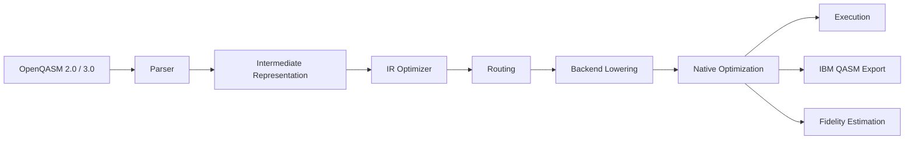

# Sirraya QuTub Transpiler

A modern **OpenQASM compiler and transpiler**, written in Rust, that turns hardware-independent quantum circuits into optimized native instructions for real quantum hardware architectures.

Write a circuit once. Compile it for trapped-ion, superconducting, or future backends without changing the algorithm.

## At a glance

* **OpenQASM 2.0 & 3.0** parsing
* **Hardware-aware routing** — automatic SWAP insertion for real coupling maps
* **Native gate decomposition** for trapped-ion, IBM Quantum, and Rigetti
* **Circuit fidelity estimation** from published calibration data
* **IBM Qiskit-compatible OpenQASM export**
* **Pure Rust**, no external toolchain dependencies

## Where to go next

| I want to... | Go to |
|---|---|
| Understand what this project is and why it exists | [Introduction](introduction.md) |
| Add the crate to my own project and compile my first circuit | [Installation](installation.md) |
| Clone the repo, build from source, and run the examples/tests | [Getting Started](getting-started.md) |
| Browse the full example catalog, organized by what I'm trying to learn | [Examples](examples.md) |
| Understand how the compiler is built internally, module by module | [Architecture](architecture.md) |
| Contribute code, docs, or bug reports | [Contributing](contributing.md) |

---

Licensed under MIT or Apache-2.0, at your option. Published on [crates.io](https://crates.io/crates/sirraya-qutub-transpiler) and [docs.rs](https://docs.rs/sirraya-qutub-transpiler).
