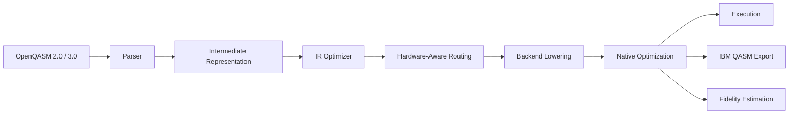

# Sirraya QuTub Transpiler

**A quantum compiler that treats "it runs" and "it runs correctly on real hardware" as two different, both-mandatory claims.**

[](https://crates.io/crates/sirraya-qutub-transpiler)
[](#license)
[](https://www.rust-lang.org/)

## What this actually is

A quantum algorithm, as you write it, is hardware-independent: a sequence of gates acting on abstract qubits that can talk to any other qubit, using whatever rotation angles the math calls for. Real quantum hardware is nothing like that. A trapped-ion device has a different native gate set than a superconducting one. Every physical device has a fixed **coupling map** — a specific, limited set of qubit pairs that can actually interact directly — and if your circuit asks for an interaction the hardware doesn't physically support, something has to give: either the compiler inserts extra SWAP operations to move the right qubits next to each other first, or the circuit simply can't run as written.

QuTub is the layer that sits between "the algorithm you designed" and "the specific device you're running it on," and does that translation for you: parsing OpenQASM, routing your circuit against a *real* backend's coupling map, decomposing it into that backend's *real* native gates, and telling you — from that backend's *real* published calibration data — what fidelity you should actually expect. Write the circuit once. Compile it for trapped-ion, superconducting, or a future backend, without touching the algorithm.

## Why hardware-awareness isn't optional

This is the part that's easy to hand-wave and expensive to get wrong. Two backends with identical qubit counts can produce wildly different results from the *same* logical circuit, purely because of topology.

In our own internal benchmark — an 8-qubit Trotterized Ising-dynamics circuit, routed identically across four backend architectures — one backend needed zero extra SWAP insertions and landed at an estimated **88.2% fidelity**. Another needed 16 SWAP insertions to satisfy its coupling map, and landed at **1.75%**. Same algorithm, same qubit count, same intent — an 86-point fidelity swing driven entirely by a routing decision most transpilers don't even surface to you, let alone let you compare across backends before you commit hardware time to finding out the hard way.

A compiler that can't tell you that up front hasn't actually finished its job. That's the gap QuTub is built to close.

## What makes it different

Most of what a transpiler does is invisible plumbing, which makes it easy to trust blindly. We built QuTub around the opposite instinct: **every number it produces should be checkable against something that doesn't depend on QuTub being right.**

* Circuit construction is validated by convergence toward an independently-derived exact reference — not "the simulator agrees with itself," but agreement with a ground truth computed by a completely separate method.
* Fidelity estimates are checked against actual Monte Carlo noise simulation, not just quoted from calibration data and left untested.
* Where statistical error-mitigation is involved, results are checked with goodness-of-fit and model-selection diagnostics — because a mitigation technique that silently assumes the wrong functional form for noise will still hand you a confident number, and confidence isn't correctness.

That standard costs more to build to, and we hold ourselves to it anyway, because a quantum compiler is exactly the kind of tool where "looks right" and "is right" quietly diverge — and closing that gap before you find out on paid hardware time is the entire reason this project exists.

## What it's for — and what it isn't

QuTub is a **compiler and transpiler**: circuit parsing, IR optimization, hardware-aware routing, native gate decomposition, and calibration-backed fidelity estimation. It also ships a simulator backend so you can run and validate circuits without hardware access.

It is **not** a quantum algorithm library, a variational-optimization framework, or a full SDK for designing circuits from scratch — it assumes you (or another tool) can already produce an OpenQASM circuit, and picks up from there. If you're choosing between backends, need routing decisions grounded in real topology instead of an idealized best case, or want a fidelity estimate you can trust before you spend hardware budget finding out, that's the problem this project is built to solve.

## At a glance

* **OpenQASM 2.0 & 3.0** parsing — bring your existing circuits, no rewrite required
* **Hardware-aware routing** — automatic SWAP insertion computed against each backend's actual coupling map, not an idealized topology
* **Native gate decomposition** for trapped-ion, IBM Quantum, and Rigetti, with more backends landing over time
* **Circuit fidelity estimation** derived from published calibration data, so "this should work" comes with a number attached
* **IBM Qiskit-compatible OpenQASM export** — move work between toolchains without a rewrite
* **Pure Rust, zero external toolchain dependencies** — `cargo add` and you're compiling circuits, no Python environment, no separate SDK install



Each stage is doing real work, not just passing data along: the **IR optimizer** collapses and simplifies gates before anything backend-specific happens; **routing** is where SWAPs get inserted against a real coupling map, which is also where most of the fidelity cost in the example above came from; **backend lowering** rewrites the routed circuit into the target device's actual native gate set; and **fidelity estimation** turns that lowered circuit plus the backend's published calibration numbers into a concrete, comparable expected-fidelity figure — the same pipeline that produced the 88.2% vs. 1.75% numbers above.

## Quickstart

This is the same pipeline shape used throughout `examples/` — construct a circuit, optimize it, route and lower it for a real backend, then either run it or find out what it'll cost you in fidelity before you do:

```rust
use sirraya_qutub_transpiler::backend::{lower, Backend};
use sirraya_qutub_transpiler::fidelity::{estimate_backend_circuit_fidelity, PublishedCalibration};
use sirraya_qutub_transpiler::ir::{Circuit, Gate};
use sirraya_qutub_transpiler::route::route_best;
use sirraya_qutub_transpiler::{decompose, emit, ir_optimize};

// Build a circuit directly, or parse it in from OpenQASM.
let mut circuit = Circuit::new(4);
circuit.push(Gate::Rzz(0, 1, 0.3));
circuit.push(Gate::Rx(1, 0.15));

// Route against the backend's real coupling map -- SWAPs get
// inserted here, not silently assumed away.
let routed = match Backend::TrappedIon.coupling_map(4) {
    Some(coupling) => route_best(&circuit, &coupling).gates,
    None => circuit.gates.clone(),
};
let mut routed_circuit = Circuit::new(4);
for gate in routed {
    routed_circuit.push(gate);
}

// Lower to the backend's native gate set, then ask what it'll
// actually cost you -- calibration-backed, not an assumption.
// See the Installation guide for how to load PublishedCalibration
// from your target backend's published numbers.
let lowered = lower(&routed_circuit, Backend::TrappedIon);
let calibration: PublishedCalibration = /* load for your backend */;
let estimated_fidelity = estimate_backend_circuit_fidelity(&lowered, &calibration);

// Or run it through the optimizer and simulator directly.
let optimized = ir_optimize::optimize(&circuit);
let native = decompose(&optimized);
let result = emit::run(&native)?;
```

Every one of these calls is exercised end to end, against real backend topologies, in the bundled `examples/` — including a full worked pipeline that goes from circuit construction through noisy-hardware simulation and statistical error mitigation. Read the code before you trust the library; we'd rather you did.

## Who this is for

* **Algorithm researchers** who want to write a circuit once and reason honestly about how it'll actually perform across backends, before committing hardware budget.
* **Hardware and quantum-cloud teams** who need routing and fidelity estimation grounded in their own calibration data, not generic assumptions.
* **Tooling and SDK builders** who want a fast, dependency-light, pure-Rust transpiler core they can embed rather than shell out to.

## Where to go next

| I want to... | Go to |
|---|---|
| Understand what this project is and why it exists | [Introduction](introduction.md) |
| Add the crate to my own project and compile my first circuit | [Installation](installation.md) |
| Clone the repo, build from source, and run the examples/tests | [Getting Started](getting-started.md) |
| Browse the full example catalog, organized by what I'm trying to learn | [Examples](examples.md) |
| Understand how the compiler is built internally, module by module | [Architecture](architecture.md) |
| Contribute code, docs, or bug reports | [Contributing](contributing.md) |

## Contributing

Bug reports, backend calibration data, new native gate sets, and better validation diagnostics are all genuinely welcome — this project gets more useful in direct proportion to how many real backends and real edge cases it's been checked against. See [Contributing](contributing.md) for how to get a change in.

If something in here doesn't hold up — a routing decision that's wrong, a fidelity estimate that doesn't match what you measured, a validation gap — that feedback is the actual product. Please raise it through the process in [Contributing](contributing.md).

## License

Licensed under the MIT License.