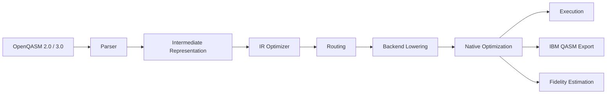

<div align="center">

# Sirraya QuTub Transpiler

**A native Rust compiler for quantum circuits — from OpenQASM to real, hardware-routed, fidelity-budgeted native instructions.**

[](https://crates.io/crates/sirraya-qutub-transpiler)
[](https://docs.rs/sirraya-qutub-transpiler)
[](#license)
[](https://rustup.rs)

</div>

---

Quantum computing is still an emerging field, and it shows in the tooling: most transpilers either assume unlimited connectivity that doesn't exist on real chips, or report fidelity as a hand-waved constant instead of a number derived from a specific device's actual calibration data. Sirraya QuTub was built to close that gap — every routing decision respects a real published coupling map, every fidelity number traces back to real calibration data for a specific backend, and every noise-mitigation claim in the bundled examples is checked for statistical significance before it's reported as real.

## Why Sirraya QuTub

**Native Rust, not a Python wrapper.** No interpreter, no dependency on a specific Python version or virtual environment to embed this in another system. Compiles to a single binary or links directly into your Rust codebase.

**Hardware-realistic from the ground up, not bolted on.** Routing targets real published topology families — IBM's heavy-hex lattice, Rigetti's square grid — not a synthetic all-to-all assumption that happens to make gate counts look better than they'd be on real silicon. Fidelity estimates are computed per-backend from that backend's own published calibration data (Quantinuum Helios, IBM Heron r2, Rigetti Ankaa-3), not one generic number reused everywhere.

**Correctness proven, not assumed.** Every rewrite the compiler performs — source-level optimization, native decomposition, backend lowering with routing — is checked by running both the original and rewritten circuit on a real simulator and computing state fidelity between them, over dozens of randomized circuits. See it run yourself: [`verify_equivalence`](examples/verify_equivalence.md).

**Benchmarked transparently against an established baseline.** This crate's routing and lowering is measured directly against Qiskit's own `transpile()`, on the same circuits, targeting the same real IBM basis gate set and the same real coupling map — not a self-reported comparison. See [`qiskit_benchmark`](examples/qiskit_benchmark.md).

**Statistically honest noise mitigation.** The bundled algorithm examples (VQE, QAOA, Trotterized dynamics) don't just apply zero-noise extrapolation and report a number — they propagate the fit's uncertainty and check whether an improvement clears statistical significance before calling it real. If you've seen a noise-mitigation demo that reports a single number with no error bar, this is the alternative.

This project doesn't claim to outperform mature ecosystems like Qiskit or Cirq across the board — those have years of engineering behind them. What it offers is a specific, honest niche: a fast, embeddable, hardware-realistic compiler core for teams building Rust systems around quantum workloads, with its accuracy claims checked against reality rather than assumed.

## The pipeline



## At a glance

* **OpenQASM 2.0 & 3.0** parsing
* **Hardware-aware routing** — automatic SWAP insertion against real coupling maps, with two routing algorithms available (plain and SABRE-style lookahead)
* **Native gate decomposition** for trapped-ion, IBM Quantum, and Rigetti
* **Circuit fidelity estimation** from published calibration data, per backend
* **IBM Qiskit-compatible OpenQASM export**, plus a companion script bridge to real IBM Quantum hardware
* **Zero-noise extrapolation** with propagated uncertainty, not a bare point estimate
* **Pure Rust**, no external toolchain dependencies for the core compiler

## Try it in 30 seconds

```toml
[dependencies]
sirraya-qutub-transpiler = "0.1"
```

```rust
use sirraya_qutub_transpiler::{qasm, optimize_ir, decompose, optimize, estimate_circuit_fidelity, PublishedCalibration};

let circuit = qasm::parse(r#"
    OPENQASM 2.0;
    include "qelib1.inc";
    qreg q[2];
    h q[0];
    cx q[0], q[1];
"#)?;

let native = optimize(&decompose(&optimize_ir(&circuit)));
let fidelity = estimate_circuit_fidelity(&native, &PublishedCalibration::quantinuum_helios_2026());
println!("{:.2}%", fidelity * 100.0);
```

Full walkthrough, including targeting a specific backend and exporting real IBM-basis QASM: [Installation](installation.md).

## Choose your path

Where you start depends on who you are, not just what you want to do — the field is new enough that "quantum developer" covers a lot of very different backgrounds.

| You are... | Start here |
|---|---|
| **New to quantum computing** — student, curious engineer, no prior background | [Introduction](introduction.md) for the concepts, then [`gate_cheatsheet`](examples/gate_cheatsheet.md) and [`bell_state_end_to_end`](examples/bell_state_end_to_end.md) for hands-on first steps |
| **A software/backend engineer** integrating quantum workloads into a larger Rust system | [Installation](installation.md) for the dependency + API shape, then [docs.rs](https://docs.rs/sirraya-qutub-transpiler) for the full API reference |
| **A quantum researcher or physicist** evaluating this for real algorithm work | [Architecture](architecture.md) for the internals, then [`vqe_h2_ground_state`](examples/vqe_h2_ground_state.md), [`qaoa_portfolio_optimization`](examples/qaoa_portfolio_optimization.md), and [`trotter_ising_dynamics`](examples/trotter_ising_dynamics.md) for complete, real algorithm implementations |
| **A technical decision-maker** evaluating whether to adopt this for a team | The differentiators above, then [`qiskit_benchmark`](examples/qiskit_benchmark.md) for an honest, reproducible comparison against an established baseline — run it yourself rather than taking the README's word for it |
| **A contributor** who wants to work on the compiler itself | [Getting Started](getting-started.md) to build from source, then [Contributing](contributing.md) for the workflow and open items |
| **Just want to see it work** with zero setup decisions | [Examples](examples.md) — pick anything under "Start here" |

## Where things stand

Currently implemented: OpenQASM parsing, an intermediate representation, source-level optimization, topology-aware routing (two algorithms, though only one is wired into the default backend-lowering path today — see [`layout_comparison`](examples/layout_comparison.md) for the specific, already-solved gap), native gate decomposition, backend abstraction across three real hardware families, circuit fidelity estimation, circuit visualization, and IBM Qiskit-compatible export.

This is an actively developed research and engineering project, not a finished product — [Architecture](architecture.md) and [Contributing](contributing.md) are both explicit about what's solid versus what's still open. If you're evaluating this for production use, read [`verify_equivalence`](examples/verify_equivalence.md) and [`qiskit_benchmark`](examples/qiskit_benchmark.md) first and judge the current state directly rather than from marketing claims.

## Community

* Open a GitHub Issue for bugs or feature requests

* Start a GitHub Discussion for questions or design conversations

* See [Contributing](contributing.md) for the development workflow and good first areas to work on

* See the [Contributors Hall of Fame](docs/CONTRIBUTORS_HALL_OF_FAME.md) to recognize the people who have made meaningful contributions to QuTub Transpiler.

### Contributors & Recognition

The contributor documentation follows this structure:

```text
README.md
   |
   +--> CONTRIBUTORS.md
            |
            +--> Contributors Hall of Fame
                     |
                     +--> docs/CONTRIBUTORS_HALL_OF_FAME.md
```

* [`CONTRIBUTORS.md`](CONTRIBUTORS.md) — How to contribute to QuTub Transpiler.
* [`Contributors Hall of Fame`](docs/CONTRIBUTORS_HALL_OF_FAME.md) — Recognized contributors, contribution categories, recognition levels, and contribution-credit criteria.

The **Contributors Hall of Fame** is the single source of truth for recognized contributors.


## License

Licensed under the MIT License. See `LICENSE` for details.

---

Published on [crates.io](https://crates.io/crates/sirraya-qutub-transpiler) and [docs.rs](https://docs.rs/sirraya-qutub-transpiler).