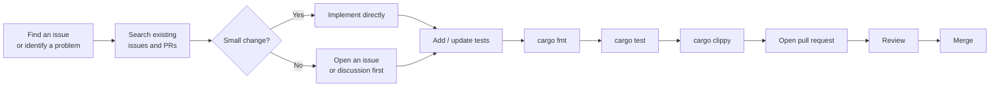
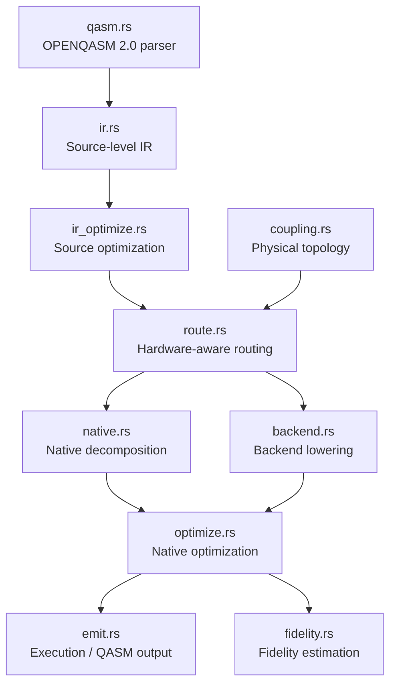
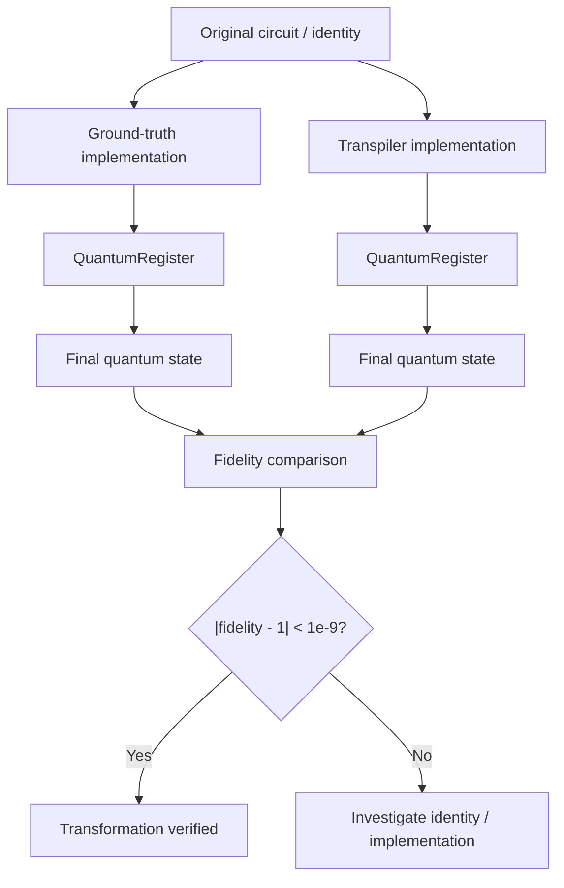
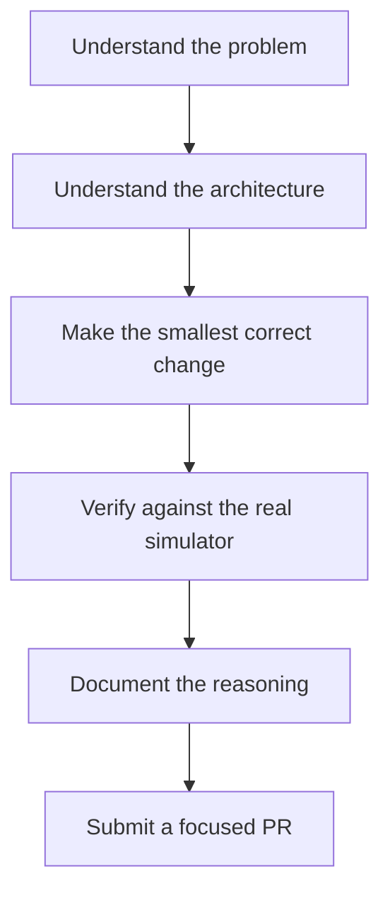

# Contributing to `sirraya-qutub-transpiler`

[](LICENSE)
[](https://github.com/sirraya-labs/QuTub-Transpiler/labels/good%20first%20issue)
[](https://github.com/sirraya-labs/QuTub-Transpiler/discussions)

Thank you for considering a contribution to `sirraya-qutub-transpiler`.

This project is a **QASM 2.0 importer and multi-backend native-gate compiler** for quantum circuits, built and maintained by [Sirraya Labs](https://github.com/sirraya-labs).

Contributions are welcome at every level, including:

* Bug reports
* Documentation improvements
* Test coverage
* Design discussions
* Optimization work
* Backend development
* Quantum-computing research and implementation

You do **not** need to be an expert in quantum computing or Rust to contribute.

For the deep technical explanation of the compiler architecture and the reasoning behind its design decisions, see [`ARCHITECTURE.md`](architecture.md).

---

## Contribution workflow

The intended contribution path is deliberately simple:



The goal is to make the path from **"I found something"** to **"I opened a good PR"** as frictionless as possible.

---

## Table of contents

* [Code of Conduct](#code-of-conduct)
* [Quick start](#quick-start)
* [Ways to contribute](#ways-to-contribute)
* [Before you start](#before-you-start)
* [Development setup](#development-setup)
* [Project layout](#project-layout)
* [Testing philosophy](#testing-philosophy)
* [The core testing rule](#the-core-testing-rule)
* [Coding conventions](#coding-conventions)
* [Commit messages](#commit-messages)
* [Pull request checklist](#pull-request-checklist)
* [Reporting bugs](#reporting-bugs)
* [Good first issues](#good-first-issues)
* [Larger projects](#larger-projects)
* [Getting help](#getting-help)
* [License](#license)

---

## Code of Conduct

This project follows the [Contributor Covenant](https://www.contributor-covenant.org/version/2/1/code_of_conduct/).

By participating, you are expected to uphold it.

Report unacceptable behavior to [amir@sirraya.org](mailto:amir@sirraya.org).

---

# Quick start

If you simply want to get the project building and run its test suite:

```bash
git clone https://github.com/sirraya-labs/QuTub-Transpiler.git
cd sirraya-qutub-transpiler

cargo build
cargo test
```

If `cargo test` passes, your development environment is ready.

If it does not, please open an issue with:

* Your operating system
* Rust version from `rustc --version`
* The full error output
* The commit or version you checked out

A broken setup is useful information. Please do not silently work around an onboarding problem if the project itself is responsible for it.

### Prerequisites

You need:

* Rust on the **stable** channel
* Cargo
* Git

If you are unsure which Rust toolchain you are using:

```bash
rustup default stable
```

### `sirraya_qutub` dependency

This crate depends on `sirraya_qutub`, the Sirraya Labs quantum simulator.

The dependency is declared in `Cargo.toml`, so:

```bash
cargo build
```

should resolve it automatically.

If dependency resolution fails, check the `sirraya_qutub` project's documentation for version-specific requirements.

---

# Ways to contribute

Not every useful contribution requires writing Rust.

| Contribution                     | Where to start                                    |
| -------------------------------- | ------------------------------------------------- |
| Report a bug                     | [Reporting bugs](#reporting-bugs)                 |
| Fix a documentation problem      | Open a focused PR                                 |
| Improve test coverage            | Follow the [testing rule](#the-core-testing-rule) |
| Pick up a beginner-friendly task | [Good first issues](#good-first-issues)           |
| Propose a feature                | Start with an issue or discussion                 |
| Work on a roadmap item           | See [`ARCHITECTURE.md`](architecture.md)          |
| Improve compiler optimization    | Discuss the intended transformation first         |
| Add a backend or topology        | Open an issue before implementation               |

Documentation and test improvements are especially valuable because they make future compiler work easier to review and maintain.

---

# Before you start

## Search first

Before opening an issue or starting implementation, search existing:

* Issues
* Pull requests
* Discussions

A problem may already be known, actively worked on, or intentionally designed that way.

This codebase contains a number of cases where an apparently simpler implementation was considered and deliberately rejected.

Read [`ARCHITECTURE.md`](architecture.md) before assuming that an unusual implementation is accidental.

---

## Discuss substantial changes first

For anything beyond a small fix, open an issue before writing significant amounts of code.

This is particularly important for changes involving:

* Gate decomposition
* Gate identities
* Routing
* Coupling maps
* Backend lowering
* Optimization rules
* Measurement semantics
* New hardware backends

The goal is to agree on the mathematical and architectural approach **before** implementation makes a particular direction expensive to change.

---

## Keep pull requests focused

Small, focused PRs are easier to review and merge.

A large change is completely acceptable when the problem itself is large, such as:

* A new backend
* A new coupling-map topology
* A major compiler pass
* A substantial architectural change

For these changes, open an issue first so the implementation and review scope can be agreed upon.

---

# Development setup

## Common commands

```bash
# Build
cargo build

# Run the complete test suite
cargo test

# Run tests for a specific module
cargo test route::

# Format the project
cargo fmt

# Verify formatting without changing files
cargo fmt --check

# Run Clippy with warnings treated as errors
cargo clippy --all-targets -- -D warnings
```

### CI-equivalent checks

Before opening a PR, these should pass:

```bash
cargo fmt --check
cargo test
cargo clippy --all-targets -- -D warnings
```

There is no separate integration-test setup step.

The integration tests under:

```text
tests/decompositions.rs
tests/measurement.rs
```

are included in the normal `cargo test` run.

They exercise the real `sirraya_qutub` simulator rather than mocked quantum operations.

---

# Project layout

The source tree is organized according to the compiler pipeline:



## Source modules

| File                 | Responsibility                                        |
| -------------------- | ----------------------------------------------------- |
| `src/ir.rs`          | Source-level gate set and `Circuit` representation    |
| `src/qasm.rs`        | OPENQASM 2.0 → `ir::Circuit` parser                   |
| `src/ir_optimize.rs` | Source-level cancellation and conservative reordering |
| `src/route.rs`       | SWAP insertion against a `CouplingMap`                |
| `src/coupling.rs`    | Physical qubit connectivity models                    |
| `src/native.rs`      | Decomposition to `{Rz, Ry, Rzz}`                      |
| `src/backend.rs`     | Backend-specific native-gate lowering                 |
| `src/optimize.rs`    | Native-level peephole optimization                    |
| `src/emit.rs`        | Execution against `sirraya_qutub` and QASM emission   |
| `src/fidelity.rs`    | Gate-count-based fidelity estimation                  |

## Tests

| File                      | Responsibility                                      |
| ------------------------- | --------------------------------------------------- |
| `tests/decompositions.rs` | Gate identities verified against the real simulator |
| `tests/measurement.rs`    | Statistical verification of `Gate::Measure`         |

For the full explanation of each module, including the mathematical identities and design constraints behind them, see [`ARCHITECTURE.md`](architecture.md).

---

# Testing philosophy

Testing is not an afterthought in this project.

The transpiler performs mathematical transformations on quantum circuits. A transformation can compile successfully, produce valid-looking gates, and still implement the wrong unitary.

The testing strategy therefore focuses on **semantic equivalence**, not simply successful compilation.



This approach makes the tests validate what actually matters:

> **Does the transpiled circuit implement the same quantum operation?**

---

# The core testing rule

> ## Every non-trivial quantum transformation must be verified against the real simulator.
>
> Every gate identity, decomposition, or optimization pass must be checked against the real `sirraya_qutub::core::QuantumRegister`.
>
> An algebraic assertion by itself is not enough.

The standard pattern is:

### 1. Build a randomized initial state

The test begins from a non-trivial state rather than relying only on basis states such as `|0⟩`.

This makes phase and amplitude errors much easier to detect.

### 2. Execute the ground truth

Run the reference operation directly through `QuantumRegister`'s native `apply_*` methods.

### 3. Execute the transpiler implementation

Run the implementation being tested on a clone of the same initial state.

### 4. Compare the resulting states

Use:

```rust
QuantumRegister::fidelity
```

and require:

```rust
(fidelity - 1.0).abs() < 1e-9
```

The expected result is therefore essentially:

```text
fidelity = 1
```

within numerical precision.

---

## Why fidelity testing matters

A mathematically plausible implementation can still contain:

* A sign error
* A reversed control and target
* An incorrect phase
* A wrong rotation convention
* An incorrect tensor-product ordering
* A faulty qubit remapping
* An optimization that changes semantics

These errors may not be obvious from the generated circuit.

Fidelity makes them immediately visible.

A sign error should produce a fidelity significantly below one rather than a subtle discrepancy that a reviewer must manually discover.

This is why the project treats simulator-backed verification as its primary quality guarantee.

---

## Measurement is the exception

`Gate::Measure` cannot be tested using state fidelity in the same way.

Measurement changes the state through probabilistic collapse, so there is no single deterministic unitary transformation to compare.

Measurement tests therefore use **shot-based statistical verification**.

See:

```text
tests/measurement.rs
```

for the corresponding approach.

---

## Pull request requirement

A PR that introduces a new:

* Gate identity
* Gate decomposition
* Optimization identity
* Backend transformation
* Routing transformation

should include an appropriate verification test.

For unitary transformations, this normally means fidelity-based verification.

For measurement behavior, it means statistical verification.

A new identity without corresponding verification will be asked to add a test before it is merged.

This is not a formality. It is what allows reviewers to validate a mathematical transformation quickly without having to independently re-derive every identity.

---

# Coding conventions

## Formatting and linting

Run:

```bash
cargo fmt
cargo clippy --all-targets -- -D warnings
```

before opening a PR.

CI checks both.

---

## Avoid `unsafe`

Do not introduce `unsafe` unless there is genuinely no reasonable safe alternative.

If `unsafe` is necessary, explain the reason in a comment immediately above the relevant code.

---

## Explain why, not only what

This codebase intentionally uses documentation comments to explain **why** an implementation is structured a particular way.

For non-obvious code, document:

* The mathematical reasoning
* The hardware constraint
* The correctness constraint
* The rejected simpler alternative
* Any important assumptions

For example, if a seemingly simpler optimization is deliberately avoided, document that decision.

Future contributors should not have to reconstruct the reasoning from `git blame`.

---

## Prefer exact transformations

When a transformation can be implemented exactly, prefer the exact identity.

For example:

```text
Ry(θ)
```

should be lowered through an exact identity rather than an approximation whenever the target gate set permits it.

If something genuinely cannot be exact, state that explicitly in the documentation.

`fidelity.rs` is an example of this distinction: its estimates are intentionally approximations and are documented as such.

---

## Preserve semantic boundaries

Be especially careful around:

```text
Measure
routing
control / target ordering
classical-bit destinations
backend topology
```

These are not ordinary optimization details.

They can change the semantics of a circuit if handled incorrectly.

---

# Commit messages

Keep commits short and imperative.

A module prefix is useful when it clarifies the scope:

```text
route: fix identity restoration on non-linear coupling maps
backend: add Rigetti-specific Rzz lowering
docs: clarify Measure's role in ir_optimize's commuting pass
```

If the change resolves an issue, reference it where appropriate:

```text
Fixes #42
```

Squash-merging is fine.

The commit history inside a PR does not need to be perfectly clean. The **PR title and description** should clearly communicate the final change because those become part of the project's long-term history.

---

# Pull request checklist

Before opening a PR, or marking one ready for review:

### Required checks

* [ ] `cargo test` passes locally
* [ ] `cargo fmt --check` passes
* [ ] `cargo clippy --all-targets -- -D warnings` passes
* [ ] New identity / decomposition / optimization includes an appropriate verification test
* [ ] Measurement behavior has shot-based verification where applicable

### Semantic checks

* [ ] `Gate::Measure` behavior was considered if touched
* [ ] `ir_optimize.rs` measurement barriers remain correct
* [ ] `route.rs` remapping logic remains correct
* [ ] Control / target ordering is preserved
* [ ] Classical-bit destinations remain valid

### Documentation checks

* [ ] Relevant doc comments are updated
* [ ] `ARCHITECTURE.md` is updated if the change is structural
* [ ] PR description explains **why**, not only **what**
* [ ] Related issue or discussion is linked where applicable

---

## The review standard

A useful mental model is:


Passing `cargo test` is necessary, but it is not the entire definition of a good contribution.

For compiler changes, reviewers should be able to understand:

1. What transformation is being introduced.
2. Why it is mathematically or semantically correct.
3. Why it belongs at that stage of the compiler pipeline.
4. How the implementation is tested.
5. What hardware or backend assumptions it makes.

---

# Reporting bugs

Open an issue with as much of the following as possible.

## What happened?

Describe:

* What you expected
* What actually happened
* Whether the result is incorrect, unexpected, or merely unclear

## Minimal reproduction

Provide the smallest circuit that reproduces the problem.

Either provide QASM:

```qasm
OPENQASM 2.0;
include "qelib1.inc";

qreg q[2];
creg c[2];

h q[0];
cx q[0],q[1];
```

or Rust code that constructs the corresponding `Circuit`.

## Environment

Include:

```bash
rustc --version
cargo --version
```

Also provide:

* Operating system
* Crate version or commit
* Whether the problem reproduces on `main`

---

## Incorrect-but-plausible results

Please explicitly flag bugs where the output appears valid but is semantically wrong.

Examples include:

* Fidelity slightly below one
* Incorrect phase relationships
* Wrong qubit mapping
* Incorrect control / target direction
* A circuit that executes but produces the wrong distribution
* A routing transformation that silently changes logical wire identity

These bugs are particularly important because they are exactly the class of problems this project's verification philosophy is designed to catch.

---

# Good first issues

Check the repository's [`good first issue`](https://github.com/sirraya-labs/QuTub-Transpiler/labels/good%20first%20issue) label for the current maintained list.

Some currently well-scoped areas include:

### Rigetti topology

Give `Rigetti` its actual grid-style coupling map instead of the conservative linear-chain stand-in currently used.

Relevant areas:

```text
coupling.rs
backend.rs
route.rs
```

### Source-level commutation

Extend `ir_optimize.rs` with gate-specific commutation rules.

For example:

```text
Rz commuting through the control wire of Cx
```

The native-level optimizer in `backend.rs` already contains related rules that can serve as a reference.

Any new rule should have an appropriate semantic verification test.

### Test coverage

Add fidelity tests for identities that currently have only an algebraic derivation or documentation explanation.

This is particularly useful for:

* Backend lowering identities
* Native decompositions
* Optimization rules
* Routing transformations

---

# Larger projects

Some contributions require architectural discussion before implementation.

For these, open an issue or discussion first.

## Pasqal / neutral-atom backend

A proper `Backend::Pasqal` implementation is substantially different from the existing digital gate backends.

It would need to reason about concepts such as:

```text
Atom placement
Blockade radius
Physical movement
Interaction geometry
Placement-aware routing
```

A simple fixed connectivity map would not accurately represent the platform.

---

## SWAP-aware routing optimization

The current router is primarily a **correctness pass**, not a global optimizer.

A future routing optimizer could consider:


Potential future concerns include:

* Lookahead
* Gate reordering
* Interaction frequency
* SWAP count
* Circuit depth
* Backend-specific gate costs
* Final logical-to-physical mapping

The objective should not be merely:

> Minimize the number of SWAP gates.

A better optimizer would eventually balance SWAP count against total circuit depth and hardware-specific execution cost.

---

# Getting help

## Using the crate

For questions about using `sirraya-qutub-transpiler`, open a [Discussion](https://github.com/sirraya-labs/QuTub-Transpiler/discussions) or an issue tagged `question`.

## Contributing

If you are stuck on a contribution:

* Comment on the issue
* Ask on your draft PR
* Share partial progress
* Explain where the implementation becomes unclear

You do not need to arrive with a finished solution.

A clear:

> "I understand the identity, but I'm unsure where this transformation belongs in the pipeline."

is a useful contribution to the discussion.

## Security or sensitive issues

For something security-related or otherwise inappropriate for a public issue, contact [amir@sirraya.org](mailto:amir@sirraya.org) directly.

---

# License

This project is licensed under the [MIT License](LICENSE).

By submitting a pull request, you agree that your contribution is licensed under the same terms.

---

## Contributor principle

The most useful way to think about contributing to this project is:



The goal is not simply to add more code.

The goal is to make the transpiler **more correct, more understandable, more verifiable, and easier for the next contributor to extend**.
